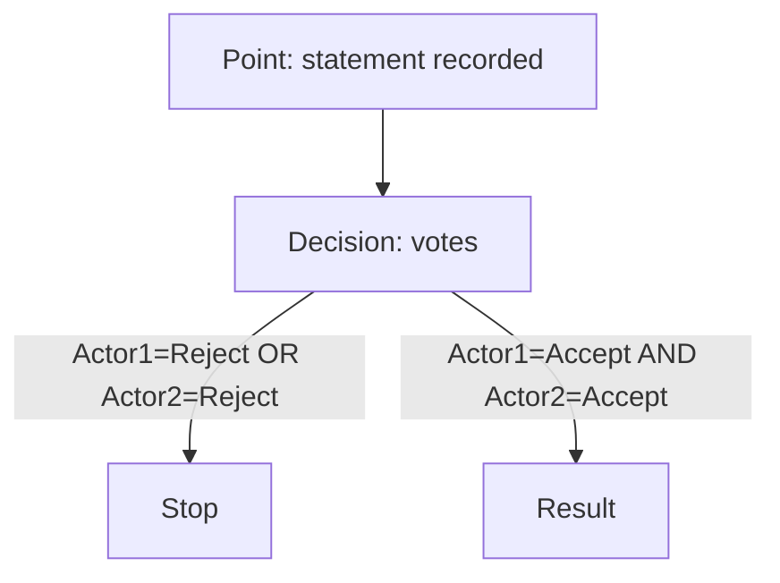

# Boldsea — an event-driven semantic model

> [!summary] TL;DR  
> **Boldsea** describes a system’s activity as an **event graph** (not as a set of objects/tables and not as a “workflow of commands”).  
> An event is the **only primitive**: facts, states, actions, relations, and even “schemas” are expressed through events.  
> Execution resembles **dataflow**: an event happens when **conditions are satisfied** and **required causes** exist.

---

## What changed in Version 2 (compared to the raw PDF digest)

- Reworked into **Obsidian/Markdown**: clean headings, navigation, callouts, examples.
- Removed typical PDF noise (broken hyphenation, repeated fragments).
- Added: a **cheat sheet**, **glossary**, **mapping table** to familiar terms, **Mermaid snippets**, **modeling checklists**.
- Added a “Practice” section: how to apply the ideas and sanity-check a model.

---

## Navigation

- [[#1 Model intuition]]
- [[#2 Event as the atom]]
- [[#3 Event categories]]
- [[#4 Dataflow execution]]
- [[#5 Constraints and rules]]
- [[#6 Constructive model]]
- [[#7 Execution architecture]]
- [[#8 Why it can be useful]]
- [[#9 Evolution of the approach]]
- [[#10 Practical templates]]
- [[#11 Glossary]]
- [[#12 Sources]]

---

## 1) Model intuition

The traditional approach (simplified):

- **Objects** (classes/tables) → a predefined set of properties → processes are built on top.
- Processes are often expressed as a **sequence of commands** (control flow), and data changes are “side effects” of running those commands.

Boldsea proposes a different anchor:

- primary are **events in time** (what happened, by whom, why, under which conditions);
- an object/entity is a **projection of a set of events** related to it;
- “executable logic” is described **declaratively**: via conditions and constraints on events.

> [!idea] A helpful mental model  
> “A system is a growing event DAG. ‘State’ is not a stored thing, but a *computed picture* derived from events and their links.”

---

## 2) Event as the atom

### 2.1 Definition

An **event** is a fact/change recorded (or generated) by an actor and considered significant for the system.

Important: in Boldsea there is **nothing more primitive** than an event.  
Entities, attributes, relations, documents, statuses—everything manifests through events.

### 2.2 Event structure (unified format)

The digest highlights these key fields:

- `id` — unique event identifier
- `base: type: value` — semantic “core” (a triplet: type + value)
- `cause` — links to causal predecessor events (what this event depends on)
- `model` — a link to the model/template that produced the event (the corresponding model event)
- `actor` — who initiated/recorded the event
- `date` — timestamp of recording

Example record (illustrative YAML):

```yaml
id: evt_2026_02_22_001
base:
  type: Document:status
  value: pending
cause:
  - evt_2026_02_22_000   # e.g., "Document:created"
model: ModelDocument/status
actor: user:ivanov
date: 2026-02-22T10:15:30+03:00
```

> [!note] “Absolute subject”  
> If a change is not initiated explicitly (external environment/sensor), it can be attributed to a fictional actor: the “absolute subject”.

### 2.3 Objects and subjects as projections of events

- An **object** (e.g., a “bolt”) is described not by a card with fixed properties, but by a **set of events**: “delivered”, “moved”, “used”, etc.
- If an attribute was **never significant** in any event (e.g., color), then in the model of that bolt **there is no such property**—it does not “have to exist”.
- A **subject (actor)** can also be described through the set of events they initiated.

---

## 3) Event categories

Boldsea distinguishes three “levels” of events (important for how the ontology is born):

1. **Genesis events** — introduce the base primitives (the “vocabulary”): entity types, property types, relation kinds, etc.
2. **Model events** — define templates/schemas: what properties exist, what constraints apply, what actions are possible.
3. **Reification events** — concrete domain facts: real actions and state changes.

```mermaid
flowchart LR
  G[Genesis events\n(vocabulary/primitives)] --> M[Model events\n(templates/schemas)]
  M --> R[Reification events\n(facts/history)]
```

> [!example] A simple chain  
> “Define the concept Employee” → “describe the Employee model (name, manager…)” → “create the concrete Ivanov with his properties”.

---

## 4) Dataflow execution

### 4.1 The key difference from control flow

Instead of a hard-coded algorithmic order of steps, the principle is:

- an event can be created/executed when:
   - required **input/cause events** exist (`cause`),
   - specified **conditions** evaluate to true.

This makes the system resemble:

- a spreadsheet (cells recompute when inputs change),
- reactive dependency graphs,
- dataflow pipelines.

### 4.2 Traits of the approach

- **asynchrony**: there is no single central loop; events can happen in parallel;
- **declarative conditions** (`Condition`) instead of imperative logic;
- **automatic dependency tracking**: changing/adding an event can unlock others.

> [!example] Decision model (simplified)  
> Two participants vote on a statement.  
> `Stop` occurs if someone rejects; `Result` occurs if both accept.



---

## 5) Constraints and rules

Constraints are defined on **model events** and validated by the engine when creating/changing reifications.

Key constraints listed in the digest:

- `Condition` — a logical “may I create this event?” predicate
- `Permission` — who (actor/role) may create the event
- `Multiple` — whether multiple reifications per template are allowed
- `Immutable` — whether the value can change after creation
- `Unique` — value uniqueness within events of this type
- `UniqueIdentifier` — the value acts as an identifier for an individual
- `Range` — allowed value range/type
- `SetRange` — a computed (query-defined) set/range of allowed values
- `ValueCondition` — an additional constraint on the value
- `SetValue` — automatic value computation (expression/query)

> [!tip] How to think about constraints  
> Constraints are the model’s contract that the engine enforces automatically.  
> The more precisely you formalize them, the less “hidden logic” remains in code/procedures.

---

## 6) Constructive model: what you build the domain with

### 6.1 Concept and Individual

- **Concept** — a class/category (Document, Employee, Deal…)
- **Individual** — a concrete instance of a concept

Illustrative notation:

```text
Concept: Instance: "Person"
Person: Individual: "Ivanov"
```

### 6.2 Properties: Attribute vs Relation

- **Attribute** — a literal value (string, number, date…)
- **Relation** — a link to another individual

```text
Attribute: Instance: "name"
Relation:  Instance: "manager"
```

### 6.3 Model

A **Model** is an ordered list of model events describing the structure and constraints.

Example (condensed):

```text
Person: Model: "ModelPerson"
 : Attribute: "name"
 :: Required: 1
 :: Datatype: "string"
 : Relation: "manager"
 :: Range: "Person"
 :: Condition: "$.department != undefined"
```

### 6.4 Act and Action

- **Act** — an atomic action that changes an individual’s state (e.g., `approve`)
- **Action** — a sequence of acts united by a goal (a process)

Example act for document approval:

```text
Document: Model: "ModelDocument"
 : Act: "approve"
 :: Permission: "manager"
 :: Condition: "$.status == 'pending'"
```

---

## 7) Execution architecture (how it “lives”)

### 7.1 Event Graph

All events and causal links form a directed acyclic graph (DAG):

- nodes: events
- edges: causality (A → B if B references A in `cause`)

Meaning: you store not only “current state” but **history + reasons**.

### 7.2 Engine

The engine’s responsibilities:

- evaluate conditions (`Condition`)
- validate constraints (`Permission`, `Range`, `Unique`, …)
- generate new events when conditions become true
- keep the graph up to date (including computed fields via `SetValue`)

### 7.3 Queries

Data is extracted from the event graph via formal queries. Example idea: select HR employees and output their names:

```text
$($EQ.$Model("ModelPerson"), $EQ.department("HR")).name
```

### 7.4 Subscriptions

Subscriptions provide reactivity:

- track events that matter for other events’ conditions,
- trigger reevaluation,
- launch generation/execution asynchronously.

```mermaid
flowchart LR
  E[New event] --> S[Subscriptions\n(dependency tracking)]
  S --> C[Recompute conditions]
  C -->|true| G[Generate consequence event]
  C -->|false| H[No-op / compensation\nif the model defines it]
```

---

## 8) Why it can be useful

Benefits emphasized in the digest:

- **instant modifiability**: change rules/conditions without “rewiring an algorithm”
- **scalability**: decentralized execution, parallelism by dependency structure
- **semantic transparency**: one event format is understandable to humans and machines
- **no-code / low-code modeling**: business rules as data (conditions/constraints)
- **audit & explainability**: each fact has actor, time, and a causal chain
- **model interoperability**: a common semantic foundation eases integration

> [!warning] The price of transparency  
> You pay with modeling discipline:  
> define events, causes, conditions, and constraints carefully.  
> If events are too fine-grained, you get noise; too coarse-grained, you lose control.

---

## 9) Evolution of the approach (very brief)

A timeline mentioned in the source digest:

- 2011 — philosophical foundations (temporality, relativity of description)
- 2015 — “subject-event approach” (Habrahabr articles), criteria for “what counts as an event”
- 2016–2019 — talks (eventFlow)
- 2021 — article on event semantics: synthesis of **Event Sourcing + Semantic Web + Dataflow**
- 2022 — chapters/articles in a collected volume (Ridero)
- 2023 — popular comparison: event ontology vs object ontology (Medium)
- 2025 — consolidation under the name **Boldsea**, formalization, full constraints list

---

## 10) Practical templates (for building models)

### 10.1 Checklist: a “good event”

An event is worth adding if (in the spirit of the early formalization):

- it is recorded/initiated by an actor (person/agent/sensor),
- it is performed on an object (or in an object’s context),
- its presence/absence affects the possibility of other events (it participates in causality/conditions).

> [!tip] If an event affects nothing  
> you may not need it at that level of granularity.

### 10.2 Checklist: a “good model (schema)”

- Concepts and key individuals are clearly separated.
- For properties you defined:
   - kind (attribute/relation),
   - allowed range (`Range`/`SetRange`),
   - uniqueness where needed (`Unique`, `UniqueIdentifier`).
- For acts you defined:
   - permissions (`Permission`),
   - conditions (`Condition`).
- For computed fields:
   - `SetValue`, and it is clear which events the formula depends on.

### 10.3 Template: minimal document lifecycle

```text
Document: Model: "ModelDocument"
 : Attribute: "status"
 :: Datatype: "string"
 :: SetValue: "'draft'"         # default (if intended)
 : Act: "submit"
 :: Condition: "$.status == 'draft'"
 : Act: "approve"
 :: Permission: "manager"
 :: Condition: "$.status == 'pending'"
```

### 10.4 Mapping to familiar terms (to explain it to a team)

| Boldsea                | Closest analogy            | The key difference                                               |
|------------------------|----------------------------|------------------------------------------------------------------|
| Event                  | event in event sourcing    | event carries semantics and causality links as part of the model |
| Event Graph (DAG)      | event store + causal graph | causality is first-class, not an external log                    |
| Model events           | schema / metamodel         | schema itself is also expressed as events                        |
| Condition / Permission | business rules / RBAC      | rules are executed by the engine as part of dataflow             |
| Query                  | DB/graph query             | may incorporate model + causal links, not only “current state”   |

---

## 11) Glossary

- **Actor** — a subject that initiates/records an event.
- **Cause** — references to predecessor events that a given event depends on.
- **Genesis events** — events that introduce the “vocabulary” of the domain.
- **Model events** — schema/template events and their constraints.
- **Reification events** — concrete facts/actions in the domain.
- **DAG** — directed acyclic graph (no cycles).
- **Dataflow** — execution based on data readiness/conditions, not command order.

---

## 12) Sources (as listed in the RU digest)

```text
Boldsea Architecture: Fundamental Principles and Conceptual Model (Medium, May 2025)
https://medium.com/@boldachev/boldsea-architecture-fundamental-principles-and-conceptual-model-36138a6bc97e

Architecture Based on Event Semantics (Open Systems. DBMS, No. 3, 2021) [RU]
https://www.osp.ru/os/2021/03/13055996

Event Ontology vs Object Ontology (Medium, 20 Jun 2023)
https://medium.com/@boldachev/event-ontology-vs-object-ontology-cef764feb12c

Subject-Event Approach to Modeling Complex Systems (Habr) [RU]
https://habr.com/ru/articles/256509/

Comparing the Subject-Event Approach with Existing BPM Systems (Habr) [RU]
https://habr.com/ru/articles/256607/

Temporal Ontology and Event Logic (YouTube) [RU]
https://www.youtube.com/watch?v=gazUrDmjAOw

AGI-in-Russian workshop plan and materials
https://agirussia.org/workshops.html

Interview: Blockchain, black magic and event ontology (ResearchGate)
https://www.researchgate.net/publication/347897044_Blockchain_black_magic_and_event_ontology_Interview_with_Alexander_Boldachev
```

---

> [!todo] Ideas for a Version 3 (optional)
> - Split into atomic notes (MOC + dedicated notes: “Constraints”, “Event Graph”, “Examples”).
> - Add a section “How to relate this to BPMN/EPC and where the applicability boundaries are”.
> - Add one end-to-end example (e.g., “document workflow”): genesis → model → facts → queries.
