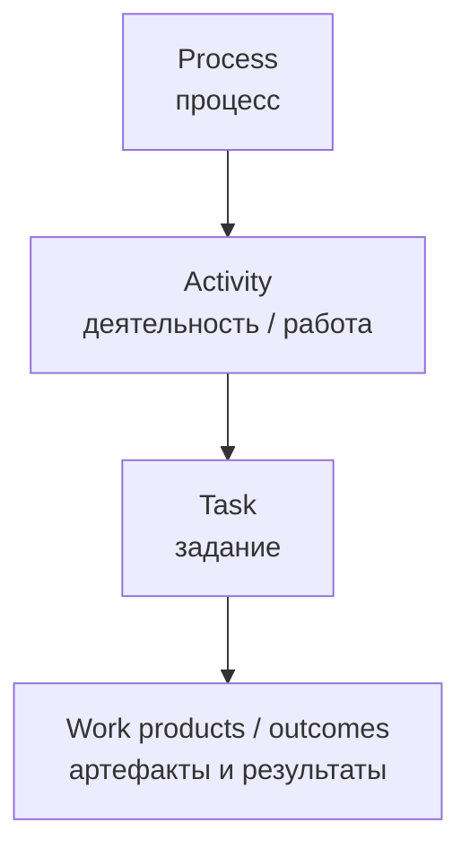
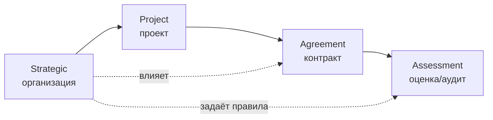
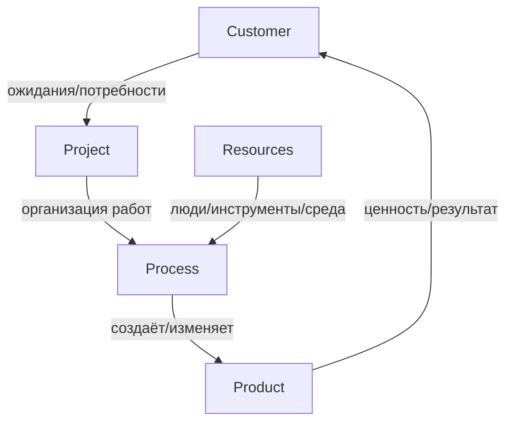
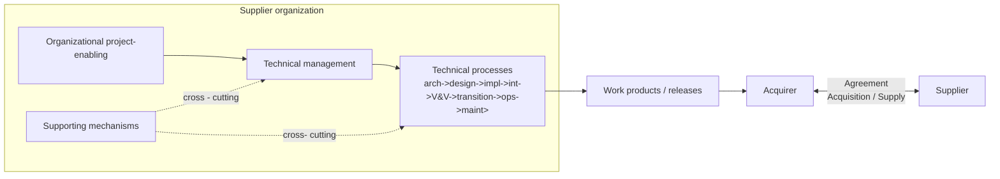
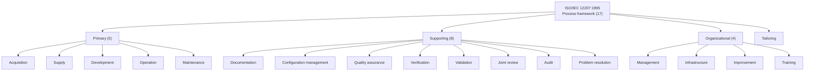
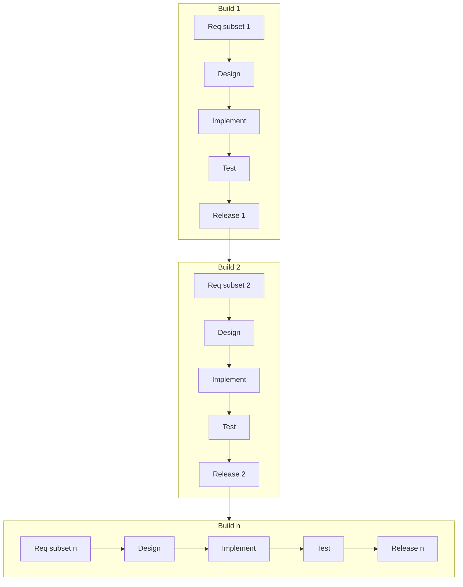
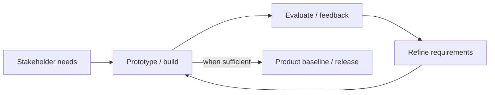
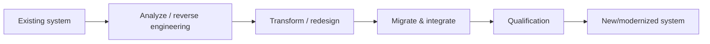
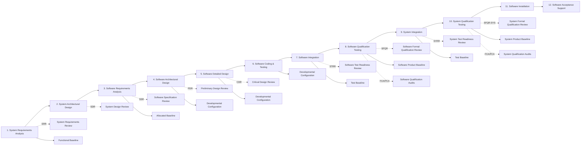
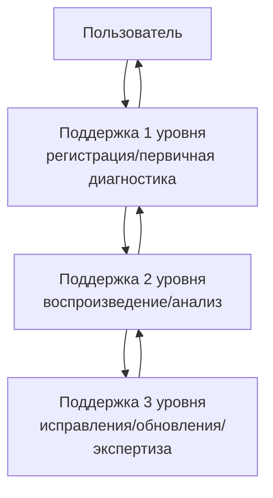

# SDLC / ISO/IEC 12207: синтез моделей, процессов, артефактов и практической адаптации

*Собранный единый документ (Markdown). Дата сборки: 2026-02-23.*

## О документе

Этот документ синтезирует несколько «точек зрения» (viewpoints) на жизненный цикл разработки и сопровождения ПО (SDLC), собранных из:

- стандартов и их производных/превью (ISO/IEC 12207:1995; ISO/IEC/IEEE 12207:2017 (полный текст: CAN/CSA-ISO/IEC/IEEE 12207:18, IDT) + Preview‑версия; IEEE/EIA 12207.2-1997);
- компактных презентаций (Croll; Laporte; Moore) — как источников ясных «каркасных» представлений;
- практического описания реализации SDLC в конкретной организации (AMS Software Lifecycle);
- конденсированного «инженерного представления» IEEE 12207 в виде 12-фазной архитектуры с артефактами/оценками/базовыми линиями (User_Provided_Summary).

### Как читать документ

- **Нормативные рамки**: ISO/IEC 12207 определяет *набор процессов* (а не «единственную правильную фазовую модель»). Процессы могут выбираться, повторяться и комбинироваться.
- **Руководства и интерпретации** (например, IEEE/EIA 12207.2-1997, ГОСТ Р ИСО/МЭК ТО 15271-2002, Rico summary) поясняют, *как применять* стандарт и как его «приземлять» на конкретные проекты.
- **Практические регламенты** (AMS) демонстрируют, как абстрактные процессы превращаются в конкретные обязанности, сервисные уровни и контрольные точки.

### Соответствие (conformance) и tailoring в 12207:2017

- В 12207:2017 требования («shall») содержатся в описаниях процессов (Clause 6) и в Annex A (Tailoring).
- Стандарт различает: **full conformance to outcomes**, **full conformance to tasks** и **tailored conformance**.
- Tailoring (Annex A) применяется только при заявлении «tailored conformance»; при заявлении «full conformance» tailoring не допускается.

### Что считается «устаревшим»

В документе явно отмечаются различия между структурами 1995/2008/2017, чтобы не переносить «как есть» старую группировку процессов в современную (гармонизированную) структуру, где программные процессы рассматриваются в контексте системной инженерии.

## Содержание

1. [Англо-русский словарь терминов](#англо-русский-словарь-терминов)
2. [Иерархия ISO/IEC 12207: процесс -> деятельность -> задание](#иерархия-isoiec-12207-процесс--деятельность--задание)
3. [Viewpoints: режимы применения и «объектный взгляд»](#viewpoints-режимы-применения-и-объектный-взгляд)
4. [Эволюция структур процессов: 1995 -> 2008 -> 2017](#эволюция-структур-процессов-1995--2008--2017)
5. [Фундаментальные модели жизненного цикла: каскад/инкремент/эволюция/реинжиниринг](#фундаментальные-модели-жизненного-цикла-каскадинкрементэволюцияреинжиниринг)
6. [12-фазная архитектура (User_Provided_Summary): артефакты, оценки, обзоры, аудиты, базовые линии, записи](#12-фазная-архитектура-user_provided_summary-артефакты-оценки-обзоры-аудиты-базовые-линии-записи)
7. [Практический взгляд: AMS SDLC и 3 уровня технической поддержки](#практический-взгляд-ams-sdlc-и-3-уровня-технической-поддержки)
8. [Приложения: аббревиатуры и справочники](#приложения-аббревиатуры-и-справочники)

## Англо-русский словарь терминов

Ниже приведён согласованный англо‑русский словарь терминов, используемых в стандартах ISO/IEC 12207 и производных материалах.  
Формулировки намеренно «нейтральные»: они фиксируют смысл термина, не навязывая одну конкретную методологию (waterfall/agile и т.п.).

| EN term                                         | RU                                                    | Трактовка (RU)                                                                                                                                                                                                                                                                                      |
|:------------------------------------------------|:------------------------------------------------------|:----------------------------------------------------------------------------------------------------------------------------------------------------------------------------------------------------------------------------------------------------------------------------------------------------|
| SDLC / Software Development Life Cycle          | ЖЦРПО / жизненный цикл разработки ПО                  | Совокупность процессов и работ по созданию, поставке, эксплуатации и сопровождению ПО на всём протяжении его жизни; в стандартах ISO/IEC 12207 описывается через процессы, виды деятельности и задания.                                                                                             |
| Software life cycle process                     | процесс жизненного цикла ПО                           | Процесс (process) стандарта, имеющий цель (purpose) и ожидаемые результаты (outcomes); может декомпозироваться до activities и tasks.                                                                                                                                                               |
| Process                                         | процесс                                               | Набор взаимосвязанных действий, трансформирующих входы в выходы (продукты/результаты), организованный для достижения цели.                                                                                                                                                                          |
| Activity                                        | деятельность / работа (вид деятельности)              | Уровень детализации внутри процесса: группировка связанных заданий; в ГОСТ/TR встречается также термин «работа (вид деятельности)».                                                                                                                                                                 |
| Task                                            | задание (task)                                        | Атомарная единица требований стандарта: то, что «делается» в рамках деятельности. Важно: задачи не обязаны быть шагами последовательности и часто являются постоянными обязанностями, а их порядок не предписан.                                                                                    |
| Work product                                    | рабочий продукт / артефакт                            | Любой документ, программный компонент или запись, создаваемые процессом/деятельностью/заданием (спецификации, планы, отчёты, код, записи проверок и т.п.).                                                                                                                                          |
| Outcome                                         | ожидаемый результат                                   | Наблюдаемое состояние/выход процесса, используемое для оценки выполнения (в новых редакциях 12207 используются purpose/outcome формулировки).                                                                                                                                                       |
| Purpose                                         | назначение / цель процесса                            | Краткое описание того, зачем процесс существует и какую ценность создаёт.                                                                                                                                                                                                                           |
| Stakeholder                                     | заинтересованная сторона                              | Лицо/организация, затронутые системой или влияющие на неё (заказчик, пользователи, поставщики, регуляторы и др.).                                                                                                                                                                                   |
| Acquirer                                        | приобретатель / заказчик                              | Сторона, приобретающая продукт/услугу у поставщика; в 12207:1995 — один из ключевых участников первичных процессов.                                                                                                                                                                                 |
| Supplier                                        | поставщик / исполнитель                               | Сторона, поставляющая продукт/услугу приобретателю; может быть разработчиком или интегратором.                                                                                                                                                                                                      |
| Developer                                       | разработчик                                           | Роль/организация, выполняющая процессы разработки (requirements->design->implementation->integration->qualification).                                                                                                                                                                               |
| Operator                                        | эксплуатирующая сторона / оператор                    | Роль, отвечающая за эксплуатацию ПО/системы в рабочей среде.                                                                                                                                                                                                                                        |
| Maintainer                                      | сопровождающая сторона / сопровождающий               | Роль, выполняющая сопровождение: анализ запросов на изменения, исправления дефектов, релизы обновлений.                                                                                                                                                                                             |
| Agreement process                               | процессы соглашений                                   | Группа процессов (в 2008/2017) для формализации отношений приобретатель–поставщик: acquisition и supply.                                                                                                                                                                                            |
| Organizational project-enabling processes       | организационные процессы, обеспечивающие проекты      | Процессы, создающие среду для проектов (управление жизненным циклом, инфраструктурой, портфелем, компетенциями, качеством и знаниями).                                                                                                                                                              |
| Technical management processes                  | процессы технического управления                      | Процессы управления на уровне проекта/технических аспектов (планирование, контроль, решения, риски, конфигурация, информация, измерения, качество).                                                                                                                                                 |
| Technical processes                             | технические процессы                                  | Процессы инженерии требований/архитектуры/дизайна/реализации/интеграции/верификации/валидации/перехода/эксплуатации/сопровождения/утилизации (2017).                                                                                                                                                |
| Supporting process                              | вспомогательный процесс                               | Процесс, поддерживающий другие процессы для управляемости и качества (напр., управление конфигурацией, качество, информация). Примечание: в 12207:1995/2008 supporting‑процессы выделялись как группа; в 12207:2017 эти функции в основном входят в Technical Management и задачи других процессов. |
| Organizational process                          | организационный процесс                               | Процесс уровня организации (управление, инфраструктура, улучшение, обучение).                                                                                                                                                                                                                       |
| Tailoring                                       | адаптация / tailoring                                 | Выбор и настройка процессов/деятельностей/заданий под проект и контекст. В 12207:2017 требования по tailoring вынесены в Annex A (normative) и применяются при заявлении «tailored conformance».                                                                                                    |
| Baseline                                        | базовая линия (конфигурации)                          | Фиксированный набор утверждённых элементов (документов/версий), служащий отправной точкой для дальнейшего изменения под управлением CM.                                                                                                                                                             |
| Functional baseline                             | функциональная базовая линия                          | Базовая линия, фиксирующая функциональные требования и условия их проверки (обычно на системном уровне требований).                                                                                                                                                                                 |
| Allocated baseline                              | распределённая (allocated) базовая линия              | Базовая линия, фиксирующая распределение системных требований по компонентам/подсистемам (архитектурный уровень).                                                                                                                                                                                   |
| Developmental configuration                     | конфигурация разработки (developmental configuration) | Контрольная точка, фиксирующая согласованное состояние проектных решений/кода (в документах Rico — устанавливается несколько раз по мере детализации).                                                                                                                                              |
| Test baseline                                   | тестовая базовая линия                                | Базовая линия, фиксирующая комплект тестов/планов/процедур для конкретного уровня интеграции/квалификации.                                                                                                                                                                                          |
| Product baseline                                | продуктовая базовая линия                             | Базовая линия, фиксирующая конфигурацию поставляемого продукта (ПО/система) перед/после квалификационных испытаний.                                                                                                                                                                                 |
| Configuration management (CM)                   | управление конфигурацией (УК)                         | Процесс поддержания целостности продуктов/изменений: идентификация КЕ, контроль изменений, учёт статусов, аудит.                                                                                                                                                                                    |
| Configuration audit                             | аудит конфигурации                                    | Проверка соответствия реализованной конфигурации утверждённым требованиям/документации (FCA/PCA).                                                                                                                                                                                                   |
| FCA / Functional Configuration Audit            | ФКА / функциональный аудит конфигурации               | Аудит соответствия функциональным требованиям (обычно: доказательство, что функции реализованы и проверены).                                                                                                                                                                                        |
| PCA / Physical Configuration Audit              | ФизКА / физический аудит конфигурации                 | Аудит соответствия физической (реальной) комплектации/версий утверждённой продуктовой конфигурации.                                                                                                                                                                                                 |
| Review                                          | обзор / ревью / формальный обзор                      | Формальная оценка артефактов/решений на контрольных точках проекта (SRR, PDR, CDR, TRR и т.д.).                                                                                                                                                                                                     |
| Walkthrough                                     | прохождение / walkthrough                             | Форма оценки, где автор «проводит» участников через продукт для выявления дефектов и достижения общего понимания.                                                                                                                                                                                   |
| Inspection                                      | инспекция / inspection                                | Более формальная проверка продукта с подготовкой и регистрацией дефектов; обычно строже, чем walkthrough.                                                                                                                                                                                           |
| Verification                                    | верификация                                           | Проверка: «сделали продукт правильно?» — соответствие реализации спецификациям и требованиям.                                                                                                                                                                                                       |
| Validation                                      | валидация                                             | Проверка: «сделали правильный продукт?» — соответствие потребностям заинтересованных сторон и назначению.                                                                                                                                                                                           |
| Quality assurance (QA)                          | обеспечение качества (ОК)                             | Набор плановых и систематических действий, дающих уверенность, что процессы и продукты соответствуют требованиям качества.                                                                                                                                                                          |
| Problem resolution                              | решение проблем / устранение дефектов                 | Процесс регистрации, анализа, устранения и контроля проблем/дефектов, включая причинно-следственный анализ.                                                                                                                                                                                         |
| Risk management                                 | управление рисками                                    | Идентификация, анализ, планирование реагирования и мониторинг рисков.                                                                                                                                                                                                                               |
| Change request                                  | запрос на изменение                                   | Формализованная заявка на изменение требований/конфигурации; основа работы сопровождения.                                                                                                                                                                                                           |
| Technical support (L1/L2/L3)                    | техническая поддержка (1/2/3 линия)                   | Организационная модель сопровождения: 1 линия — приём/триаж; 2 линия — анализ и воспроизведение; 3 линия — разработка исправлений/экспертиза и релизы.                                                                                                                                              |
| Firmware                                        | программно-аппаратные средства (firmware)             | ПО, реализованное техническими средствами; в 2017 также подчёркнуто, что стандарт охватывает программную часть firmware.                                                                                                                                                                            |
| Once-through strategy                           | одноразовая (once-through) стратегия / каскад         | Стратегия, при которой все требования определяются «сразу», а этапы выполняются последовательно; типично — «waterfall».                                                                                                                                                                             |
| Waterfall model                                 | каскадная модель                                      | Классическая линейная модель, где результаты каждой стадии являются входом следующей; применима при стабильных требованиях.                                                                                                                                                                         |
| Incremental model / planned product improvement | инкрементная модель / плановое улучшение продукта     | Разработка ведётся серией заранее спланированных сборок (builds), каждая из которых добавляет функциональность.                                                                                                                                                                                     |
| Build                                           | сборка (build)                                        | Планируемый выпуск/пакет изменений продукта (в инкрементной модели определяется заранее и оценивается по «значимой функциональности»).                                                                                                                                                              |
| Evolutionary model                              | эволюционная модель                                   | Модель, полезная при невозможности заранее полностью определить требования; продукт уточняется через последовательные итерации и обратную связь.                                                                                                                                                    |
| Reengineering model                             | модель реинжиниринга                                  | Подход, при котором создаётся новый продукт на основе (или с учётом) существующей системы: перенос функций, миграция, модернизация.                                                                                                                                                                 |
| Iteration                                       | итерация                                              | Повторяющийся цикл выполнения части работ с уточнением результата; не тождественен «инкременту», но часто используется совместно.                                                                                                                                                                   |
| Life cycle model management                     | управление моделью ЖЦ                                 | Организационный процесс выбора/поддержания применяемой модели жизненного цикла и правил её использования в проектах.                                                                                                                                                                                |
| Infrastructure management                       | управление инфраструктурой                            | Обеспечение инструментов, сред, процедур и сервисов, необходимых для выполнения работ и управления проектами.                                                                                                                                                                                       |
| Portfolio management                            | управление портфелем                                  | Управление набором проектов/инициатив на уровне организации: приоритизация, балансировка ресурсов, контроль ценности.                                                                                                                                                                               |
| Human resource management                       | управление персоналом                                 | Планирование и обеспечение компетенций: роли, обучение, назначение ресурсов, развитие квалификации.                                                                                                                                                                                                 |
| Quality management                              | управление качеством                                  | Организационные правила и цели качества, метрики и улучшение, включая взаимодействие с QA.                                                                                                                                                                                                          |
| Knowledge management                            | управление знаниями                                   | Сбор, хранение и использование знаний/уроков, баз знаний, типовых решений и практик.                                                                                                                                                                                                                |
| Project assessment and control                  | оценка и контроль проекта                             | Мониторинг статуса проекта и управление отклонениями относительно плана (сроки, стоимость, содержание, качество).                                                                                                                                                                                   |
| Decision management                             | управление решениями                                  | Формализация значимых решений: критерии, альтернативы, обоснования, протоколирование.                                                                                                                                                                                                               |
| Information management                          | управление информацией                                | Организация информационных потоков и артефактов: доступ, актуальность, хранение, публикация.                                                                                                                                                                                                        |
| Measurement                                     | измерения / метрики                                   | Определение и применение метрик для процессов и продуктов; сбор и анализ данных.                                                                                                                                                                                                                    |
| Architecture definition                         | определение архитектуры                               | Процесс выработки архитектурного решения: компоненты, интерфейсы, распределение требований, ограничения.                                                                                                                                                                                            |
| Design definition                               | определение дизайна (проектных решений)               | Детализация архитектуры до проектных решений, пригодных для реализации и тестирования.                                                                                                                                                                                                              |
| System analysis                                 | системный анализ                                      | Анализ поведения и свойств системы/ПО, включая компромиссы, ограничения и проверки согласованности.                                                                                                                                                                                                 |
| Integration                                     | интеграция / комплексирование                         | Сборка компонентов в более крупные единицы и проверка взаимодействия (software integration / system integration).                                                                                                                                                                                   |
| Transition                                      | переход (ввод в эксплуатацию)                         | Перенос продукта в целевую среду: установка, настройка, обучение, миграция, подготовка эксплуатации.                                                                                                                                                                                                |
| Disposal                                        | утилизация / вывод из эксплуатации                    | Завершение жизненного цикла: снятие с эксплуатации, архивирование, замена, утилизация компонентов и данных.                                                                                                                                                                                         |
| Reuse                                           | повторное использование                               | Использование ранее созданных активов (компонентов, требований, тестов, документации) в новых продуктах/проектах.                                                                                                                                                                                   |
| Software support                                | поддержка ПО                                          | Группа процессов (2008) для эксплуатации и сопровождения, включая приём обращений, исправления и релизы.                                                                                                                                                                                            |
| Viewpoint                                       | точка зрения (viewpoint)                              | Способ описания процессов/системы, ориентированный на конкретные интересы и аудиторию (роль, объект, контракт, оценка и т.п.).                                                                                                                                                                      |
| Process view                                    | представление процесса (process view)                 | Выбранный «срез» описания процессов, позволяющий рассматривать их под специфическим углом (например, software assurance, interface management и др.).                                                                                                                                               |

## Иерархия ISO/IEC 12207: процесс -> деятельность -> задание

### Базовая структура

Стандарт использует трёхуровневую декомпозицию:

- **Process (процесс)** — верхний уровень; описывает «что должно быть обеспечено» и ожидаемые результаты.
- **Activity (деятельность / работа)** — группировка связанных заданий в рамках процесса.
- **Task (задание)** — атомарная единица; формулируется глаголами (например, *develop, define, establish, maintain*) и может быть постоянной обязанностью.

Важное следствие: **tasks ≠ «шаги»**, и **порядок tasks обычно не предписан**. На практике их выполняют итеративно и параллельно, если это необходимо.

### Модульность и ответственность (идея «встроенных» supporting процессов)

В 12207 supporting процессы (например, конфигурационное управление или обеспечение качества) *используются* первичными/техническими процессами, но ответственность за результат остаётся у владельца основного процесса.

Практически это означает:

- если проект «использует конфигурационное управление», то это не освобождает разработку/сопровождение от обязанности вести базовые линии;
- supporting процессы — не «внешняя служба», а «механизм» внутри жизненного цикла, который может быть централизован организационно, но остаётся частью потока работ.

## Viewpoints: режимы применения и «объектный взгляд»

Материалы подчёркивают, что ISO/IEC 12207 может применяться по-разному — в зависимости от того, *кто смотрит* и *для чего*.

### 4 режима применения (Laporte, 12207:2008)

Один и тот же набор процессов может использоваться в одном или нескольких режимах:

1. **Strategic mode (организационный / стратегический)** — создание среды и правил для всех проектов.
2. **Project mode (проектный / тактический)** — управление конкретным проектом и его процессами.
3. **Agreement mode (договорной)** — формализация отношений приобретатель–поставщик.
4. **Assessment mode (оценочный)** — аудит/оценка процессов и результатов (внутренняя или внешняя).

### «Объектный взгляд» (Croll)

Для «склейки» разных описаний удобно использовать объектный взгляд: рассматривать SDLC как взаимодействие **5 сущностей**:

- **Customer** (заказчик / пользователь)
- **Project** (проект)
- **Product** (продукт)
- **Process** (процессы)
- **Resources** (ресурсы)

Такой взгляд помогает связать процессы с тем, *какие объекты они изменяют* (контракт, продукт, ресурсы) и *кто получает ценность*.

### Ролевой интерфейс «приобретатель—поставщик» и потоки работ

Многие источники (особенно 12207:1995 и учебные материалы) акцентируют **двусторонний контрактный контур**:

- *Acquirer* формирует потребность/запрос и принимает результат.
- *Supplier* планирует, разрабатывает, интегрирует и поставляет продукт, обеспечивая качество и управляемость.

Ниже — обобщённая (синтетическая) схема, показывающая, как вокруг контура «acquirer↔supplier» группируются процессы и где возникают ключевые артефакты:

> Схема намеренно *обобщённая*: она не подменяет точные требования стандарта, а помогает «склеить» ролевой и процессный взгляд.

## Эволюция структур процессов: 1995 -> 2008 -> 2017

Ниже — сравнение «каркаса» стандарта в разных редакциях/производных представлениях.  
Цель — показать *эволюцию группировки* (а не переписать все тексты стандартов).

### ISO/IEC 12207:1995 (классическая структура 17 процессов)

В редакции 1995 процессы группируются в:

- **Primary processes (5)** — отражают «основную цепочку» приобретение/поставка/разработка/эксплуатация/сопровождение.
- **Supporting processes (8)** — обеспечивают качество и управляемость (документация, CM, QA, V&V, обзоры и т.п.).
- **Organizational processes (4)** — процессы уровня организации (управление, инфраструктура, улучшение, обучение).
- **Tailoring** — правила адаптации.

| Group (1995)             | Process                                                            |
|:-------------------------|:-------------------------------------------------------------------|
| Primary processes        | Acquisition                                                        |
| Primary processes        | Supply                                                             |
| Primary processes        | Development                                                        |
| Primary processes        | Operation                                                          |
| Primary processes        | Maintenance                                                        |
| Supporting processes     | Documentation                                                      |
| Supporting processes     | Configuration management                                           |
| Supporting processes     | Quality assurance                                                  |
| Supporting processes     | Verification                                                       |
| Supporting processes     | Validation                                                         |
| Supporting processes     | Joint review                                                       |
| Supporting processes     | Audit                                                              |
| Supporting processes     | Problem resolution                                                 |
| Organizational processes | Management                                                         |
| Organizational processes | Infrastructure                                                     |
| Organizational processes | Improvement                                                        |
| Organizational processes | Training                                                           |
| Tailoring                | Tailoring (selection and adaptation of processes/activities/tasks) |

### IEEE Std 12207:2008 (Laporte, «гармонизация» с системной инженерией)

В 2008 структура групп процессов меняется: появляются **Agreement / Organizational Project‑Enabling / Project / Technical**  
и отдельно выделяются **Software Implementation / Software Support / Software Reuse**.

| Process group (2008)            |
|:--------------------------------|
| Agreement                       |
| Organizational Project-Enabling |
| Project                         |
| Technical                       |
| Software Implementation         |
| Software Support                |
| Software Reuse                  |

Ключевой смысл (в презентации Laporte) — **стратегия гармонизации** программных процессов с системными, чтобы software не описывалось «в изоляции».

### ISO/IEC/IEEE 12207:2017 (CAN/CSA-ISO/IEC/IEEE 12207:18, IDT): 4 группы процессов и системный контекст

В редакции 2017 (ISO/IEC/IEEE 12207:2017; CAN/CSA-ISO/IEC/IEEE 12207:18, IDT) используется группировка:

- Agreement processes
- Organizational project‑enabling processes
- Technical management processes
- Technical processes

и перечень процессов внутри групп (см. Clause 5.6.1 / Figure 4):

| Group                                     | Clause | Process                                               |
|:------------------------------------------|:-------|:------------------------------------------------------|
| Agreement processes                       | 6.1.1  | Acquisition process                                   |
| Agreement processes                       | 6.1.2  | Supply process                                        |
| Organizational project-enabling processes | 6.2.1  | Life cycle model management process                   |
| Organizational project-enabling processes | 6.2.2  | Infrastructure Management process                     |
| Organizational project-enabling processes | 6.2.3  | Portfolio Management process                          |
| Organizational project-enabling processes | 6.2.4  | Human Resource Management process                     |
| Organizational project-enabling processes | 6.2.5  | Quality Management process                            |
| Organizational project-enabling processes | 6.2.6  | Knowledge Management process                          |
| Technical management processes            | 6.3.1  | Project Planning process                              |
| Technical management processes            | 6.3.2  | Project assessment and control process                |
| Technical management processes            | 6.3.3  | Decision Management process                           |
| Technical management processes            | 6.3.4  | Risk Management process                               |
| Technical management processes            | 6.3.5  | Configuration Management process                      |
| Technical management processes            | 6.3.6  | Information Management process                        |
| Technical management processes            | 6.3.7  | Measurement process                                   |
| Technical management processes            | 6.3.8  | Quality Assurance process                             |
| Technical processes                       | 6.4.1  | Business or Mission Analysis process                  |
| Technical processes                       | 6.4.2  | Stakeholder Needs and Requirements Definition process |
| Technical processes                       | 6.4.3  | System/Software requirements definition process       |
| Technical processes                       | 6.4.4  | Architecture Definition process                       |
| Technical processes                       | 6.4.5  | Design Definition process                             |
| Technical processes                       | 6.4.6  | System Analysis process                               |
| Technical processes                       | 6.4.7  | Implementation process                                |
| Technical processes                       | 6.4.8  | Integration process                                   |
| Technical processes                       | 6.4.9  | Verification process                                  |
| Technical processes                       | 6.4.10 | Transition process                                    |
| Technical processes                       | 6.4.11 | Validation process                                    |
| Technical processes                       | 6.4.12 | Operation process                                     |
| Technical processes                       | 6.4.13 | Maintenance process                                   |
| Technical processes                       | 6.4.14 | Disposal process                                      |

Дополнительно, 2017 включает:

- **Operation, Maintenance, Disposal** как технические процессы жизненного цикла (вместе с инженерией требований/архитектуры/перехода).
- Приложения включают **Annex A (Tailoring, normative)** и **Annex B–I (informative)**, включая Agile (Annex H) и process mapping (Annex I).

### Сводное сравнение «что куда переехало»

| 1995 (группа)                                | 2017 (куда «естественно» маппится по смыслу)          | Комментарий                                                                                                                                                                    |
|----------------------------------------------|-------------------------------------------------------|--------------------------------------------------------------------------------------------------------------------------------------------------------------------------------|
| Primary: Acquisition/Supply                  | Agreement processes                                   | Сохранены как процессы соглашений.                                                                                                                                             |
| Primary: Development                         | Technical processes + Technical management            | Development «распакован» в набор технических процессов (requirements->architecture->design->implementation->integration->verification/validation->transition) плюс управление. |
| Primary: Operation/Maintenance               | Technical processes                                   | В 2017 они остаются, но как часть «технических процессов» (в одном списке с интеграцией, верификацией и т.п.).                                                                 |
| Supporting (CM, QA, Reviews, Audit, etc.)    | Technical management + (частично) Technical processes | Например, конфигурационное управление и качество в 2017 явно включены как процессы управления; verification/validation — как технические процессы.                             |
| Organizational (Mgmt/Infra/Improve/Training) | Organizational project‑enabling processes             | Расширены и детализированы (портфель, HR, знания и др.).                                                                                                                       |

> Важно: таблица — **синтетическая** (по названиям процессов и общему смыслу), а не «официальная карта соответствий». Для официального мэппинга 2017 <-> 2008 см. Annex I (Table I.1 и I.2). Мэппинг с 1995 в этой таблице остаётся синтетическим.

## Фундаментальные модели жизненного цикла: каскад/инкремент/эволюция/реинжиниринг

ISO/IEC 12207 не привязан к одной модели разработки: процессы могут применяться внутри разных стратегий.  
Руководства (ГОСТ Р ИСО/МЭК ТО 15271‑2002 и IEEE/EIA 12207.2‑1997) описывают типовые модели как **стратегии применения**.

### Обобщающая таблица

| Модель                                                   | Суть                                                                            | Когда применять                                                         | Типовые преимущества                                        | Типовые риски/ограничения                                |
|----------------------------------------------------------|---------------------------------------------------------------------------------|-------------------------------------------------------------------------|-------------------------------------------------------------|----------------------------------------------------------|
| Каскадная (Waterfall / once-through)                     | Линейное прохождение стадий при максимально ранней фиксации требований          | Требования стабильны; цена изменений высока; нужна строгая документация | Простая управляемость; понятные контрольные точки           | Плохо переносит изменения; позднее обнаружение проблем   |
| Инкрементная (Incremental / planned product improvement) | Серия заранее спланированных сборок (builds), каждая добавляет функциональность | Можно выделить «значимые» инкременты; требуется ранняя полезность       | Ранние поставки; контролируемое наращивание                 | Требует дисциплины интеграции и управления конфигурацией |
| Эволюционная (Evolutionary)                              | Требования уточняются по мере развития продукта; итерации и обратная связь      | Требования не могут быть известны заранее; нужен быстрый фидбек         | Лучше адаптируется к неопределённости; раннее уточнение     | Риск расползания требований; сложнее планировать         |
| Реинжиниринг (Reengineering)                             | Создание/обновление продукта на базе существующей системы                       | Есть legacy; нужна миграция/модернизация; важно сохранить функции       | Использование существующих активов; снижение риска «с нуля» | Сложность анализа текущего состояния и зависимостей      |

### Mermaid‑шаблоны моделей (упрощённые)

#### Каскад (waterfall)

#### Инкрементная модель

#### Эволюционная модель (итерации + обратная связь)

#### Реинжиниринг

> Диаграммы отражают *паттерны применения процессов*, а не структуру процессов стандарта: сами процессы (V&V, CM, QA, reviews и т.п.) могут «проходить через» любую модель.

## 12-фазная архитектура (User_Provided_Summary): артефакты, оценки, обзоры, аудиты, базовые линии, записи

User_Provided_Summary описывает «фазовый» взгляд на IEEE 12207 в виде **12 фаз** и даёт компактную «матрицу управления» жизненным циклом:

- **Фазы:** 12
- **Рабочие продукты (products):** 35 (распределены по фазам)
- **Оценки (evaluations):** 62 (= 31 walkthrough + 31 inspection)
- **Записи (records):** 17
- **Аудиты:** 4 (FCA/PCA на уровнях software qualification и system qualification)
- **Обзоры (reviews):** 9
- **Базовые линии (baselines):** 9 (включая 3 раза «developmental configuration»)

Этот раздел фиксирует данные **точно в том виде**, как они представлены в таблицах документа, и переупаковывает их в удобные мастер‑таблицы.

### 12 фаз (перечень)

1) System Requirements Analysis
2) System Architectural Design
3) Software Requirements Analysis
4) Software Architectural Design
5) Software Detailed Design
6) Software Coding and Testing
7) Software Integration
8) Software Qualification Testing
9) System Integration
10) System Qualification Testing
11) Software Installation
12) Software Acceptance Support

### Сводная мастер-таблица по фазам (оценки/обзоры/базовые линии/записи)

|  № | Фаза (phase)                   | Walkthru (шт.) | Inspection (шт.) | Аудит (шт.) | Обзор/Review (gate)                  | Базовая линия/Baseline      | Записи/Records        |
|---:|:-------------------------------|---------------:|-----------------:|------------:|:-------------------------------------|:----------------------------|:----------------------|
|  1 | System Requirements Analysis   |              1 |                1 |           0 | System Requirements Review           | Functional Baseline         | SYRER                 |
|  2 | System Architectural Design    |              1 |                1 |           0 | System Design Review                 |                             | SYAER                 |
|  3 | Software Requirements Analysis |              1 |                1 |           0 | Software Specification Review        | Allocated Baseline          | SORER                 |
|  4 | Software Architectural Design  |              5 |                5 |           0 | Preliminary Design Review            | Developmental Configuration | SOAER                 |
|  5 | Software Detailed Design       |              6 |                6 |           0 | Critical Design Review               | Developmental Configuration | DDER                  |
|  6 | Software Coding and Testing    |              5 |                5 |           0 |                                      | Developmental Configuration | EOCR SCTRER SCR |
|  7 | Software Integration           |              4 |                4 |           0 | Software Test Readiness Review       | Test Baseline (Soft-Int)    | SIER                  |
|  8 | Software Qualification Testing |              2 |                2 |           2 | Software Formal Qualification Review | Software Product Baseline   | DER SCR            |
|  9 | System Integration             |              2 |                2 |           0 | System Test Readiness Review         | Test Baseline (Sys-Int)     | SQTER                 |
| 10 | System Qualification Testing   |              1 |                1 |           2 | System Formal Qualification Review   | System Product Baseline     | SCR SER SQTARR  |
| 11 | Software Installation          |              1 |                1 |           0 |                                      |                             | SIRR                  |
| 12 | Software Acceptance Support    |              2 |                2 |           0 |                                      |                             | SCR                   |

### Рабочие продукты по фазам (products)

|  № | Фаза                           | Рабочие продукты (products)                                                                                    |
|---:|:-------------------------------|:---------------------------------------------------------------------------------------------------------------|
|  1 | System Requirements Analysis   | SRS                                                                                                            |
|  2 | System Architectural Design    | SARAD                                                                                                          |
|  3 | Software Requirements Analysis | SRD                                                                                                            |
|  4 | Software Architectural Design  | SAD SIDD (Top-Level) DDD (Top-Level) UDD (Preliminary) TVPL (Soft-Int)                             |
|  5 | Software Detailed Design       | SDD SIDD (Detailed) DDD (Detailed) UDD (Update) TVPL (Soft-Unit) TVPL (Soft-Int-Update)         |
|  6 | Software Coding and Testing    | Software Unit/Database TVPR (Soft/DB-Unit) TVRR (Soft/DB-Unit) UDD (Update) TVPL (Soft-Int-Update) |
|  7 | Software Integration           | SOIP TVRR (Soft-Int) UDD (Update) TVPR (Soft-Qual)                                                    |
|  8 | Software Qualification Testing | TVRR (Soft-Qual) UDD (Update) SIAR (Soft-Qual-FCA) SIAR (Soft-Qual-PCA)                               |
|  9 | System Integration             | TVRR (Sys-Int) TVPR (Sys-Qual)                                                                              |
| 10 | System Qualification Testing   | TVRR (Sys-Qual) SIAR (Sys-Qual-FCA) SIAR (Sys-Qual-PCA)                                                  |
| 11 | Software Installation          | SIP                                                                                                            |
| 12 | Software Acceptance Support    | TVRR (Soft-Acc) Software Training                                                                           |

### Обзоры (Reviews): что и где ревьюится

| Review                               | Фаза                           | Артефакты                                                                                                                                        |
|:-------------------------------------|:-------------------------------|:-------------------------------------------------------------------------------------------------------------------------------------------------|
| System Requirements Review           | System Requirements Analysis   | SRS Review                                                                                                                                       |
| System Design Review                 | System Architectural Design    | SARAD Review                                                                                                                                     |
| Software Specification Review        | Software Requirements Analysis | SRD Review                                                                                                                                       |
| Preliminary Design Review            | Software Architectural Design  | SAD Review SIDD (Top-Level) Review DDD (Top-Level) Review UDD (Preliminary) Review TVPL (Soft-Int) Review                            |
| Critical Design Review               | Software Detailed Design       | SDD Review SIDD (Detailed) Review DDD (Detailed) Review UDD (Update) Review TVPL (Soft-Unit) Review TVPL (Soft-Int-Update) Review |
| Software Test Readiness Review       | Software Integration           | SOIP Review TVRR (Soft-Int) Review UDD (Update) Review TVPR (Soft-Qual) Review                                                          |
| Software Formal Qualification Review | Software Qualification Testing | TVRR (Qualification) Review UDD (Update) Review SIAR (Soft-Qual-FCA) Review SIAR (Soft-Qual-PCA) Review                                 |
| System Test Readiness Review         | System Integration             | TVRR (Sys-Int) Review TVPR (Sys-Qual) Review                                                                                                  |
| System Formal Qualification Review   | System Qualification Testing   | TVRR (Sys-Qual) Review SIAR (Sys-Qual-FCA) Review SIAR (Sys-Qual-PCA) Review                                                               |

### Аудиты конфигурации (Audits): FCA/PCA и отчёты SIAR

| Audit group                  | Фаза                           | Выходной артефакт    |
|:-----------------------------|:-------------------------------|:---------------------|
| Software Qualification Audit | Software Qualification Testing | SIAR (Soft-Qual-FCA) |
| Software Qualification Audit | Software Qualification Testing | SIAR (Soft-Qual-PCA) |
| System Qualification Audit   | System Qualification Testing   | SIAR (Sys-Qual-FCA)  |
| System Qualification Audit   | System Qualification Testing   | SIAR (Sys-Qual-PCA)  |

### Базовые линии (Baselines): точки фиксации конфигурации

| Baseline/Configuration item | Фаза                           |
|:----------------------------|:-------------------------------|
| Functional Baseline         | System Requirements Analysis   |
| Allocated Baseline          | Software Requirements Analysis |
| Developmental Configuration | Software Architectural Design  |
| Developmental Configuration | Software Detailed Design       |
| Developmental Configuration | Software Coding and Testing    |
| Test Baseline (Soft-Int)    | Software Integration           |
| Software Product Baseline   | Software Qualification Testing |
| Test Baseline (Sys-Int)     | System Integration             |
| System Product Baseline     | System Qualification Testing   |

#### Определения базовых линий (по User_Provided_Summary)

Ниже — краткое изложение определений базовых линий из документа.

- **Functional Baseline**: устанавливается на уровне системных требований; фиксирует системные требования, условия тестирования и документацию.
- **Allocated Baseline**: устанавливается на уровне архитектуры; фиксирует системные требования, распределённые на конфигурационные единицы, интерфейсы и документацию.
- **Developmental Configuration**: устанавливается при достижении консенсуса по конфигурационной единице; фиксирует design, code, тестовые требования и документацию.
- **Test Baseline**: устанавливается на уровнях software integration и system integration; фиксирует тестовые требования и документацию для соответствующего уровня.
- **Product Baseline (Software/System)**: устанавливается на уровнях квалификационных испытаний; фиксирует фактическую product configuration (включая design/code/test docs и др.).

> В 12‑фазной архитектуре **Developmental Configuration** фигурирует трижды — как повторяемая точка фиксации в ходе детализации.

### Оценки (Evaluations): walkthrough и inspection

User_Provided_Summary использует два типа оценок артефактов:

- **Walkthrough (31)** — прохождение продукта с участниками, чтобы найти дефекты и подтвердить общую интерпретацию требований.
- **Inspection (31)** — формальная проверка продукта (часто строже walkthrough), ориентированная на выявление дефектов и соответствие требованиям.

Практически оба типа оценок применяются к ключевым артефактам требований, архитектуры, дизайна и тестов на протяжении всего жизненного цикла.

### Записи (Records): распределение по фазам

| Фаза                           | Record |
|:-------------------------------|:-------|
| System Requirements Analysis   | SYRER  |
| System Architectural Design    | SYAER  |
| Software Requirements Analysis | SORER  |
| Software Architectural Design  | SOAER  |
| Software Detailed Design       | DDER   |
| Software Coding and Testing    | EOCR   |
| Software Coding and Testing    | SCTRER |
| Software Coding and Testing    | SCR    |
| Software Integration           | SIER   |
| Software Qualification Testing | DER    |
| Software Qualification Testing | SCR    |
| System Integration             | SQTER  |
| System Qualification Testing   | SCR    |
| System Qualification Testing   | SER    |
| System Qualification Testing   | SQTARR |
| Software Installation          | SIRR   |
| Software Acceptance Support    | SCR    |

### Детализация по фазам (как в User_Provided_Summary)

### 1. System Requirements Analysis

**Development / рабочие продукты**

- SRS

**Evaluation / оценки**

- **System Requirements Walkthru**
   - SRS Walkthru
- **System Requirements Inspection**
   - SRS Inspection

**Review / обзоры, базовые линии и контрольные точки**

- **System Requirements Review**
   - SRS Review
- **Baselines / базовые линии**
   - Functional Baseline

**Records / записи**

- SYRER

### 2. System Architectural Design

**Development / рабочие продукты**

- SARAD

**Evaluation / оценки**

- **System Architecture Walkthru**
   - SARAD Walkthru
- **System Architecture Inspection**
   - SARAD Inspection

**Review / обзоры, базовые линии и контрольные точки**

- **System Design Review**
   - SARAD Review

**Records / записи**

- SYAER

### 3. Software Requirements Analysis

**Development / рабочие продукты**

- SRD

**Evaluation / оценки**

- **Software Requirements Walkthru**
   - SRD Walkthru
- **Software Requirements Inspection**
   - SRD Inspection

**Review / обзоры, базовые линии и контрольные точки**

- **Software Specification Review**
   - SRD Review
- **Baselines / базовые линии**
   - Allocated Baseline

**Records / записи**

- SORER

### 4. Software Architectural Design

**Development / рабочие продукты**

- SAD
- SIDD (Top-Level)
- DDD (Top-Level)
- UDD (Preliminary)
- TVPL (Soft-Int)

**Evaluation / оценки**

- **Software Architecture Walkthru**
   - SAD Walkthru
   - SIDD (Top-Level) Walkthru
   - DDD (Top-Level) Walkthru
   - UDD (Preliminary) Walkthru
   - TVPL (Soft-Int) Walkthru
- **Software Architecture Inspection**
   - SAD Inspection
   - SIDD (Top-Level) Inspection
   - DDD (Top-Level) Inspection
   - UDD (Preliminary) Inspection
   - TVPL (Soft-Int) Inspection

**Review / обзоры, базовые линии и контрольные точки**

- **Preliminary Design Review**
   - SAD Review
   - SIDD (Top-Level) Review
   - DDD (Top-Level) Review
   - UDD (Preliminary) Review
   - TVPL (Soft-Int) Review
- **Baselines / базовые линии**
   - Developmental Configuration

**Records / записи**

- SOAER

### 5. Software Detailed Design

**Development / рабочие продукты**

- SDD
- SIDD (Detailed)
- DDD (Detailed)
- UDD (Update)
- TVPL (Soft-Unit)
- TVPL (Soft-Int-Update)

**Evaluation / оценки**

- **Software Design Walkthru**
   - SDD Walkthru
   - SIDD (Detailed) Walkthru
   - DDD (Detailed) Walkthru
   - UDD (Update) Walkthru
   - TVPL (Soft-Unit) Walkthru
   - TVPL (Soft-Int-Update) Walkthru
- **Software Design Inspection**
   - SDD Inspection
   - SIDD (Detailed) Inspection
   - DDD (Detailed) Inspection
   - UDD (Update) Inspection
   - TVPL (Soft-Unit) Inspection
   - TVPL (Soft-Int-Update) Inspection

**Review / обзоры, базовые линии и контрольные точки**

- **Critical Design Review**
   - SDD Review
   - SIDD (Detailed) Review
   - DDD (Detailed) Review
   - UDD (Update) Review
   - TVPL (Soft-Unit) Review
   - TVPL (Soft-Int-Update) Review
- **Baselines / базовые линии**
   - Developmental Configuration

**Records / записи**

- DDER

### 6. Software Coding and Testing

**Development / рабочие продукты**

- Software Unit/Database
- TVPR (Soft/DB-Unit)
- TVRR (Soft/DB-Unit)
- UDD (Update)
- TVPL (Soft-Int-Update)

**Evaluation / оценки**

- **Software Coding and Testing Walkthru**
   - Software Unit/Database Walkthru
   - TVPR (Soft/DB-Unit) Walkthru
   - TVRR (Soft/DB-Unit) Walkthru
   - UDD (Update) Walkthru
   - TVPL (Soft-Int-Update) Walkthru
- **Software Coding and Testing Inspection**
   - Software Unit/Database Inspection
   - TVPR (Soft/DB-Unit) Inspection
   - TVRR (Soft/DB-Unit) Inspection
   - UDD (Update) Inspection
   - TVPL (Soft-Int-Update) Inspection

**Review / обзоры, базовые линии и контрольные точки**

- **Baselines / базовые линии**
   - Developmental Configuration

**Records / записи**

- EOCR
- SCTRER
- SCR

### 7. Software Integration

**Development / рабочие продукты**

- SOIP
- TVRR (Soft-Int)
- UDD (Update)
- TVPR (Soft-Qual)

**Evaluation / оценки**

- **Software Integration Walkthru**
   - SOIP Walkthru
   - TVRR (Soft-Int) Walkthru
   - UDD (Update) Walkthru
   - TVPR (Soft-Qual) Walkthru
- **Software Integration Inspection**
   - SOIP Inspection
   - TVRR (Soft-Int) Inspection
   - UDD (Update) Inspection
   - TVPR (Soft-Qual) Inspection

**Review / обзоры, базовые линии и контрольные точки**

- **Software Test Readiness Review**
   - SOIP Review
   - TVRR (Soft-Int) Review
   - UDD (Update) Review
   - TVPR (Soft-Qual) Review
- **Baselines / базовые линии**
   - Test Baseline (Soft-Int)

**Records / записи**

- SIER

### 8. Software Qualification Testing

**Development / рабочие продукты**

- TVRR (Soft-Qual)
- UDD (Update)

**Evaluation / оценки**

- **Software Qualification Walkthru**
   - TVRR (Soft-Qual) Walkthru
   - UDD (Update) Walkthru
- **Software Qualification Inspection**
   - TVRR (Soft-Qual) Inspection
   - UDD (Update) Inspection
- **Software Qualification Audit**
   - SIAR (Soft-Qual-FCA)
   - SIAR (Soft-Qual-PCA)

**Review / обзоры, базовые линии и контрольные точки**

- **Software Formal Qualification Review**
   - TVRR (Qualification) Review
   - UDD (Update) Review
   - SIAR (Soft-Qual-FCA) Review
   - SIAR (Soft-Qual-PCA) Review
- **Baselines / базовые линии**
   - Software Product Baseline

**Records / записи**

- DER
- SCR

### 9. System Integration

**Development / рабочие продукты**

- TVRR (Sys-Int)
- TVPR (Sys-Qual)

**Evaluation / оценки**

- **System Integration Walkthru**
   - TVRR (Sys-Int) Walkthru
   - TVPR (Sys-Qual) Walkthru
- **System Integration Inspection**
   - TVRR (Sys-Int) Inspection
   - TVPR (Sys-Qual) Inspection

**Review / обзоры, базовые линии и контрольные точки**

- **System Test Readiness Review**
   - TVRR (Sys-Int) Review
   - TVPR (Sys-Qual) Review
- **Baselines / базовые линии**
   - Test Baseline (Sys-Int)

**Records / записи**

- SQTER

### 10. System Qualification Testing

**Development / рабочие продукты**

- TVRR (Sys-Qual)

**Evaluation / оценки**

- **System Qualification Walkthru**
   - TVRR (Sys-Qual) Walkthru
- **System Qualification Inspection**
   - TVRR (Sys-Qual) Inspection
- **System Qualification Audit**
   - SIAR (Sys-Qual-FCA)
   - SIAR (Sys-Qual-PCA)

**Review / обзоры, базовые линии и контрольные точки**

- **System Formal Qualification Review**
   - TVRR (Sys-Qual) Review
   - SIAR (Sys-Qual-FCA) Review
   - SIAR (Sys-Qual-PCA) Review
- **Baselines / базовые линии**
   - System Product Baseline

**Records / записи**

- SCR
- SER
- SQTARR

### 11. Software Installation

**Development / рабочие продукты**

- SIP

**Evaluation / оценки**

- **Software Installation Walkthru**
   - SIP Walkthru
- **Software Installation Inspection**
   - SIP Inspection

**Review / обзоры, базовые линии и контрольные точки**

- **Milestones / контрольные точки**
   - Software Installation

**Records / записи**

- SIRR

### 12. Software Acceptance Support

**Development / рабочие продукты**

- TVRR (Soft-Acc)
- Software Training

**Evaluation / оценки**

- **Software Acceptance Walkthru**
   - TVRR (Soft-Acc) Walkthru
   - Software Training Walkthru
- **Software Acceptance Inspection**
   - TVRR (Soft-Acc) Inspection
   - Software Training Inspection

**Review / обзоры, базовые линии и контрольные точки**

- **Milestones / контрольные точки**
   - Software Delivery

**Records / записи**

- SCR

### Диаграмма потока 12 фаз с контрольными точками (Mermaid)

> Диаграмма отражает **интерпретацию** IEEE 12207 в виде 12 фаз из User_Provided_Summary (это отдельный viewpoint).

## Практический взгляд: AMS SDLC и 3 уровня технической поддержки

AMS_Software_Lifecycle_GetLab показывает, как требования стандартов «приземляются» в регламент компании:  
добавляются роли, фиксируются входы/выходы, описывается сервисная часть эксплуатации.

### 3 уровня технической поддержки

В документе AMS выделены три уровня поддержки:

- **1-й уровень**: приём обращений, регистрация инцидентов, первичная диагностика; подготовка заявки на 2-й уровень.
- **2-й уровень**: воспроизведение ошибок, углублённый анализ, подготовка заявок на 3-й уровень; взаимодействие с пользователем по уточнениям.
- **3-й уровень**: разработка исправлений/обновлений, сложная экспертиза; в том числе возможны выезды на объект и установка обновлений.

### Сопровождение как продолжение SDLC

В AMS сопровождение явно связано с процессами:

- анализ модификаций;
- управление конфигурацией;
- верификация/валидация изменений;
- аудиты и ревизии;
- вывод ПО из использования (прекращение применения).

Это полезно как практическая «проекция» процессов 12207 на эксплуатацию: сопровождение не «после разработки», а часть жизненного цикла с собственными артефактами и контрольными точками.

## Приложения: аббревиатуры и справочники

### A. Рабочие продукты (аббревиатуры) из User_Provided_Summary

| Type          | Acronym | Full name                                                   |
|:--------------|:--------|:------------------------------------------------------------|
| Plan          | SIP     | Software Installation Plan                                  |
| Plan          | SOIP    | Software Integration Plan                                   |
| Plan          | TVPL    | Test or Validation Plan                                     |
| Specification | SRS     | System Requirements Specification                           |
| Description   | DDD     | Database Design Description                                 |
| Description   | SAD     | Software Architecture Description                           |
| Description   | SARAD   | System Architecture and Requirements Allocation Description |
| Description   | SDD     | Software Design Description                                 |
| Description   | SIDD    | Software Interface Design Description                       |
| Description   | SRD     | Software Requirements Description                           |
| Description   | UDD     | User Documentation Description                              |
| Procedure     | TVPR    | Test or Validation Procedures                               |
| Report        | SIAR    | Software Integration Audit Report                           |
| Report        | TVRR    | Test or Validation Results Report                           |

### B. Аудиты (аббревиатуры)

| Type   | Acronym | Full name                      |
|:-------|:--------|:-------------------------------|
| Audits | FCA     | Functional Configuration Audit |
| Audits | PCA     | Physical Configuration Audit   |

### C. Записи (Records) — типы

| Type   | Acronym | Full name                                        |
|:-------|:--------|:-------------------------------------------------|
| Record | DDER    | Detailed Design Evaluation Record                |
| Record | DER     | Documentation Evaluation Record                  |
| Record | EOCR    | Executable Object Code Record                    |
| Record | SCR     | Source Code Record                               |
| Record | SCTRER  | Software Code and Test Results Evaluation Record |
| Record | SER     | System Evaluation Record                         |
| Record | SIER    | Software Integration Evaluation Record           |
| Record | SIRR    | Software Installation Results Record             |
| Record | SOAER   | Software Architecture Evaluation Record          |
| Record | SORER   | Software Requirements Evaluation Record          |
| Record | SQTARR  | System Qualification Test Audit Results Record   |
| Record | SQTER   | System Qualification Test Evaluation Record      |
| Record | SYAER   | System Architecture Evaluation Record            |
| Record | SYRER   | System Requirements Evaluation Record            |

### D. Символы/контексты (например, уровни тестов)

| Type    | Acronym | Full name                               |
|:--------|:--------|:----------------------------------------|
| Symbols | (t)     | Top-Level                               |
| Symbols | (p)     | Preliminary                             |
| Symbols | (si)    | Software Integration                    |
| Symbols | (d)     | Detailed                                |
| Symbols | (u)     | Update                                  |
| Symbols | (su)    | Software Unit                           |
| Symbols | (siu)   | Software Integration Update             |
| Symbols | (sq)    | Software Qualification                  |
| Symbols | (sfc)   | Software Functional Configuration Audit |
| Symbols | (spc)   | Software Physical Configuration Audit   |
| Symbols | (yi)    | System Integration                      |
| Symbols | (yq)    | System Qualification                    |
| Symbols | (yfc)   | System Functional Configuration Audit   |
| Symbols | (ypc)   | System Physical Configuration Audit     |
| Symbols | (sa)    | Software Acceptance                     |

### E. Источники (использованные файлы)

- User_Provided_Summary.pdf
- BSI_ISO-IEC-IEEE_12207_2017_Preview_ANSI.pdf
- CAN_CSA_ISO_IEC_IEEE_12207-18.md
- international-standard-iso-iec-12207-software-life-cycle-2vke9fu8gz.pdf
- IEEE_Std_12207_ETS_MTL_Laporte.pdf
- An_Overview_of_IEEE_Software_Engineering_Standards_Croll.pdf
- A3-2_IEEE-EIA-12207_Unit2_JamesWMoore.pdf
- IEEE-EIA_12207.2-1997_Implementation_Considerations.pdf
- GOST_R_ISO-IEC_12207_Meganorm_6430.pdf
- AMS_Software_Lifecycle_GetLab.pdf
