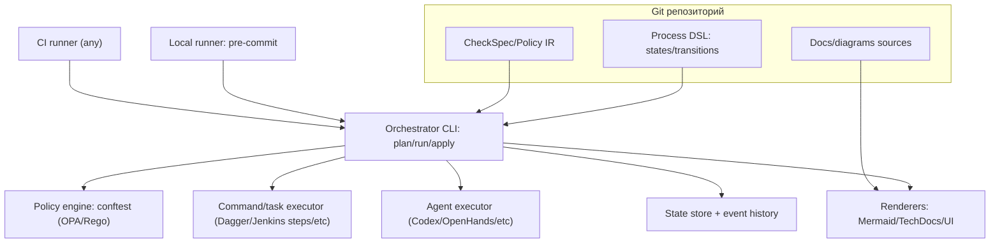
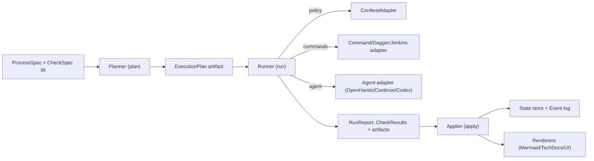

# OSS экосистема для SDLC‑оркестрации в репозитории и агентного development workflow

## Резюме

На рынке почти нет **одного** open‑source инструмента, который «из коробки» полностью закрывает вашу целевую архитектуру целиком: **Process DSL (states/transitions) + Policy/Checks + Triggers/Runners + Executors + State store/history + Renderers**. На практике «закрывается» это либо **оркестратором выполнения (workflow engine)** с долговременной историей, либо **CI/merge‑gating платформой**, а всё остальное добирается адаптерами и договорённостями по формату спецификаций (ваш будущий DSL/IR). citeturn13view0turn25search3turn15search11turn30search0

Если цель — **plan/run/apply** с воспроизводимостью и полноценной историей событий *как у инфраструктурного GitOps/plan‑apply*, то «самый близкий к идеалу» фундамент дают:
- **Temporal** как «currency» для долговременных workflow с event history, запросами/сигналами, UI и плагинностью. citeturn25search0turn25search1turn25search2turn25search5  
- Либо Kubernetes‑стек **Tekton Pipelines + Triggers + Results** как «DSL+triggers+execution+long‑term history» в k8s‑нативной форме. citeturn31search2turn31search3turn34search0

Если цель — **минимум самописного кода** и быстрый «боевой» запуск с привычной CI‑моделью, то наиболее прагматичный фундамент:
- **Jenkins (Pipeline as Code) + OPA/Conftest + pre-commit**, где ваш DSL сначала может быть «компилятором» в Jenkinsfile/шаги пайплайна, а state/history жить в артефактах/БД/логах плюс CI‑UI. citeturn30search0turn30search1turn30search10turn29search0turn29search3

Для «agent‑driven» слоя (Codex/LLM‑агент как исполнитель) наиболее близкие OSS‑кандидаты сегодня: **OpenHands** (SDK + GitHub Action + event‑log подход) и **Continue** (source‑controlled AI checks в репозитории). Но у обоих заметная доля value завязана на «control plane / hosted интеграции», поэтому их разумнее проектировать как **плагины‑исполнители**/интеграции поверх вашего DSL, а не как единственный фундамент. citeturn32search2turn32search0turn32search5turn26search4turn27search8turn26search6

## Требования к системе и целевая архитектура

Ваша целевая система (в терминах слоёв) хорошо раскладывается на 6 компонент:

- **Process DSL**: граф состояний и переходов (states/transitions), guards, инварианты.
- **Checks/Policies (policy‑as‑code)**: спецификация проверок (tool‑agnostic), единый формат результата, возможность «объяснить» и «починить/предложить diff».
- **Triggers/Runners**: локально (git hooks, `pre-commit`) и удалённо (CI, webhooks, issue/PR commands, cron).
- **Executors**: task runner/command runner/agent runner (в идеале — детерминированные шаги + опционально агентные).
- **State store/history**: журнал событий и история решений (почему был сделан переход), а также актуальное состояние.
- **Renderers**: диаграммы, документация, отчёты, «граф процесса» и «граф выполнения». citeturn25search3turn16search8turn31search1turn24search1

С практической точки зрения, «plan/run/apply» обычно означает:
- **plan**: вычислить, *какие проверки/действия нужны*, в каком порядке, какие переходы допустимы, и сформировать артефакт плана (в идеале — воспроизводимый).
- **run**: исполнить план (локально/в CI), собрать CheckResult/артефакты.
- **apply**: зафиксировать состояние/историю (и, опционально, применить изменения: merge, label, PR comment, обновление docs). Паттерн «plan/apply по событиям PR» очень хорошо иллюстрирует Atlantis (пусть он и Terraform‑специфичен). citeturn4view3turn5view1

Ниже — архитектурный «скелет» (ваш DSL как source of truth; разные backends подключаются адаптерами):

citeturn29search0turn29search3turn25search3turn16search8turn24search1turn32search2

Ключевая «future‑proof» идея здесь: **вы вводите стабильный промежуточный контракт** (IR) — `ProcessSpec`, `CheckSpec`, `CheckResult`, `Event`, `StateSnapshot` — и делаете набор адаптеров под execution backends и policy engines. Тогда появление «новых инструментов/подходов» сводится к добавлению нового адаптера, без переизобретения процесса. citeturn25search2turn33search0turn15search0turn30search1

## Приоритетный список OSS решений и оценка по слоям

Данные по stars/последним коммитам — по состоянию на **20 февраля 2026** (UTC+7). citeturn14view0turn11view0turn9view0turn35view0turn12view0

| Проект | Коротко | Слои (DSL / Policy / Triggers / Exec / State / Render) | Зрелость и активность | Язык/рантайм | Интеграции (pre-commit / conftest / CI / агенты) | Расширяемость | Ограничения относительно вашей DSL‑цели |
|---|---|---|---|---|---|---|---|
| entity["organization","Temporal","workflow engine"] | Durable workflow engine с полной event history, message passing (signals/queries/updates) и Web UI. citeturn13view0turn25search1turn25search5 | **DSL**: частично (кодовые workflow как «граф»); **Policy**: частично; **Triggers**: частично; **Exec**: да; **State**: **да**; **Render**: да (UI). citeturn25search0turn25search5 | ~18.4k★; коммиты **20 Feb 2026**. citeturn13view0turn14view0 | Go (server); SDK в разных языках (workers/clients). citeturn13view0 | `pre-commit` вызывает ваш `plan`; Activities запускают conftest/команды; CI/webhooks шлют signals/updates. citeturn25search8turn29search0turn29search3 | Плагины/интерсепторы/плагин‑гайд. citeturn25search2turn25search6 | Вам нужно самим определить «repo‑state» модель и bridges к git/PR; policy‑as‑code не нативный. citeturn25search2turn25search0 |
| entity["organization","Tekton","kubernetes ci pipelines"] | Kubernetes‑нативный CI/CD: Tasks/Pipelines/PipelineRuns + Triggers (EventListener/Trigger/Binding/Template). citeturn31search6turn31search2turn31search3 | **DSL**: да (CRDs); **Policy**: частично; **Triggers**: **да**; **Exec**: да; **State**: частично (CRDs) + **долго** через Results; **Render**: частично (dashboard/внешние UI). citeturn31search2turn31search3turn34search0 | `pipeline` ~8.9k★; коммиты **16 Feb 2026**. citeturn21view0turn23view0 | Go, k8s | Отлично ложится как CI backend; conftest можно запускать как Task; `pre-commit` остаётся локальным. citeturn31search6turn29search3turn29search0 | Расширение через новые Tasks/Resolvers/Interceptors, композиция YAML. citeturn31search6turn31search7turn31search3 | Kubernetes‑зависимость и «DAG/Steps» вместо «FSM‑состояний»; state‑machine придётся моделировать поверх PipelineRun/Results. citeturn31search2turn34search0 |
| entity["organization","Tekton Results","tekton run history store"] | Долговременное хранение истории запусков и логов отдельно от etcd: API server + controller + retention agent. citeturn34search0 | **State/History**: **да** (для Tekton workload). citeturn34search0 | ~86★; обновлялся **20 Feb 2026**. citeturn34search11turn34search3 | Go | Используется как «event store» для CI‑выполнений. citeturn34search0 | API/метаданные/retention. citeturn34search0 | Это история *запусков*, не ваша доменная FSM‑история — её нужно сквозным correlation id связывать с Result. citeturn34search0 |
| entity["organization","Argo Workflows","kubernetes workflow engine"] | Workflow engine для k8s, поддерживает DAG и step‑based workflows; UI показывает артефакты. citeturn31search11turn31search0turn31search1 | **DSL**: да (YAML); **Policy**: частично; **Triggers**: частично (обычно с Argo Events); **Exec**: да; **State**: частично (CRDs); **Render**: да (UI + artifact viz). citeturn31search0turn31search1 | ~16.5k★; коммиты **20 Feb 2026**. citeturn20view0turn22view0 | Go + k8s | Хороший backend для run‑фазы; conftest как шаг/контейнер; локально — через `pre-commit`. citeturn31search0turn29search0turn29search3 | Простая расширяемость через templates/steps/DAG и артефакты. citeturn31search4turn31search1 | Как и Tekton: нет встроенной «FSM доменной модели»; придётся строить state store поверх. citeturn31search4 |
| entity["organization","Jenkins","automation server"] | Automation server с Pipeline as Code (Jenkinsfile), огромный плагинный мир, визуализация пайплайнов (Blue Ocean). citeturn30search0turn30search10turn30search1 | **DSL**: да (pipeline script); **Policy**: частично; **Triggers**: да; **Exec**: да; **State**: частично (build history); **Render**: да (UI). citeturn30search0turn30search10 | ~25k★; коммиты **15 Feb 2026**. citeturn21view1turn23view1 | Java | Отлично как CI backend; webhooks/SCM triggers; локально остаётся `pre-commit`. citeturn30search14turn29search0 | Extension points и плагины. citeturn30search1turn30search4 | DSL вам придётся компилировать в Jenkinsfile/Steps; «история решений» (почему сменили состояние) не нативна — нужна своя БД/лог. citeturn30search0turn30search1 |
| entity["organization","Prow","kubernetes ci system"] | k8s‑based CI/CD для GitHub: webhooks + плагины + jobs + crier; Tide управляет merge pool и автослиянием. citeturn15search0turn15search1turn15search3 | **DSL**: частично (job config); **Policy**: частично; **Triggers**: **да**; **Exec**: да; **State**: частично (ProwJobs CRD/статусы); **Render**: частично (Deck). citeturn15search3turn15search1 | repo `kubernetes-sigs/prow` ~261★; коммиты **20 Feb 2026**; код исторически мигрировал из `kubernetes/test-infra`. citeturn11view0turn4view2 | Go + k8s | Очень силён для PR‑гейтинга и автоматизации вокруг GitHub; ваши checks можно запускать как presubmit jobs. citeturn15search3turn15search0turn15search1 | Плагины на Go (hook plugins). citeturn15search0 | Сложность эксплуатации (k8s‑кластер), и «процесс» чаще выражается job‑критериями/лейблами, а не строгой FSM. citeturn15search11turn15search1 |
| entity["organization","Dagger","ci automation engine"] | Programmable delivery engine: одинаково локально и в CI; модули для переиспользования; OpenTelemetry traces (TUI/web). citeturn4view1turn16search0turn16search8 | **DSL**: частично (модули/функции); **Policy**: частично; **Triggers**: частично (через CI); **Exec**: **да**; **State**: частично (кэш/артефакты); **Render**: да (traces). citeturn4view1turn16search8 | ~15.4k★; коммиты **18 Feb 2026**. citeturn4view1turn9view1 | Go engine + SDK (Go/TS/Python и др.) citeturn16search1turn16search18 | Отличен как executor для run‑фазы; есть GitHub Action интеграция; conftest можно вызывать как шаг. citeturn16search16turn16search3turn29search3 | Модульность и переиспользование через Dagger modules. citeturn16search0 | Не даёт «доменной» state/history — это нужно строить поверх (хотя трассировка помогает). citeturn16search8turn4view1 |
| entity["organization","Backstage","developer portal"] | Developer Portal: Software Templates (scaffolder) + TechDocs (docs‑as‑code) + плагины. В TechDocs у Spotify заявлены 5000+ док‑сайтов. citeturn24search0turn24search4turn24search1turn24search2 | **DSL**: частично (template YAML steps/actions); **Policy**: нет/частично; **Triggers**: частично; **Exec**: частично (scaffolder actions); **State**: частично (каталог/задачи); **Render**: **да** (портал, TechDocs). citeturn24search4turn24search1 | ~32.6k★; коммиты **20 Feb 2026**. citeturn12view0 | Node/TS + плагины citeturn24search2 | Сильная интеграция с docs/диаграммами; можно показать ваш процесс/состояния в портале; CI/проверки остаются внешними. citeturn24search1turn24search19 | Плагинная архитектура (frontend plugins). citeturn24search2turn24search15 | Не заменяет оркестратор исполнения; скорее «Renderer/Portal слой» + шаблоны. citeturn24search1turn24search4 |
| entity["organization","Continue","ai checks cli"] | Source‑controlled AI checks: checks в репозитории как markdown в `.continue/checks/`, репортятся как GitHub status checks; есть CLI (`cn`) как модульный agent loop. citeturn26search4turn27search7turn27search2 | **DSL**: частично (check DSL в md+frontmatter); **Policy**: частично (LLM‑policy); **Triggers**: да (PR/cron/issues — часть через control plane); **Exec**: да (агент); **State**: частично; **Render**: частично (через PR checks). citeturn27search8turn26search6 | ~31.5k★; коммиты **20 Feb 2026**. citeturn5view4turn35view0 | TypeScript/Node | Может стать «AI‑check runner» в вашей системе; но офиц. «Run checks in CI» подразумевает Continue account + наблюдение репозитория. citeturn27search8turn26search2 | Плагинообразно через CLI инструменты/конфиги; checks как files‑as‑code. citeturn27search7turn27search2 | Часть триггеров/оркестрации уходит в их Mission Control; для чистого OSS вам придётся воспроизвести control plane или запускать CLI самим. citeturn26search6turn27search8 |
| entity["organization","OpenHands","coding agent platform"] | Платформа coding agents: SDK (tools: bash/files/web/MCP), CLI/GUI; есть GitHub Action: триггер по label `fix-me` или комменту `@openhands-agent`. В статье/пейпере описан event‑log как представление state/memory. citeturn4view0turn32search2turn32search0turn32search5 | **DSL**: нет/частично (agent workflows); **Policy**: частично; **Triggers**: да (GitHub Action); **Exec**: **да** (агент); **State**: частично (event log/траектории); **Render**: частично (UI/логи). citeturn32search0turn32search5turn9view0 | ~68k★; коммиты **20 Feb 2026**. citeturn5view0turn9view0 | Python + web UI | Хороший «agent executor» слой; легко оборачивается в вашу run‑фазу; но policy/guards должны оставаться у вас. citeturn32search2turn32search0 | SDK + возможность определять tools/поведение. citeturn32search2 | Агентная недетерминированность; требует жёстких «safety rails» и контрактов CheckSpec/TaskSpec. citeturn32search5turn32search0 |
| entity["organization","LangGraph","agent orchestration lib"] | Graph‑based orchestrator для агентных workflow; есть встроенная persistence через checkpointers, checkpoints «на каждом super‑step», поддержка time travel/HiTL. citeturn33search1turn33search0 | **DSL**: да (graph API); **Policy**: частично; **Triggers**: нет/частично; **Exec**: да; **State**: **да** (checkpointers); **Render**: частично (mermaid‑вывод/инструменты экосистемы). citeturn33search0turn33search15 | ~24.9k★; активные релизы (например, 19 Feb 2026). citeturn10view0turn7search3 | Python/JS | Может стать «движком» для вашей FSM/агентных веток и state store; conftest/pre‑commit подключаются как tools/steps. citeturn33search0turn29search3turn29search0 | Checkpointer‑плагины (Postgres и др.). citeturn33search6turn33search2 | Это **agent workflow engine**, не SDLC‑оркестратор repo‑событий; триггеры/CI интеграции придётся писать. citeturn33search1turn33search0 |
| entity["organization","Atlantis","terraform pr automation"] | PR‑оркестратор для Terraform: слушает PR events по webhooks, запускает `plan/apply` и комментирует в PR. Очень «похоже» на вашу plan/run/apply архитектуру. citeturn4view3turn5view1 | **DSL**: частично; **Policy**: частично; **Triggers**: да; **Exec**: да; **State**: частично (locks/история PR); **Render**: частично (PR comments). citeturn4view3 | ~8.8k★. citeturn5view1 | Go | Как шаблон/референс‑модель «plan/apply через PR»; сам по себе узко‑доменный. citeturn4view3 | Конфиг‑ориентированное расширение под Terraform workflow. citeturn4view3 | Не универсален для SDLC; но даёт проверенный паттерн «коммент‑как‑триггер», «план‑как‑артефакт». citeturn4view3 |
| entity["organization","bors-ng","merge bot"] | Merge queue / continuous testing workflow для PR; объясняет, почему простые required checks не гарантируют «вечнозелёную main». Но проект архивирован. citeturn17view0 | **Process/Queue**: да (merge gating); **остальное**: частично. citeturn17view0 | ~1.5k★; архивирован 4 Apr 2024, коммиты до Jan 2024. citeturn17view0turn18view0 | Elixir/Phoenix | Полезен как «исторический референс» merge‑queue подсистемы. citeturn17view0 | — | Не future‑proof (архив), лучше использовать как источник идей, не как основу. citeturn17view0turn18view0 |

Дополнительно (как «базовые кирпичи» для ваших слоёв Checks/Triggers):
- entity["organization","pre-commit","git hook framework"] — стандартный каркас для локальных git hooks; мотивация — ловить проблемы до code review. citeturn29search0turn29search10  
- entity["organization","Open Policy Agent","policy engine"] + entity["organization","Conftest","opa config testing tool"] — policy‑as‑code через Rego и тестирование структурированных конфигов в CI/CD. citeturn29search4turn29search2turn29search3  

## Топ кандидатов и расхождение с вашими DSL‑целями

Ниже — «топ‑5» кандидатов как **ядро** (или как ключевой слой) и то, насколько они закрывают ваши компоненты **полностью/частично/нет** (F/P/N). Далее — какой glue code обычно нужен, чтобы уложить их в ваш plan/run/apply и tool‑agnostic CheckSpec.

| Кандидат | Process DSL (states/transitions) | Checks/Policies | Triggers/Runners | Executors | State store/history | Renderers | Что обычно придётся дописать под ваши цели |
|---|---:|---:|---:|---:|---:|---:|---|
| Temporal | P | P | P | F | F | F | Компиляция DSL → workflow/activities; адаптеры git/PR events → signals/updates; общий CheckSpec/CheckResult; экспортер диаграмм вашего процесса. citeturn25search1turn25search0turn25search2turn25search5 |
| Tekton (+Triggers+Results) | P | P | F | F | P→F (через Results) | P | Компиляция DSL → Pipeline/PipelineRun; связка «доменный state» ↔ «PipelineRun/Result»; единый формат план‑артефакта (ConfigMap/Artifact). citeturn31search2turn31search3turn34search0 |
| Jenkins | P | P | F | F | P | F | Компиляция DSL → Jenkinsfile/stages; state/history (почему переход) — в отдельную БД/артефакты; стандартизировать contracts шагов (CheckSpec). citeturn30search0turn30search1turn30search10 |
| Prow (+Tide) | P | P | F | F | P | P | Выразить процесс через критерии Tide/плагины; хранить доменную FSM отдельно; написать job‑генератор из DSL; интеграция локального `pre-commit` с серверными presubmit. citeturn15search1turn15search0turn15search3turn29search0 |
| Continue | P | P→F (AI checks) | P→F (через GitHub integration / Mission Control) | F (агент) | P | P | Если хотите «чистый OSS»: воспроизвести/обойти control plane; встроить в ваш plan/run/apply как executor чеков; нормализовать CheckResult и историю. citeturn27search8turn27search7turn26search6turn35view0 |

Три «жёстких» расхождения с вашей DSL‑целью, которые повторяются почти у всех кандидатов:

1) **FSM ≠ DAG pipeline**. Большинство CI/Workflow систем нативно DAG/steps‑ориентированы (Argo, Tekton, Jenkins stages). Ваш доменный процесс (states/transitions + guards) надо либо (а) компилировать в DAG «на конкретный plan», либо (б) хранить как FSM отдельно и использовать pipeline только как executor для run‑фазы. citeturn31search0turn31search2turn30search3

2) **Tool‑agnostic checks** — обычно *ваша ответственность*. OPA/Conftest решает policy‑as‑code, но «единый CheckSpec» + «поддержка разных движков» (conftest, линтеры, тесты, AI‑чеки) обычно делается вашим слоем-адаптером. citeturn29search3turn29search4turn29search0

3) **Event history есть, но “decision history” нет**. Temporal хранит богатую event history workflow execution. В CI‑системах история — это логи/статусы джобов. Но «почему приняли решение о переходе состояния» и «какие guards сработали» чаще всего нужно явно логировать/хранить как доменные events. citeturn25search3turn25search0turn34search0

## Проверенные людьми SDLC‑процессы и шаблоны

Ниже — проекты/документы, которые можно считать «проверенными людьми» (battle‑tested) и полезными как **процессные шаблоны** для вашей системы:

- **Merge gating / merge queue паттерн**: Prow Tide («merge pool», ретест и автомерж при соблюдении критериев) — это практический шаблон того, как формализовать «готовность к merge» как набор условий + автоматическое исполнение. citeturn15search1turn15search5turn15search16  
  Исторически похожий паттерн описан bors‑подходом (очередь мержа, staging, batch‑тестирование), даже если bors‑ng сейчас архивирован — как модель процесса он полезен. citeturn17view0turn18view0

- **plan/apply через PR events**: Atlantis прямо документирует модель «слушаем PR webhooks → делаем plan/apply → комментируем результат в PR», что практически тот же «plan/run/apply» контур, только на Terraform‑домены. citeturn4view3turn5view1

- **Docs‑as‑code на масштабе**: Backstage TechDocs описан как docs‑as‑code внутри портала; в документации утверждается использование в Spotify на уровне тысяч doc‑сайтов и ежедневных просмотров. Это хороший шаблон того, как рендерить и хостить «процессную документацию» и диаграммы как часть SDLC. citeturn24search1turn24search20

- **Code review как формализованный gate**:
  - Документация Google Engineering Practices подробно описывает, что проверять в code review (design, tests, readability и т.д.). citeturn28search0turn28search8  
  - Microsoft Engineering Fundamentals Playbook фиксирует практики code review/PR. citeturn28search5turn28search1  
  Эти документы полезно «перевести» в ваши CheckSpec (часть — как conftest/линтеры, часть — как AI‑чеки/чеклисты).

- **Branching и интеграционная дисциплина**:
  - GitHub Flow как простой PR‑центричный процесс. citeturn28search2  
  - Trunk‑Based Development как модель «не ломать trunk», короткоживущие ветки и практики, уменьшающие merge hell. citeturn28search3turn28search7

- **Локальный “shift‑left” gate**: pre-commit прямо объясняет мотивацию — ловить тривиальные проблемы до code review, освобождая ревьюерам время на архитектуру. Это практически «локальный trigger/runner» слой вашего процесса. citeturn29search0

## Рекомендуемые стеки и план интеграции с вашим DSL

Ниже — две «лучшие комбинации» (стека) под вашу цель: **минимум самописного кода**, но при этом **future‑proof** (легко подключать новые инструменты и подходы).

### Стек A: Temporal как ядро + Dagger как executor + OPA/Conftest + pre-commit + мермаид‑рендер

**Почему это минимизирует кастомный код**: Temporal уже даёт *durable execution* + event history + message passing + Web UI и поддерживает расширение worker setup через плагины/интерсепторы. Dagger закрывает «выполняй одинаково локально и в CI», плюс трассировка через OpenTelemetry помогает дебажить сложные планы. citeturn25search3turn25search1turn25search5turn4view1turn16search8  
Conftest/OPA дают реальный policy‑as‑code движок, а pre-commit — стандартный локальный триггер. citeturn29search4turn29search3turn29search0

**Tradeoffs**: нужен Temporal cluster (или dev‑режим для старта), а также придётся определить ваше отображение DSL → workflow/activities и каналы событий (webhooks → signals/updates). citeturn13view0turn25search8turn25search2

### Стек B: Tekton (Pipelines+Triggers) + Tekton Results + OPA/Conftest + pre-commit + Backstage TechDocs

**Почему это минимизирует кастомный код**: Tekton закрывает CI‑орchestrator, Triggers закрывают событийный вход (webhooks), а Results добавляет долговременную историю и хранение логов отдельно от etcd. citeturn31search3turn31search2turn34search0  
Backstage TechDocs закрывает «портализацию» процесса/диаграмм (включая docs‑as‑code подход), а conftest — policy‑as‑code. citeturn24search1turn29search3turn29search4

**Tradeoffs**: Kubernetes‑инфраструктура и типичная сложность «k8s‑native CI». Доменные FSM‑состояния всё равно придётся хранить как отдельный слой (или как аннотации/CRDs + корреляция с PipelineRun/Results). citeturn31search2turn34search0

### Пошаговая стратегия миграции и адаптации под ваш DSL

Шаги ниже построены так, чтобы вы могли начать с **pre-commit + conftest** (как вы и планируете), а затем «подложить» более мощный backend без ломки архитектуры.

1) **Зафиксировать промежуточный контракт (IR) вместо привязки к конкретным тулзам**  
   Определите в коде (и в схеме) стабильные типы:
   - `ProcessSpec`: states, transitions, guards, invariants.
   - `CheckSpec`: id, inputs (files/refs), engine (`conftest`, `command`, `ai_check`, …), severity, tags.
   - `ExecutionPlan`: упорядоченный список шагов + зависимости + expected transitions.
   - `CheckResult`: status, evidence (logs/artifacts), suggested_fix (diff/patch), metrics.
   - `ProcessEvent`: timestamp, actor, trigger, transition, checkout SHA, policy decisions.  
   Так вы получаете «место», куда в будущем встроятся новые инструменты (например, новый агентный runtime или новый policy engine), как просто новый `engine`/`adapter`.

2) **Реализовать plan/run/apply как чистые функции вокруг IR**  
   - `plan(context) -> ExecutionPlan`: вычисляет, какие проверки нужны и какие переходы допустимы (без исполнения).  
   - `run(plan) -> RunReport`: исполняет (локально/в CI), собирает `CheckResult`.  
   - `apply(report) -> NewState + EventLogAppend`: принимает решение о переходах, фиксирует историю, генерирует рендеры (диаграммы/доки), опционально комментирует PR.  
   Паттерн Atlantis («plan/apply по PR webhooks и комментариям») полезно взять как референс UX для apply‑фазы. citeturn4view3

3) **Адаптеры для conftest и pre-commit как первые “бэкенды”**
   - **ConftestAdapter**: запускает conftest, парсит deny‑сообщения, маппит в `CheckResult` (включая payload с указанием файла/правила). Conftest позиционируется как инструмент тестирования структурированных конфигов и работает поверх OPA/Rego. citeturn29search3turn29search4turn29search2  
   - **PreCommitAdapter**: предоставляет один «hook entry» (например, `orchestrator plan && orchestrator run --local`) и превращает провалы `CheckResult` в понятный вывод, чтобы остановить commit. Мотивация pre-commit — именно в том, чтобы ловить проблемы раньше code review. citeturn29search0  
   Если нужно — можно использовать готовые хуки для форматирования Rego, например pre-commit‑opa. citeturn29search9

4) **Добавить “State store/history” минимальными средствами**  
   До появления «большого» движка можно хранить:
   - `state.yaml` в репозитории (как у вас уже есть паттерн state‑yaml в метаданных) + append‑only `events.jsonl`.  
   Но если вы выбираете Temporal, то **event history** и «durable log» уже существуют, и вашу доменную историю можно либо (а) хранить как workflow events/markers, либо (б) синхронизировать в отдельное хранилище. Temporal прямо описывает, что сервис хранит полную event history lifecycle workflow execution. citeturn25search0turn25search3

5) **Подключить один “сильный backend” (Temporal или Tekton) без смены DSL**  
   - Для **Temporal**: компилируете `ExecutionPlan` в workflow: каждый шаг → Activity; переходы и guards → workflow state + message handlers; triggers → signals/updates. Тем более, Temporal прямо описывает Workflows как stateful сервисы, которые принимают signals/queries/updates. citeturn25search1turn25search8  
   - Для **Tekton**: компилируете `ExecutionPlan` в PipelineRun; Triggers связываете с GitHub/GitLab webhooks; историю запусков и логи отдаёте в Tekton Results. citeturn31search3turn31search2turn34search0

6) **Добавить Renderers как обязательный артефакт apply‑фазы**
   - Минимум: генерировать Mermaid‑диаграмму процесса и диаграмму фактического Run (DAG/последовательность) как `*.md` артефакт.  
   - Если используете Backstage: публиковать это в TechDocs (docs‑as‑code), что уже описано как центральная модель «md рядом с кодом → doc site в портале». citeturn24search1turn24search20  
   - Если используете Dagger как executor: можно прикладывать OpenTelemetry traces как диагностический слой исполнения. citeturn16search8turn4view1

7) **Опционально: добавить agent‑executor как “плагин”, не как ядро**
   - OpenHands удобен как agent runtime: SDK заявляет готовые tools (bash, files, web, MCP) и GitHub Action триггеры по label/комментам. citeturn32search2turn32search0  
   - Continue удобен как «AI checks как files‑as‑code» (markdown checks) и как CLI agent loop. citeturn26search4turn27search7turn27search2  
   В обоих случаях будущая устойчивость достигается тем, что агент — это просто один из executors, а guards/policies/история решений остаются у вашего DSL.

Ниже — как это выглядит на уровне адаптеров (важно: ваш DSL/IR остаётся одним, меняются только бэкенды):

citeturn29search3turn29search0turn25search3turn16search8turn24search1turn32search2turn27search7