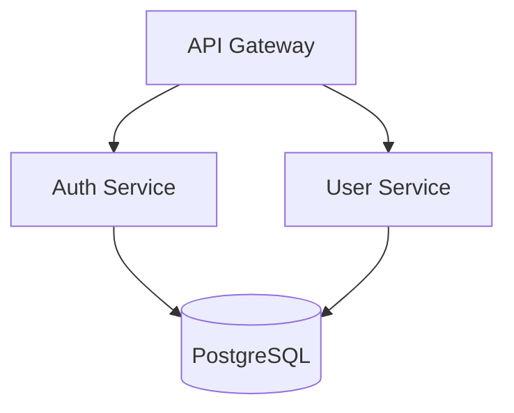

# Описание запросов в репозиториях

<user>
Помоги мне разобраться. Для начала задай в списке, ну, задай какое-то количество вопросов, не очень большое, минимально необходимое, чтобы понять идею до конца. Может быть, я сейчас что-то неправильно объясню или недостаточно понятно. В общем, идея в следующем. Я хочу при разработке программного обеспечения, то есть я делаю веб-приложение, делать следующее. При проектировании я бы хотел описывать модели данных и запросы к ним. То есть при разработке, чтобы у меня, когда там в репозитории, который обращается к базе данных, появлялись методы с запросами, ну, то есть запросы, когда я буду писать. У меня были пояснения к этим запросам, чтобы у меня был какой-то артефакт, в котором хранилась информация о том, какие методы сейчас есть в репозиториях, что они конкретно делают и зачем. Это упростит понимание работы системы. Вот. Но я думаю, что можно будет таким образом еще какую-то трассировку вести к тому, где это используется и почему. То есть, когда будет рисоваться какая-то схема того, как работает система, будет понятно, какие запросы в каких частях системы используются к базе данных и зачем. Вот. Идея, в принципе, кажется достаточно разумной на столько, что мне кажется, уже так могли бы кто-то делать. У этого должно быть какое-то название. В общем, нужно разобраться.

</user>
<agent>
Ок, чтобы не промахнуться с форматом и уровнем “трассировки”, мне нужно понять буквально несколько вещей. Ответь коротко, пунктами — можно даже “да/нет” где подходит.

1. **Стек и стиль доступа к БД**
   - Язык/фреймворк? (Node/Nest, Python/FastAPI, Java/Spring, .NET и т.д.)
   - Запросы пишешь **сырой SQL**, **ORM (typeORM/Prisma/SQLAlchemy/JPA)**, или **query builder**?

2. **Что именно ты хочешь считать “запросом” в каталоге**
   - Только чтение/запись в БД (SELECT/INSERT/UPDATE), или ещё и транзакции, блокировки, миграции?
   - Включать ли “сложные” штуки: CTE, window functions, batch upsert, stored procedures?

3. **Артефакт должен быть “вручную поддерживаемый” или “живой/генерируемый”**
   - Ты хочешь **писать пояснения руками** рядом с методом (JSDoc/docstring/аннотация), а дальше оно **собирается в доку**?
   - Или ты хочешь **полуавтомат**: извлечение SQL из кода + шаблоны описаний?

4. **Какой уровень трассировки тебе нужен**
   - Достаточно **статической**: “какой сервис/юзкейс вызывает какой репозиторный метод”?
   - Или нужна **рантайм-трассировка**: “в конкретном HTTP запросе реально выполнились вот эти SQL” (через tracing/APM)?

5. **Как ты хочешь этим пользоваться в разработке**
   - Это должно быть:\
     a) Markdown в репо,\
     b) отдельный “каталог” (веб-страница/Storybook-style),\
     c) диаграммы (C4/UML),\
     d) всё вместе?

6. **Зачем это в первую очередь** (выбери 1–2 главных)
   - Понимание домена/поведения системы
   - Ревью запросов и качества данных
   - Оптимизация производительности
   - Безопасность/контроль доступа (кто куда читает)
   - Ускорение онбординга/поддержки

7. **Масштаб**
   - Примерно сколько репозиториев/методов ожидаешь: десятки, сотни, тысячи?
   - Одна БД или несколько (Postgres + Redis + Elastic и т.п.)?

---

Чтобы ты видел, “как это обычно называют” (черновые варианты, которые чаще всего всплывают в индустрии):

- **Query Catalog / Query Registry** — каталог запросов (метод → SQL/ORM-запрос → назначение).
- **Data Access Catalog / Repository Catalog** — каталог методов слоя доступа к данным.
- **Living Documentation / Documentation-as-Code** — документация как код, генерируется из исходников.
- **Service-to-Database Dependency Map** — карта зависимостей: сервисы/юзкейсы → таблицы/запросы.
- Если добавить рантайм-часть: **Distributed Tracing (OpenTelemetry) + DB spans** — уже про трассировку реальных вызовов БД.

Ответь на вопросы выше — и я предложу 1–2 “наилучших” реализации (минимально бюрократичных) и как это красиво увязать: **описание запроса → ссылка на доменную причину → где вызывается → какие таблицы трогает → как визуализировать**.


</agent>
<user>
Я хочу, чтобы ты сейчас сделал изучение идеи, то есть мне нужно, чтобы ты нашел, есть ли уже использование того, о чем мы говорю, ну, то есть, может быть, уже есть концепт, который прям вот название я его не знаю, который именно это и означает, то, что я предлагаю делать.

</user>
<agent>
Я посмотрел, как это обычно называется и где уже встречается. Твоя идея **реально “существует”**, просто в индустрии она чаще распадается на несколько близких концептов (поэтому и ощущение, что «должно быть название, но не находится»).

## 1) Именованные запросы

Самое близкое по смыслу (в плане **“запрос = отдельный артефакт с именем, который вызывается из кода”**) — это **Named Queries / Named SQL queries**.

Это встречается в разных экосистемах:

- **Hibernate / JPA**: “named SQL queries” и вообще практика вынести/обозначить запрос как именованный, чтобы он был переиспользуемым и понятным. citeturn2search8turn2search17
- В некоторых платформах/репозиториях прямо описывают “named queries … invoked by some String name / reusable queries” (идея — не собирать запрос “на лету”, а ссылаться на зафиксированный артефакт). citeturn2search19
- Даже в прикладных платформах (не “чисто код”) есть термин **Named Queries** как “написал один раз — вызываешь из разных мест проекта с параметрами”. citeturn2search11

**Что совпадает с твоим замыслом:**

- у запроса есть **имя**,
- он живёт как **отдельная сущность**,
- его проще каталогизировать/документировать.

## 2) “Query catalog / query registry” как часть codebase

Второй прямой родственник твоей идеи — подход “**SQL хранится как код в .sql файлах + рядом комментарии/описания + из этого получаются методы**”.

Очень показательные примеры:

### aiosql (Python, YeSQL-стиль)

- Они прямо формулируют идею как “**SQL is code: write it, version control it, comment it…** и хранить SQL в файлах, загружая как методы”. citeturn2search0turn3search11turn3search19
- И — ключевой момент — **имя метода берётся из SQL-комментария `-- name:`**, то есть сам SQL-файл становится каталогом “именованных запросов”. citeturn1search0

Это почти 1-в-1 то, что ты описываешь как “в репозитории появляются методы с запросами + пояснения”.

### sqlc (Go, codegen из SQL)

- `sqlc` работает по той же идее: “schema + queries → генерируем типобезопасный код”, а запросы в `.sql` файлах **именуются через комментарии** (`-- name: ...`). citeturn1search14turn1search1

**Как это обычно называют в разговорах:**

- *query catalog*, *query registry*, *named queries in SQL files*, *SQL-as-code*.

(Важно: “query registry” в интернете иногда уводит в сторону Windows Registry, но в контексте БД/кода “registry” тоже встречается как “реестр заранее определённых запросов”.)

## 3) “Living documentation” + граф зависимостей/lineage

Третья часть твоей идеи — “чтобы рисовалась схема: где какие запросы используются и зачем” — очень похожа по духу на то, что в data/analytics-мире называют:

- **Documentation-as-code / living documentation**
- **Data lineage (граф происхождения/зависимостей данных)**

Самый узнаваемый пример — **dbt Docs**: это автогенерируемый сайт документации, где есть **описания моделей + метаданные + lineage-граф**. citeturn1search15turn1search11

dbt — не про веб-бэкенд напрямую (это про трансформации в DWH), но **концептуально** это очень близкий паттерн:

> “SQL-модели/запросы + описания → документация и граф, который помогает понять систему”.

## 4) Трассировка “какой код породил этот SQL”: SQL comments / SQLCommenter + tracing

То, что ты назвал “можно ещё трассировку вести — где используется и почему”, в продакшн-мире чаще решают **не статически**, а через **инструментацию**:

### SQLCommenter (стандарт де‑факто для “тегов” в SQL)

- **sqlcommenter** — набор middleware/плагинов, которые **добавляют к SQL комментарий с key=value метаданными о коде**, чтобы потом коррелировать запросы в логах/мониторинге с местом в приложении. citeturn5search1turn5search0
- Это прямо позиционируется как способ “легко сопоставить медленные запросы с исходным кодом” (observability). citeturn5search4turn5search19
- У Rails даже есть встроенная механика query log tags, и **формат по умолчанию — SQLCommenter**. citeturn5search3turn4search2
- Prisma тоже поддерживает SQL comments и указывает, что формат sqlcommenter (Google) широко поддержан инструментами мониторинга. citeturn5search8turn4search7
- Prisma отдельно описывает корреляцию DB-запросов с трейсами: можно добавлять `traceparent` в SQL как комментарий через плагин. citeturn4search3

### Distributed tracing (OpenTelemetry / APM)

- В OpenTelemetry есть семантические конвенции для **DB client spans** (то есть “спан = запрос к БД”). citeturn1search5
- В APM-платформах это доводят до UI: например, Datadog описывает, что в trace view можно выбрать database span и увидеть вкладку **SQL Queries** с метриками/планами. citeturn1search12

**Что совпадает с твоей “трассировкой”**:

- из SQL (в логах БД / slow query log / APM) можно понять **какой endpoint/job/часть приложения** его породила, иногда даже source\_location.

---

# Какое “название” ближе всего к твоей исходной идее

Если тебе нужно коротко назвать то, что ты описал (для обсуждения с командой), то чаще всего это звучит как комбинация:

1. **Query Catalog / Query Registry (именованные запросы как артефакты в репозитории)** — статическая часть
2. **Trace correlation / SQLCommenter tags / OpenTelemetry DB spans** — динамическая часть трассировки
3. (опционально) **Living documentation + lineage graph** — визуализация/схема зависимостей

То есть в одном предложении:\
**“Мы хотим Query Catalog (named queries) с живой документацией и трассировкой до места в коде (через sqlcommenter/OTel).”**

---

Если хочешь, следующим шагом я могу:

- предложить **2–3 референс-архитектуры**, как это собрать в веб-приложении (без привязки к языку),
- или подобрать **готовые инструменты под твой стек** (например: Node/Nest + Prisma/TypeORM + OTel + генерация каталога из аннотаций/SQL-файлов).


</agent>
<user>
Query Catalog / Query Registry - это оно. Напиши эссе-документацию с объяснением смысла этой концепции. Эссе должно быть качественным и сложным. Пиши как человек, например в стиле Чехова, чёткими и ёмкими формулировками. Без метафор, технический язык, но для широкой группы читающих.

</user>
<agent>
### Query Catalog / Query Registry

**Каталог запросов как структурный принцип проектирования**

Разработка программного обеспечения часто начинается с описания домена и пользовательских сценариев, но заканчивается в базе данных. В ней фиксируется состояние системы, в ней же концентрируется логика, от которой зависит корректность работы приложения. Между бизнес-смыслом и SQL-оператором обычно лежит слой репозиториев, сервисов, вспомогательных методов. С течением времени этот слой разрастается. Методы появляются, меняются, дублируются. Их назначение становится неочевидным.

Query Catalog — это попытка навести порядок не на уровне таблиц и не на уровне сервисов, а на уровне **запросов как самостоятельных сущностей**.

---

## 1. Исходная проблема

В типичном веб-приложении запрос к базе данных — это техническая деталь. Он встроен в метод, скрыт в ORM-конструкции или в строке SQL. Документация, если существует, описывает API или архитектуру в целом, но редко фиксирует:

- какие именно запросы существуют в системе,
- что они делают на уровне данных,
- зачем они введены,
- где и при каких сценариях используются.

В результате:

- поведение системы становится трудно объяснимым;
- анализ производительности превращается в поиск по строкам;
- рефакторинг сопровождается риском скрытых зависимостей;
- онбординг новых разработчиков требует значительного устного контекста.

Запросы живут в коде, но не существуют как осмысленные объекты архитектуры.

---

## 2. Определение

**Query Catalog (или Query Registry)** — это структурированный реестр всех запросов к источникам данных, рассматриваемых как именованные, документированные и отслеживаемые артефакты системы.

Каталог фиксирует:

1. **Имя запроса** — стабильный идентификатор.
2. **Техническое выражение** — SQL, ORM-конструкция или DSL.
3. **Назначение** — формулировка бизнес-смысла.
4. **Контекст использования** — какие сервисы, use-case или API его вызывают.
5. **Затрагиваемые объекты данных** — таблицы, индексы, представления.
6. **Дополнительные атрибуты** — требования к производительности, особенности транзакций, ограничения.

Таким образом, запрос становится не побочным эффектом реализации, а **первоклассной единицей архитектуры**.

---

## 3. Концептуальный сдвиг

Query Catalog меняет точку зрения на слой доступа к данным.

Обычный подход:

> Сервис → Репозиторий → SQL.

Каталогированный подход:

> Use-case → Именованный запрос → Источник данных.

Запрос получает собственную идентичность. Репозиторий становится механизмом вызова, а не местом смысловой концентрации.

Это сближает проектирование базы данных с проектированием публичного API: так же как эндпоинты описываются и версионируются, так и запросы подлежат инвентаризации и объяснению.

---

## 4. Документация как часть кода

Query Catalog не предполагает отдельного “документного” слоя, поддерживаемого вручную. Его сила — в принципе **documentation-as-code**.

Описание запроса живёт рядом с его реализацией:

- в SQL-файле с аннотацией,
- в комментарии к методу,
- в декларативном описании.

Каталог может быть:

- статическим (Markdown, сгенерированный сайт),
- динамическим (веб-интерфейс с поиском),
- или интегрированным в инструменты анализа кода.

Главное условие — источник истины один: сам код.

---

## 5. Трассировка и зависимость

Смысл каталога не ограничивается описанием. Он создаёт основу для анализа связей.

Если каждому запросу присвоено имя и метаданные, становится возможным:

- построить карту: *сервис → запрос → таблица*;
- выявить дублирующие операции;
- обнаружить “мертвые” запросы;
- анализировать влияние изменения схемы на поведение системы;
- сопоставлять запросы с runtime-трейсами (через инструменты наблюдаемости).

Таким образом, Query Registry становится точкой пересечения трёх уровней:

1. **Доменного** — зачем существует операция.
2. **Технического** — как она реализована.
3. **Операционного** — как она ведёт себя в продакшене.

---

## 6. Граница ответственности

Важно различать:

- **Data Catalog** — описывает таблицы и поля.
- **API Documentation** — описывает внешние интерфейсы.
- **Data Lineage (в аналитике)** — описывает потоки данных между моделями.

Query Catalog расположен между ними.\
Он описывает не структуру данных и не внешний контракт, а **конкретные операции изменения и чтения состояния**.

Именно операции определяют поведение системы.\
Именно они формируют нагрузку, издержки, риски блокировок, требования к индексации.

---

## 7. Архитектурные эффекты

Введение Query Catalog приводит к ряду системных изменений:

1. **Уменьшение скрытых зависимостей**\
   Запрос не может существовать без объяснения своего назначения.

2. **Повышение дисциплины проектирования**\
   Перед добавлением нового запроса разработчик проверяет, не существует ли уже функционально эквивалентного.

3. **Ускорение анализа производительности**\
   Имя запроса связывает метрики APM с конкретным смысловым действием.

4. **Упрощение рефакторинга**\
   Появляется список операций, которые нужно пересмотреть при изменении схемы.

5. **Прозрачность для аудиторов и архитекторов**\
   Поведение системы становится обозримым.

---

## 8. Ограничения

Query Catalog не является универсальным решением.

- Он требует дисциплины.
- Он увеличивает формализацию.
- Он может быть избыточным в малых проектах.
- Без автоматизации легко превращается в устаревающий реестр.

Его эффективность зависит от интеграции с CI, статическим анализом и инструментами наблюдаемости.

---

## 9. Практический смысл

В зрелой системе количество запросов может измеряться сотнями.\
Без каталога они существуют как разрозненные фрагменты кода.

С каталогом они становятся:

- перечнем операций над состоянием,
- документированной картой взаимодействия с данными,
- основой для архитектурного контроля.

Query Registry — это не инструмент и не библиотека.\
Это способ смотреть на систему через операции, а не через классы.

---

## Заключение

Запрос к базе данных — это акт изменения или извлечения состояния.\
Каждый такой акт имеет причину.

Если причина не зафиксирована, система постепенно теряет ясность.

Query Catalog возвращает этой ясности форму:\
запрос получает имя, назначение и место в структуре.

С этого момента он становится не строкой кода, а элементом архитектуры.


</agent>
<user>
Проверь и исправь неточности или упущения, если потребуется.

</user>
<agent>
Ниже — выверенная версия. Я исправил и дополнил несколько моментов, чтобы концепция была точнее и практичнее:

- Уточнил **границы понятия**: Query Catalog/Registry — это **организационный артефакт уровня приложения**, а не “каталог” в смысле системных таблиц СУБД (data dictionary / system catalog).
- Расширил объект до **всех источников данных** (SQL/NoSQL/поисковые индексы), если команда этого хочет; при этом ядро идеи остаётся тем же.
- Добавил то, что в реальных системах чаще всего “болит” и потому должно быть в реестре: **контракт запроса** (параметры, форма результата, кардинальность), **транзакционные свойства**, **безопасность и доступ**, **владение**, **жизненный цикл и версия**.
- Разделил **статическую** и **рантайм-трассировку** и показал, что каталог полезен для обеих, но решаются они разными механизмами.
- Смягчил формулировки, которые звучали как “гарантия эффекта” (например, что дисциплина “сама появится”). Это не свойство каталога, а свойство процесса вокруг него.

---

## Query Catalog / Query Registry

### Каталог запросов как структурный принцип проектирования

### 1. Зачем это вообще нужно

Веб‑приложение живёт в данных. Поведение системы в конечном счёте определяется тем, **что именно** и **как именно** она читает и пишет. При этом запросы обычно растворены в коде: в репозиториях, ORM‑цепочках, query builder’ах, в строках SQL и транзакционных блоках. Они существуют, но не описаны как единицы системы.

Когда запросов становится много, появляются типовые последствия:

- часть запросов дублирует друг друга по смыслу;
- назначение отдельных методов понятно только автору и только “в момент написания”;
- исправление схемы или индексов превращается в угадывание: где это используется;
- анализ производительности сводится к поиску по логам и строкам;
- безопасность и аудит осложняются: трудно сказать, где читаются персональные данные и на каких условиях.

Проблема не в отсутствии документации вообще. Проблема в отсутствии документации **на уровне операций над данными**.

---

### 2. Определение и точные границы

**Query Catalog / Query Registry** — это реестр запросов к источникам данных, рассматриваемых как **именованные и документированные артефакты** приложения, с фиксированным назначением и контрактом.

Важно не путать:

- **System catalog / data dictionary** СУБД (внутренние таблицы и метаданные базы) — это механизм СУБД.
- **Data catalog** — описывает наборы данных (таблицы, поля, витрины), их смысл и владельцев.
- **Query Catalog** — описывает **операции доступа**: что и зачем делает приложение с данными, какими условиями, в каких сценариях, с какими ограничениями.

Каталог может охватывать только SQL, а может — любой доступ к хранилищам (SQL/NoSQL/cache/search). Это решение команды. Концепция от этого не меняется: объектом остаётся **операция чтения/записи**, а не структура хранения.

---

### 3. Что считается “запросом” в каталоге

Каталог работает, когда фиксирует **не синтаксис**, а **семантику операции**. Поэтому “запросом” разумно считать:

- конкретный `SELECT/INSERT/UPDATE/DELETE`;
- транзакционный блок, если он имеет цель как единое действие (например, списание + запись события);
- батч‑операции, если они имеют отдельные риски (bulk update, upsert, миграция состояния);
- вызов процедуры/функции, если логика лежит в БД;
- read‑модель/агрегацию, если она оформлена как отдельный запрос с контрактом результата.

А вот что обычно не стоит включать в каталог как отдельные элементы:

- чисто инфраструктурные запросы ORM (проверки соединения, introspection);
- временные ad‑hoc запросы разработчика;
- дубли одного и того же запроса, если они различаются только формой записи, но не смыслом.

---

### 4. Структура записи: что должно быть у каждого элемента

Если каталога “много”, он обязан быть минималистичным, но достаточным. Базовый состав метаданных для одного запроса:

1. **Идентификатор**\
   Стабильное имя. Желательно в едином формате (например, `User.GetById`, `Order.ListForCustomer`, `Ledger.PostTransfer`).

2. **Назначение**\
   Короткая формулировка: что делает операция и почему она существует (в терминах системы, не SQL).

3. **Контракт**

- входные параметры и ограничения (диапазоны, формат, обязательность);
- форма результата (поля/структура) и ожидаемая кардинальность: один объект, список, “0..1”, агрегат;
- семантика сортировки и пагинации, если применимо.

4. **Данные и границы**

- какие таблицы/коллекции/индексы затрагиваются;
- какие инварианты должны сохраняться (например, уникальность, баланс, отсутствие отрицательных остатков);
- какие данные чувствительны (PII/финансовые/секреты).

5. **Транзакционные свойства**

- требуется ли транзакция;
- уровень изоляции/блокировки, если это важно;
- идемпотентность (можно ли повторить без побочных эффектов) и условия, при которых это верно.

6. **Нефункциональные ожидания**\
   SLO/ограничения по времени и объёму (например, “для интерактивного API должно укладываться в N мс при типовой нагрузке”), ожидаемая селективность, требования к индексу.

7. **Связи использования**\
   Какие use‑case, endpoint’ы, фоновые задачи вызывают этот запрос. Не обязательно перечислять всё вручную, но важно иметь опору для трассировки.

8. **Владение и жизненный цикл**

- владелец (команда/модуль);
- статус: активен/устарел/к удалению;
- версия, если контракт меняется.

Эти поля превращают запрос из “кусочка доступа к БД” в объект, пригодный для обсуждения, ревью и поддержки.

---

### 5. Каталог как документация‑в‑коде

Каталог не должен становиться отдельной книгой, которую никто не обновляет. Практический смысл возникает тогда, когда:

- описание хранится рядом с реализацией (аннотации, docstring, SQL‑комментарии, декларативные файлы);
- каталог собирается автоматически (генерация Markdown/HTML/страниц);
- CI проверяет минимальную полноту: запрос без имени и описания не проходит.

Это не усложнение ради порядка. Это способ удержать систему от распада на набор неявных правил.

---

### 6. Трассировка: статическая и рантайм

Каталог полезен для двух разных задач, и их не стоит смешивать.

**Статическая трассировка** отвечает на вопрос:\
“Какие части кода могут вызвать этот запрос?”

Это строится по исходникам: вызовы, зависимости, контуры модулей. Даёт карту и помогает при рефакторинге.

**Рантайм‑трассировка** отвечает на вопрос:\
“Какие запросы реально выполнялись при данном HTTP‑запросе/джобе, сколько заняли, что блокировали?”

Это решается инструментами наблюдаемости: tracing/APM/логирование, часто с добавлением `query_id` или тегов в SQL‑комментариях. Каталог здесь даёт “словарь смыслов”: метрика и трейс связываются не с фрагментом SQL, а с именем операции и её назначением.

---

### 7. Что меняется в архитектуре

Если подход внедрён последовательно, появляются устойчивые эффекты:

- **Снижается дублирование**: проще найти уже существующую операцию и переиспользовать её.
- **Проще ревью**: обсуждается не строка SQL, а контракт и смысл.
- **Схема меняется безопаснее**: видно, какие операции затрагиваются.
- **Производительность управляемее**: запросы получают ожидания и наблюдаемость.
- **Безопасность прозрачнее**: понятно, где читаются чувствительные данные и на каких условиях.

Но это не магия. Это последствия дисциплины, которую каталог делает проверяемой и дешёвой.

---

### 8. Ограничения и типовые ошибки

Каталог проваливается, если:

- он становится слишком подробным и превращается в бюрократию;
- “описания” пишутся общими словами и не помогают отличить запросы друг от друга;
- нет автоматизации и проверок, поэтому реестр быстро устаревает;
- каталог пытается заменить дизайн домена или API‑документацию, хотя он решает другую задачу.

Хороший каталог — это не энциклопедия. Это реестр контрактов и намерений на уровне доступа к данным.

---

### 9. Итог

Query Catalog / Query Registry фиксирует простую вещь: **операции над данными — часть архитектуры**, и их нужно описывать так же внимательно, как публичные интерфейсы.

Запрос получает:

- имя,
- назначение,
- контракт,
- ограничения,
- связь с использованием и наблюдаемостью.

После этого система становится объяснимой без устной передачи контекста. Это и есть главная цель.

---

Если ты хочешь, я могу дальше сделать из этого **короткий “стандарт команды”**: правила именования, минимальный шаблон записи запроса, требования CI и рекомендации по трассировке — но уже строго в виде практического документа, без эссе.


</agent>
<user>
Помоги мне обдумать идею. В общем, я понял, что вот этот документ, который ты сделал, он достаточно большой, но недостаточно подробный. Я бы его, может быть, даже подробнее расписал, добавив мотивации, еще что-то. То есть, может быть, словарь какой-нибудь в самом начале, чтобы непонятные термины прояснять, чтобы была однозначность терминов. Ну, в общем, получится какой-то огромный документ, такое эссе, а может быть, и документация вроде стандартов, которые используются в IEEE. Ну, в общем, документ большой, для агента он не подходит, слишком много контекста, но я при этом думаю, что, может быть, стоит два уровня завести документации. То есть, один уровень – это условно-стандарты, где все описано подробно. А второй уровень – это уже прикладная документация, по сути, синтез того, что нужно, каких-то указаний для агента уже из этой документации, как отдельный навык, чтобы не захламлять контекст лишним текстом, потому что количество токенов ограничено. Я вот сейчас тебе приложу пример скилла архитектора, но я бы, в принципе, просто чтобы показать, как устроен скилл, а так по-хорошему в этом чате обсуждается отдельный скилл, то есть отдельный агент, который следит именно за этой ответственностью, за тем, чтобы вот этот вот каталог запросов, ну, он соблюдался и использовался из него к этим, ну, в общем, следил за этим каталогом запросов, чтобы типа отдельная ответственность была у него.

</user>
<agent>
Ты мыслишь в правильную сторону: **один большой документ (стандарт)** нужен людям, а **короткий прикладной слой (skill / playbook)** — агенту и CI. Если пытаться совместить это в одном файле, он неизбежно станет либо слишком общим, либо слишком тяжёлым для оперативного использования и для LLM‑контекста.

Ниже — как я бы “разложил” эту систему, чтобы она была строгой, расширяемой и при этом удобной для агента.

---

## 1) Два уровня документации — и зачем они оба

### Уровень A: Стандарт (Normative)

**Цель:** однозначность терминов, мотивации, рамки применимости, правила и их обоснование, примеры, исключения, жизненный цикл.

**Читатели:**

- архитекторы, тимлиды, senior‑разработчики;
- люди, кто спорит о правилах, принимает компромиссы;
- аудит/безопасность/производительность.

**Стиль:** максимально точный, допускает объём, использует “нормативную лексику” (MUST/SHOULD/MAY), содержит глоссарий, контрпримеры.

---

### Уровень B: Skill / Playbook (Operational)

**Цель:** минимальный набор инструкций и проверок, который позволяет:

- добавить/изменить запрос **без ошибок**;
- пройти ревью;
- поддерживать каталог “живым”;
- быстро диагностировать проблемы.

**Читатели:**

- разработчик, который прямо сейчас добавляет метод репозитория;
- “агент‑сторож” (LLM‑агент) и CI‑гейты.

**Стиль:** коротко, чек‑листы, шаблоны, команды, точные критерии “принято/не принято”.

👉 Это ровно как у тебя в примере skill‑файла: сверху краткое назначение, далее quick start, workflows, common commands. fileciteturn0file0

---

## 2) Ключевая идея: стандартизируй правила как “атомы” с ID

Чтобы не “дублировать” стандарт в skill‑док, сделай правила атомарными и адресуемыми.

Пример:

- **QC‑01 Naming**
- **QC‑02 Contract**
- **QC‑03 Data touched**
- **QC‑04 Transactionality**
- **QC‑05 Security classification**
- **QC‑06 Observability tags**
- **QC‑07 Deprecation**
- **QC‑08 Performance expectations**

Тогда:

- В **стандарте** у каждого правила есть: формулировка + мотивация + примеры + исключения.
- В **skill** вместо длинных объяснений — **ссылка на ID** и короткая проверка: “убедись, что соблюдено QC‑02”.

Это даёт:

- компактность;
- трассируемость требований;
- возможность автоматизации (CI может валить PR по невыполненному QC‑xx).

---

## 3) Третий слой (рекомендую): “машиночитаемая спецификация” каталога

Если ты хочешь, чтобы агент реально “следил”, лучше иметь **единый источник истины** в форме, удобной для анализаторов:

Варианты:

1. `query_catalog.yaml` (единый файл)
2. `queries/<QueryId>.yaml` + `queries/<QueryId>.sql`
3. SQL‑файлы с заголовком‑метаданными (в комментариях), как в подходах `-- name:`.

Минимальная схема (не как документ, а как данные):

```yaml
id: User.GetById
purpose: Получить пользователя по идентификатору для сценария авторизации
owner: team-identity
sources:
  - postgres.main
tables:
  read: [users]
  write: []
contract:
  params:
    - name: user_id
      type: uuid
      required: true
  returns:
    cardinality: "0..1"
    shape: UserRow
consistency:
  transaction: required_if_called_inside
  isolation: default
security:
  pii: true
observability:
  tag_sql_comment: true
  metrics: [latency_ms, rows_returned]
lifecycle:
  status: active
  since: 2026-02-01
```

**Стандарт** описывает, что это значит.\
**Skill** говорит: “как это заполнить и проверить”.

---

## 4) Рекомендуемая структура репозитория

Простой, понятный layout:

```
/docs/query-catalog/
  STANDARD.md          # большой нормативный документ
  SKILL.md             # прикладной слой для агента и разработчика
  GLOSSARY.md          # можно вынести отдельно, чтобы не раздувать STANDARD
  ADR/                 # решения по исключениям и эволюции подхода

/query-catalog/
  schema.yaml          # схема метаданных (если используешь YAML/JSON)
  entries/             # по файлу на запрос (лучше для больших систем)
  generated/           # автогенерируемые HTML/MD, если нужно

/src/
  repositories/
  services/
```

---

## 5) Что добавить в “большой стандарт”, чтобы он был действительно полноценным

Ниже — список разделов, которые обычно делают документ “стандартом”, а не эссе.

### STANDARD.md — рекомендуемая оглавление‑матрица

1. **Purpose and scope**

- Для каких систем и какого уровня зрелости это вводится
- На что не претендует (non‑goals)

2. **Normative language**

- Определение MUST/SHOULD/MAY (важно для однозначности)

3. **Glossary**

- Query, Query ID, Contract, Cardinality, Use‑case, Repository method, Data source, PII, SLO, Idempotency, Isolation level, Deprecation…

4. **Motivation**

- Поддерживаемость
- Производительность
- Безопасность
- Снижение дублирования
- Онбординг

5. **Concept model**

- Что является “запросом”
- Чем запрос отличается от “метода репозитория”
- Связь “Use‑case → Query → Data objects”

6. **Normative requirements (QC‑xx)**
   Для каждого QC‑xx:

- формулировка требований;
- rationale;
- examples;
- exceptions & tradeoffs;
- enforcement (как проверяется).

7. **Lifecycle**

- Добавление
- Изменение контракта
- Версионирование
- Деприкация и удаление
- Миграции схемы и влияние на queries

8. **Observability**

- как маркировать запросы (query\_id в SQL comment, trace correlation)
- что обязательно логировать/метрить

9. **Security**

- классификация данных
- правила доступа
- запреты (например, “SELECT \*” в PII‑таблицах или массовые выгрузки без явного разрешения)

10. **Performance**

- требования к пагинации
- запреты на “неконтролируемые” full scan’ы
- ожидания по индексации и планам
- правила для batch‑операций

11. **Governance**

- кто владелец каталога
- как проходит ревью
- как работает CI‑gate
- что считается нарушением стандарта

12. **Appendix**

- шаблоны
- примеры хороших/плохих записей
- чек‑листы

---

## 6) Как сделать “Skill” компактным и действенным (для агента и людей)

Тут важно: skill не должен объяснять “почему”, он должен объяснять “что делать” и “как проверить”.

### SKILL.md — структура (по образцу твоего skill‑дока)

Ниже — черновик, который ты можешь буквально положить как файл (подстрой под свой репо и инструменты):

```markdown
---
name: query-catalog-steward
description: >
  Use this skill when the user adds/modifies data access logic (SQL/ORM queries),
  introduces new repository methods, changes DB schema, or asks to generate/validate
  the Query Catalog / Query Registry. The skill enforces QC-xx rules, generates
  catalog artifacts, and checks traceability (use-case → query → tables).
---

# Query Catalog Steward

Operational playbook for maintaining Query Catalog / Query Registry.

## Quick Start

1) When adding a new query:
- Assign Query ID
- Write purpose + contract
- Tag query with `query_id` for tracing (if enabled)
- Register entry in catalog

2) Before merge:
- Run catalog validation
- Ensure QC-01..QC-08 compliance

## Core Outputs

- New/updated catalog entry (YAML/MD)
- Updated repository method annotations
- Optional: generated docs page / index

## Workflows

### 1) Add a new query (author workflow)

Checklist:
- [ ] QC-01: Query ID format is valid and unique
- [ ] QC-02: Contract defined (params, result shape, cardinality)
- [ ] QC-03: Data touched listed (tables/collections/indexes)
- [ ] QC-04: Transactionality & idempotency stated
- [ ] QC-05: Security classification set (PII, tenant boundary)
- [ ] QC-06: Observability tags enabled (query_id in SQL comments if applicable)
- [ ] QC-08: Performance notes included if query is on hot path

Templates:
- catalog entry template: `query-catalog/entries/<id>.yaml`
- repository annotation template: docstring/JSDoc block

### 2) Modify an existing query (review workflow)

Rules:
- If contract changes → bump query version OR create new Query ID (see QC-02)
- If tables touched change → update QC-03 and check indexes
- If query is used in critical path → update performance expectations (QC-08)

### 3) Deprecate a query

- Mark lifecycle.status = deprecated
- Add replacement Query ID
- Define removal date
- Ensure call sites are migrated

### 4) Generate docs (optional)

- Build a human-readable index: queries by module, by table, by use-case
- Export Mermaid graph: use-case → query → table

## Common Checks

- Duplicate queries (same purpose + same tables)
- Missing pagination on list endpoints
- Unbounded scans on large tables
- PII access without explicit policy flag
- Queries missing tracing tags (if observability required)
```

---

## 7) Роль отдельного агента: что ему поручать, чтобы это не было “формально”

Твоя мысль про отдельную ответственность — правильная. Но важно очертить область, чтобы агент не стал “архитектором всего”.

**“Query Catalog Steward” агент** должен быть узко заточен на:

1. **Инвентаризацию**

- новые запросы не появляются “втихую”;
- каждое изменение запроса отражено в каталоге.

2. **Качество контракта**

- параметры, кардинальность, результат, пагинация.

3. **Трассируемость**

- минимально: привязка к use‑case/service;
- желательно: query\_id в observability.

4. **Риски**

- PII/тенант‑изоляция;
- транзакции и блокировки;
- hot path performance.

5. **Деприкации**

- не оставлять “мертвые” запросы.

При этом агент **не должен**:

- решать за команду архитектуру домена;
- переписывать сложные SQL без запроса;
- быть единственным источником истины (истина — код + каталог).

---

## 8) Как уменьшить нагрузку на контекст LLM

Практические приёмы:

- **Разбить стандарт** на модули: `GLOSSARY.md`, `SECURITY.md`, `PERFORMANCE.md`, `LIFECYCLE.md`.\
  Агент будет подгружать только нужное.
- **Rule IDs** (QC‑xx): агенту достаточно видеть список правил и короткие формулировки; подробности подтягиваются при споре.
- **Шаблоны**: агенту полезнее шаблон и чек‑лист, чем длинная мотивация.
- **Генерация краткого “Context Pack”**: один файл на 1–2 страницы, который содержит только:
  - список QC‑xx (по 1–2 строки),
  - шаблон entry,
  - критерии “accept/reject”.

---

Если хочешь, я могу сделать следующий шаг прямо здесь:

1. набросать **полноценный STANDARD.md** (с глоссарием, QC‑xx правилами, примерами и исключениями),
2. параллельно сделать **короткий SKILL.md**,
3. и главное — связать их через QC‑xx и “machine spec”, чтобы это реально работало как процесс, а не как текст.


</agent>
<user>
начни со стандарта

</user>
<agent>
Ниже — черновик **STANDARD.md** в стиле “нормативного документа”: с областью применения, словарём, однозначными терминами, правилами уровня MUST/SHOULD/MAY, жизненным циклом, процессами и приложениями (шаблон записи, примеры, чек‑листы). Его можно сразу класть в репозиторий и дальше итеративно шлифовать.

> Примечание о стиле: это именно “стандарт”, поэтому текст местами сухой и повторяет определения. Это нормально: цель — однозначность, проверяемость, пригодность для CI и для агента, который будет из него делать краткий skill позже.

---

# STANDARD: Query Catalog / Query Registry

**Документ:** QC-STANDARD\
**Версия:** 0.9 (Draft)\
**Дата:** 2026‑02‑19\
**Статус:** Черновик для внедрения и пилота\
**Владельцы стандарта:** Архитектура / Платформенная команда (назначить)\
**Область:** Backend‑сервисы, фоновые задачи, интеграции, которые обращаются к источникам данных

---

## 0. Статус документа и правила чтения

### 0.1. Нормативная лексика

В документе используются слова **MUST / MUST NOT / SHOULD / SHOULD NOT / MAY** в нормативном смысле:

- **MUST / MUST NOT** — обязательное требование, нарушение считается дефектом процесса.
- **SHOULD / SHOULD NOT** — требование по умолчанию; отступление допускается при наличии обоснования и фиксации исключения.
- **MAY** — допустимая опция.

### 0.2. Что является “истиной”

- **Registry** (реестр) — **источник истины** в репозитории: машиночитаемые записи о запросах.
- **Catalog** (каталог) — человекочитаемое представление реестра: страницы/Markdown/сайт, генерируемые из Registry.

Если термины “Catalog” и “Registry” употребляются как синонимы, приоритет имеет смысл выше: **Registry = данные**, **Catalog = представление**.

---

## 1. Назначение

Query Catalog / Query Registry вводится, чтобы:

1. зафиксировать **полный перечень операций доступа к данным** (чтение/запись) в системе;
2. обеспечить однозначное понимание **что делает запрос** и **зачем** он существует;
3. дать трассируемость **use‑case → запрос → затронутые данные** (и, по возможности, к runtime‑трейсам);
4. повысить управляемость изменений схемы, производительности и безопасности.

---

## 2. Область применения и ограничения

### 2.1. Применяется к

Стандарт применяется ко всем компонентам, которые выполняют операции над данными:

- SQL БД (PostgreSQL/MySQL/…)
- NoSQL (MongoDB/…)
- поисковые хранилища (Elastic/…)
- кэши (Redis/…) — **если** через них читаются/пишутся бизнес‑значимые данные или кеш влияет на корректность

### 2.2. Не является целью (Non‑goals)

Стандарт **не** пытается:

- заменить документацию API;
- заменить описание модели данных (data dictionary / data catalog);
- регламентировать всю архитектуру домена;
- требовать описания каждой внутренней ORM‑операции, не влияющей на бизнес‑поведение.

### 2.3. Минимальная гранулярность

Записи в реестре должны соответствовать **операциям**, которые имеют самостоятельный смысл: “получить пользователя”, “создать заказ”, “списать баланс”.\
Технические детали (например, “ORM сделал 3 запроса вместо 1”) относятся к оптимизации и наблюдаемости, но не обязаны становиться отдельными “Query ID”, если не меняют смысл.

---

## 3. Термины и определения

### 3.1. Основные термины

**Query (Запрос)**\
Операция чтения/записи состояния из источника данных, выполняемая приложением, имеющая имя (Query ID) и контракт.

**Query ID**\
Стабильный идентификатор запроса в рамках системы. Используется в реестре, документации, наблюдаемости и обсуждениях.

**Query Entry (Запись запроса)**\
Структурированная запись в Registry, описывающая Query ID, назначение, контракт, затронутые данные, ограничения и жизненный цикл.

**Contract (Контракт запроса)**\
Описание входных параметров, формы результата, кардинальности, сортировки/пагинации, ошибок и значимых гарантий.

**Cardinality (Кардинальность результата)**\
Ожидаемое количество сущностей в результате: `1`, `0..1`, `0..N`, `1..N`.

**Use-case (Сценарий / прикладной кейс)**\
Бизнес‑операция уровня приложения: “авторизоваться”, “оформить заказ”, “получить список транзакций”.

**Call site (Место вызова)**\
Конкретная функция/метод/endpoint/job, откуда вызывается запрос.

**Repository method (Метод репозитория)**\
Техническая точка доступа к данным в коде. Может соответствовать одному Query ID или агрегировать несколько запросов (см. “Composite operation”).

**Data source (Источник данных)**\
Конкретное хранилище: `postgres.main`, `redis.cache`, `elastic.search` и т. п.

**Data objects (Объекты данных)**\
Таблицы/коллекции/индексы/представления, затрагиваемые запросом.

**Hot path**\
Путь исполнения, чувствительный к задержкам и частоте (например, синхронные API‑эндпоинты).

**Idempotency (Идемпотентность)**\
Свойство операции: повторное выполнение с одинаковыми параметрами не меняет состояние сверх первого эффекта (или меняет предсказуемо и безопасно по правилам домена).

**PII (Персональные данные)**\
Данные, позволяющие идентифицировать человека или относящиеся к нему по требованиям политики/закона.

**Tenant boundary (Граница арендатора)**\
Гарантия, что данные разных арендаторов (клиентов) не смешиваются и недоступны друг другу.

**Observability correlation (Корреляция наблюдаемости)**\
Связь между Query ID и runtime‑метриками/логами/трейсами (например, через теги в SQL‑комментариях, span attributes, лог‑поля).

### 3.2. Виды операций

**Read query**\
Запрос, не изменяющий бизнес‑состояние (чтение).

**Write query**\
Запрос, изменяющий бизнес‑состояние (запись).

**Composite operation**\
Логическая операция, включающая несколько запросов (например, транзакция из нескольких statement’ов). Может иметь отдельный Query ID, если рассматривается как единый контракт.

---

## 4. Артефакты и требования к хранению

### 4.1. Registry MUST быть в репозитории

Registry MUST храниться в репозитории приложения/сервиса и версионироваться вместе с кодом.

### 4.2. Registry MUST быть машиночитаемым

Registry MUST иметь машиночитаемый формат: YAML/JSON/или иной формат, пригодный для валидации и генерации каталога.

Допустимы два варианта структуры:

- **Один файл на сервис**: `query-catalog.yaml`
- **Один файл на запрос**: `query-catalog/entries/<QueryID>.yaml`

Выбор фиксируется для репозитория и не меняется без ADR.

### 4.3. Catalog SHOULD генерироваться

Человекочитаемый каталог SHOULD генерироваться автоматически из Registry (Markdown/HTML). Ручная поддержка допускается только на пилоте.

---

## 5. Модель данных Registry

### 5.1. Обязательные поля (минимум)

Каждая запись Query Entry MUST содержать:

- `id` — Query ID
- `purpose` — назначение (1–3 предложения)
- `source` — источник данных
- `contract` — параметры и результат (включая кардинальность)
- `data_objects` — перечень затронутых объектов данных (read/write)
- `lifecycle.status` — состояние (active/deprecated/…)
- `owner` — владелец (команда/модуль)

### 5.2. Рекомендуемые поля

Каждая запись SHOULD содержать:

- `use_cases` или `call_sites` (хотя бы один)
- `security` (PII, tenant boundary, классификация)
- `consistency` (транзакционность, изоляция, идемпотентность)
- `performance` (ожидания, лимиты, требования к пагинации)
- `observability` (корреляция, метрики)

---

## 6. Нормативные требования (QC‑xx)

Ниже правила, подлежащие соблюдению. Для удобства они атомарны и имеют ID.

### QC‑01. Идентификатор Query ID

**Требование**

- Query ID MUST быть уникальным в рамках сервиса/системы (определить границу уникальности в разделе 9).
- Query ID MUST быть стабильным: после публикации в `active` он не переименовывается; при необходимости создаётся новый Query ID.
- Query ID SHOULD отражать доменную сущность и действие.

**Рекомендуемый формат**
`<DomainOrModule>.<Action>[.<Qualifier>]`

Примеры:

- `User.GetById`
- `Order.Create`
- `Ledger.PostTransfer`
- `Payment.ListForCustomer`
- `AuthSession.RevokeAll`

**Запрещено**

- технические имена вида `query1`, `getUsers2`
- имена, привязанные к структуре таблиц (`Users_SelectById`) — если это не оправдано контекстом

---

### QC‑02. Назначение (Purpose)

**Требование**

- `purpose` MUST объяснять смысл запроса на уровне системы: *что делает операция* и *зачем она нужна*.
- `purpose` MUST NOT повторять SQL/ORM‑формулировку (“делает SELECT из таблицы…”).

**Рекомендация**

- 1–3 коротких предложения, без воды.
- Допустимо указание сценария: “используется при …”.

---

### QC‑03. Контракт (Contract)

**Требование**
Контракт MUST включать:

1. параметры:

- имя, тип, обязательность;
- важные ограничения (диапазон, формат, допустимые значения).

2. результат:

- кардинальность (`0..1`, `0..N` и т. д.);
- форма результата (минимально: перечисление полей или ссылка на тип/DTO).

3. правила сортировки/пагинации:

- если возвращается список, MUST быть определён порядок (явный `order_by`) и стратегия пагинации.

4. ошибки/исключения:

- хотя бы на уровне категорий (например: “not\_found”, “conflict”, “validation\_failed”).

**Запрещено**

- “возвращает список” без лимита/пагинации для потенциально больших наборов данных (см. QC‑07).

---

### QC‑04. Затронутые данные (Data objects)

**Требование**

- Запись MUST перечислять затронутые объекты данных в разрезе чтения и записи:
  - `read`: таблицы/коллекции/индексы/представления
  - `write`: таблицы/коллекции/…
- Для composite‑операций MUST перечисляться все объекты, затронутые в рамках операции.

**Рекомендации**

- Если используется view/материализованное представление, указывать его как объект чтения.
- Если запрос зависит от конкретного индекса или constraint, это SHOULD быть отмечено в `performance` или `consistency`.

---

### QC‑05. Транзакционность, согласованность, идемпотентность

**Требование**
Каждая запись MUST указать:

- требуется ли транзакция: `required / optional / forbidden` (в зависимости от политики сервиса);
- идемпотентность: `true/false/conditional` и условия;
- для write‑операций SHOULD указать ожидаемое поведение при повторе/гонках.

**Рекомендации**

- Указывать уровень изоляции или блокировок только если это действительно значимо.
- Если операция может дедлокаться или конфликтовать по уникальности — отметить в `consistency`/`errors`.

---

### QC‑06. Безопасность и приватность

**Требование**
Каждая запись MUST иметь security‑раздел с минимумом:

- `pii: true/false` (или градацию, если принята);
- `tenant_boundary: enforced/not_applicable/unknown` (unknown запрещать после пилота);
- правила доступа: кто имеет право вызывать запрос (роль/контекст), если это применимо.

**Обязательные принципы**

- Запрос, читающий PII, MUST иметь явное указание на это.
- Для multi‑tenant систем запросы MUST подтверждать, как соблюдается граница арендатора (фильтр по tenant\_id, row‑level security, отдельная БД и т. п.).

---

### QC‑07. Производительность и ограничения

**Требование**

- Любой запрос, возвращающий коллекцию, MUST иметь явный лимит и стратегию пагинации, если объём потенциально велик.
- Запросы hot path SHOULD иметь SLO/ожидания: “обычно < X мс при N‑объёме данных”.
- Для операций, способных сканировать большие объёмы, MUST быть явная отметка и условия безопасного использования.

**Запрещено (по умолчанию)**

- неограниченный список в синхронном API;
- сортировка без индекса на больших таблицах в hot path (допускается при ADR/исключении).

---

### QC‑08. Наблюдаемость и корреляция

**Требование**

- Query ID MUST быть доступен для корреляции с runtime‑наблюдаемостью хотя бы на уровне логов приложения (поле `query_id`).
- Для SQL источников SHOULD быть включена корреляция Query ID в SQL‑комментарии или в атрибутах trace span (если практикуется tracing).

**Рекомендации**

- Стандартизировать поля: `query_id`, `data_source`, `rows`, `duration_ms`, `error_code`.
- Для composite‑операций логировать как `operation_id`, а внутренние запросы — как `query_id` при наличии.

---

### QC‑09. Владение и ответственность

**Требование**

- У каждого Query Entry MUST быть `owner` (команда/модуль) и канал связи (например, GitHub team, группа, он‑колл).
- Владелец обязан:
  - отвечать за актуальность записи;
  - сопровождать изменения контракта и деприкации;
  - принимать решения по исключениям или эскалации.

---

### QC‑10. Жизненный цикл и совместимость

**Состояния**
`draft` → `active` → `deprecated` → `removed`

**Требования**

- Любой запрос MUST быть `draft` до первого слияния.
- `active` означает: контракт стабилен, запись полная по минимальным полям.
- `deprecated` MUST содержать:
  - причину деприкации,
  - ссылку на замену (replacement Query ID),
  - план удаления (дата/версия).
- `removed` означает, что запрос не используется и может быть удалён из кода и реестра (либо оставлен как историческая запись — политика выбирается отдельно).

**Правила изменения**

- Если меняется контракт результат/кардинальность/семантика — SHOULD создавать новый Query ID или версию (см. QC‑11), а старый депрекейтить.
- Мелкие изменения без влияния на контракт (например, оптимизация SQL) MAY не требовать нового Query ID, но SHOULD обновлять `performance`/`notes`.

---

### QC‑11. Версионирование контракта и правила “breaking change”

**Требование**
Сервис MUST определить одну из стратегий (зафиксировать в разделе 9 “Политики сервиса”):

**Стратегия A (рекомендуется): новый Query ID при breaking change**

- Breaking change → новый Query ID
- Старый → deprecated → removed

**Стратегия B: версия внутри Query ID**

- `id: User.GetById`, `contract.version: 2`
- Breaking change → bump version + миграционный план

**Определение breaking change**
Breaking change включает (не исчерпывающе):

- изменение кардинальности (`0..N` → `0..1`);
- изменение семантики фильтрации/доступа;
- изменение обязательности параметров;
- изменение состава результата так, что ломает потребителей (если потребители зависят от полей; определить политику).

---

### QC‑12. Тестирование и проверяемость

**Требование**

- Для write‑операций SHOULD быть тест, фиксирующий ключевую семантику и инварианты.
- Для запросов со сложной фильтрацией/сортировкой SHOULD быть тест на корректность.
- Для критичных запросов SHOULD быть нагрузочный/профилировочный сценарий (минимально — ручной профиль + план запроса), если команда практикует.

---

## 7. Процессы (Workflows)

### 7.1. Добавление нового запроса

Автор MUST:

1. выбрать/создать Query ID (QC‑01);
2. описать purpose и contract (QC‑02, QC‑03);
3. описать data\_objects (QC‑04);
4. заполнить security/consistency/performance/observability по правилам (QC‑05..QC‑08);
5. добавить/обновить точки вызова (use\_case / call\_site) по выбранной политике;
6. обеспечить прохождение валидации Registry (CI‑гейт).

### 7.2. Изменение существующего запроса

Автор MUST:

- определить, является ли изменение breaking change (QC‑11);
- при необходимости создать новый Query ID/версию и запустить деприкацию (QC‑10);
- обновить contract/data\_objects/performance/observability по факту изменений.

### 7.3. Деприкация и удаление

Владелец MUST:

- обозначить замену;
- обеспечить миграцию всех call sites;
- после миграции — удалить код и перевести запись в `removed` (или удалить из реестра — по политике сервиса).

---

## 8. Исключения и ADR

Любое отступление от MUST/MUST NOT возможно только через документированное исключение.

**Правило**

- Исключение MUST быть зафиксировано в ADR (Architecture Decision Record) с:
  - контекстом,
  - решением,
  - рисками,
  - сроком действия или условиями пересмотра.

---

## 9. Политики сервиса (service‑level policy appendix)

Каждый сервис, внедряющий стандарт, MUST зафиксировать:

1. границу уникальности Query ID (в рамках сервиса или всей системы);
2. формат Registry (один файл / много файлов);
3. стратегию версионирования (QC‑11 A или B);
4. минимальный набор observability (логи / tracing / SQL comments);
5. требования по безопасности (PII, tenant boundary, роли);
6. “порог каталога”: какие источники данных включаются (SQL‑только или все).

---

## Приложение A. Шаблон Query Entry (минимально рекомендуемый)

```yaml
id: User.GetById
status: active                 # draft|active|deprecated|removed
owner: team-identity

purpose: >
  Получить профиль пользователя по идентификатору для сценариев
  авторизации и отображения профиля.

source: postgres.main

contract:
  params:
    - name: user_id
      type: uuid
      required: true
  returns:
    cardinality: "0..1"
    shape: UserRow             # ссылка на тип/DTO/описание полей
  ordering: null
  pagination: null
  errors:
    - not_found
    - forbidden

data_objects:
  read:
    - users
  write: []

consistency:
  transaction: optional        # required|optional|forbidden
  idempotent: true
  isolation: default           # optional, only if meaningful

security:
  pii: true
  tenant_boundary: enforced
  access: "internal:auth, internal:profile"

performance:
  hot_path: true
  expected_latency_ms_p95: 30
  notes: "Требуется индекс users(id)."

observability:
  log_query_id: true
  trace: recommended
  sql_comment: recommended

links:
  use_cases:
    - Auth.Login
    - Profile.View
  call_sites:
    - "src/services/auth/AuthService.ts#loadUser"
    - "src/controllers/profile/ProfileController.ts#get"
```

---

## Приложение B. Чек‑лист ревью (ссылки на QC‑xx)

- [ ] QC‑01 Query ID корректный, уникальный, стабильный
- [ ] QC‑02 Purpose объясняет смысл, а не SQL
- [ ] QC‑03 Контракт полон: параметры, кардинальность, shape, пагинация/порядок
- [ ] QC‑04 Data objects перечислены корректно (read/write)
- [ ] QC‑05 Транзакционность/идемпотентность/ошибки описаны
- [ ] QC‑06 Security: PII/tenant boundary/доступ
- [ ] QC‑07 Производительность: лимиты, пагинация, hot path ожидания
- [ ] QC‑08 Наблюдаемость: query\_id в логах, корреляция в трейсах/SQL (если принято)
- [ ] QC‑09 Owner указан
- [ ] QC‑10 Lifecycle корректен, деприкации оформлены
- [ ] QC‑11 Breaking changes обработаны по политике сервиса
- [ ] QC‑12 Тесты/проверки добавлены, где нужно

---

## Приложение C. Антипаттерны (коротко)

1. **“Каталог ради каталога”**: записи есть, но не используются в ревью, не валидируются CI.
2. **Размытые purpose**: “получить данные”, “обновить сущность”. Невозможно отличить запросы.
3. **Контракт без кардинальности**: потребители не знают, чего ожидать.
4. **Списки без лимитов**: медленно и опасно, особенно в hot path.
5. **PII без маркировки**: риск безопасности и аудита.
6. **Невидимость в runtime**: в APM видно SQL, но не видно смысл (Query ID отсутствует).

---

## Что дальше

Если этот STANDARD.md тебя устраивает по направлению, следующий логичный шаг — сделать:

1. **минимальную схему валидации** (что обязательно, что опционально),
2. **короткий SKILL.md** для “Query Catalog Steward” агента — как практический слой поверх QC‑xx (по структуре, похожей на твой пример skill‑файла). fileciteturn0file0


</agent>
<user>
Сделай валидацию и SKILL.md

Также я даю тебе дополнительный контекст. Это статья от OpenAI о том, как они разрабатывали у себя структуру документации. Вот. Она интересна с точки зрения мышления о том, как должны работать системы, подобные той, которую я настраиваю.

</user>
<agent>
Ниже я даю два результата, которые ты запросил: **валидация** (как механический контур контроля) и **SKILL.md** (операционный “краткий слой” для агента/CI).

Я специально делаю это в логике, близкой к тому, что описано в статье OpenAI: **не “одна огромная инструкция”, а короткая карта + структурированная база знаний + механические проверки**. В статье прямо разобрано, почему “один большой мануал” плохо работает для агентов (контекст дорог, всё быстро протухает, сложно проверять), и почему лучше иметь короткий входной файл‑карту и глубокие источники истины в репозитории, которые проверяются линтерами/CI, плюс периодический “садовник” документации. fileciteturn0file0

---

## 1) Валидация Query Registry

### 1.1. Цели валидации

Валидация должна:

1. **не допускать “тихого” дрейфа** между кодом и реестром запросов;
2. быть **проверяемой автоматически** (CI gate);
3. выдавать ошибки так, чтобы они были **ремедиационно‑ориентированы** (что поправить прямо сейчас).

Эта механизация — ключевой принцип: не надеяться на дисциплину, а **кодировать инварианты в проверках** (в статье OpenAI это формулируется как “enforcing invariants mechanically” и как практика продвижения правил из документации в код/линтеры, когда документация не справляется). fileciteturn0file0

---

### 1.2. Архитектура валидации: 3 слоя

#### Слой A — Schema validation (структура)

Проверяет, что каждая запись Query Entry имеет нужные поля, типы, enum’ы, форматы дат и т.д.

- Инструмент: **JSON Schema** (Draft 2020‑12)
- Артефакт: `query-catalog.schema.json`

#### Слой B — Semantic QC rules (семантика стандарта)

Проверяет инварианты, которые схемой не выразить или неудобно выражать:

- уникальность Query ID по всему реестру;
- правило “листовые результаты обязаны иметь пагинацию”;
- требования к security/observability;
- правила жизненного цикла (deprecated/removed);
- best‑effort проверки call sites.

#### Слой C — Drift signals (дрейф/слабые сигналы)

Не всё можно строго доказать статически, особенно без знания стека. Поэтому часть проверок стоит делать как **предупреждения**, а не как блокирующие ошибки:

- Query ID нигде не встречается в коде (если вы ожидаете instrumentation);
- anchor в call\_site не найден (файл есть, но строка/якорь не найден).

Эта идея “слабых сигналов + строгих инвариантов” хорошо ложится на агент‑first контур: агент может сам открывать PR‑ы на устранение дрейфа (как описанный в статье “doc‑gardening” процесс). fileciteturn0file0

---

### 1.3. Конвенции размещения реестра

Валидатор поддерживает два режима:

**Режим 1 (предпочтительный): один файл на запрос**

- `query-catalog/entries/<QueryID>.yaml`
- имя файла **должно** совпадать с `id` (это сильный инвариант против хаоса).

**Режим 2: один общий файл**

- `query-catalog/query-catalog.yaml` (или `query-catalog.yaml`)
- список entries либо под ключом `queries`, либо корнем‑списком.

---

### 1.4. Политика (настройки строгости)

Чтобы не “жёстко зашить вкус” в скрипт, валидатор поддерживает policy‑файл (опционально):

- `query-catalog/policy.yaml`

Там задаются:

- где “warn”, где “error”, где “off”;
- allowed\_sources (допустимые источники данных);
- code\_roots и exclude\_dirs для best‑effort scan.

---

## 2) Готовые артефакты

Я подготовил 4 файла. Их можно просто перенести в репозиторий:

1. **JSON Schema**\
   [Скачать `query-catalog.schema.json`](sandbox:/mnt/data/query-catalog.schema.json)

2. **Валидатор (Python‑скрипт)**\
   [Скачать `qc_validate.py`](sandbox:/mnt/data/qc_validate.py)

> Требует `pip install pyyaml jsonschema`

3. **SKILL.md для агента**\
   [Скачать `SKILL-query-catalog-steward.md`](sandbox:/mnt/data/SKILL-query-catalog-steward.md)

4. **Шаблон policy** (опционально, но рекомендую)\
   [Скачать `policy.template.yaml`](sandbox:/mnt/data/policy.template.yaml)

---

## 3) Как встроить в CI (пример GitHub Actions)

Минимальный gate:

```yaml
name: Query Catalog

on:
  pull_request:
    paths:
      - "query-catalog/**"
      - "query-catalog.schema.json"
      - "scripts/qc_validate.py"
      - "src/**"

jobs:
  qc-validate:
    runs-on: ubuntu-latest
    steps:
      - uses: actions/checkout@v4

      - uses: actions/setup-python@v5
        with:
          python-version: "3.11"

      - name: Install deps
        run: pip install pyyaml jsonschema

      - name: Validate Query Catalog (strict)
        run: python scripts/qc_validate.py --root . --check-call-sites --strict
```

Если хочешь режим “садовника” (периодический контроль дрейфа), добавляешь scheduled job, который запускает `--check-usage` и складывает JSON‑отчёт в artifacts, либо открывает PR ботом. Это ровно тот тип “фоновой уборки”, который описан в статье как способ удерживать базу знаний от протухания. fileciteturn0file0

---

## 4) SKILL.md (операционный слой)

Я сделал SKILL в структуре, похожей на твой пример (frontmatter + table of contents + quick start + workflows + common commands). fileciteturn0file1\
Файл: [SKILL-query-catalog-steward.md](sandbox:/mnt/data/SKILL-query-catalog-steward.md)

Ключевые свойства этого SKILL:

- он **короткий** и intentionally “map‑first” (как рекомендовано в статье: агента нельзя кормить энциклопедией, ему нужен вход‑указатель); fileciteturn0file0
- он **операционализирует** стандарт: что делать, какими командами, в каком порядке;
- он предполагает, что “истина” живёт в Registry + проверяется валидатором, а docs‑страницы можно генерировать отдельно (progressive disclosure). fileciteturn0file0

Если тебе нужно — следующим шагом я могу:

- усилить валидатор под твой стек (например, Prisma/TypeORM/SQLAlchemy) и научить его доставать Query ID из конкретных мест исполнения;
- добавить генератор “Catalog pages + Mermaid graph use-case → query → tables”;
- оформить “Catalog Gardener” как отдельный scheduled workflow (или отдельного агента), который открывает PR‑ы по drift‑сигналам.


</agent>
<user>
напиши задачу codex агенту по интеграции этих файлов в мой репозиторий. что делать или не делать он определит сам.

<PARSED TEXT FOR PAGE: 1 / 9>
Switch to
ChatGPT
Sora
API Platform
Research
Safety
For Business
For Developers
ChatGPT
Sora
Codex
Stories
Company
News
Overthe past five months, ourteam has been running an experiment:
building and shipping an internal beta of a software product with 0 lines of manually-written code.
The product has internal daily users and external alpha testers. It ships,
deploys, breaks, and gets fixed. What’s different is that every line of code—
application logic,tests, CI configuration, documentation, observability, and
internal tooling—has been written by Codex. We estimate that we built this in
about 1/10th the time it would have taken to write the code by hand.
Humans steer. Agents execute.
We intentionally chose this constraint so we would build what was necessary
to increase engineering velocity by orders of magnitude. We had weeks to
ship what ended up being a million lines of code. To do that, we needed to
understand what changes when a software engineering team’s primary job is
no longerto write code, but to design environments, specify intent, and build
feedback loops that allow Codex agents to do reliable work.
This post is about what we learned by building a brand new product with a
team of agents—what broke, what compounded, and how to maximize our
one truly scarce resource: human time and attention.
We started with an empty git repository
The first commit to an empty repository landed in late August 2025.
The initial scaffold—repository structure, CI configuration,formatting rules,
package manager setup, and application framework—was generated by
Codex CLI using GPT‑5, guided by a small set of existing templates. Even the
initial AGENTS.md file that directs agents how to work in the repository was
itself written by Codex.
There was no pre-existing human-written code to anchorthe system. From
the beginning,the repository was shaped by the agent.
Five months later,the repository contains on the order of a million lines of
code across application logic, infrastructure,tooling, documentation, and
internal developer utilities. Overthat period, roughly 1,500 pull requests have
been opened and merged with a small team of just three engineers driving
Codex. This translates to an average throughput of 3.5 PRs per engineer per
day, and surprisingly the throughput has increased as the team has grown to
now seven engineers. Importantly,this wasn’t output for output’s sake: the
product has been used by hundreds of users internally, including daily internal
power users.
Throughout the development process, humans never directly contributed
any code. This became a core philosophy forthe team: no manually￾written code.
Redefining the role of the engineer
February 11, 2026 Engineering Harness engineering:
leveraging Codex in
an agent-first world
By Ryan Lopopolo, Member ofthe Technical Staff
Listen to article 18:04 Share
Log in
<PARSED TEXT FOR PAGE: 2 / 9>
Switch to
ChatGPT
Sora
API Platform
Research
Safety
For Business
For Developers
ChatGPT
Sora
Codex
Stories
Company
News
The lack of hands-on human coding introduced a different kind of
engineering work,focused on systems, scaffolding, and leverage.
Early progress was slowerthan we expected, not because Codex was
incapable, but because the environment was underspecified. The agent
lacked the tools, abstractions, and internal structure required to make
progress toward high-level goals. The primary job of our engineering team
became enabling the agents to do useful work.
In practice,this meant working depth-first: breaking down larger goals into
smaller building blocks (design, code, review,test, etc), prompting the agent
to construct those blocks, and using them to unlock more complex tasks. When something failed,the fix was almost never “try harder.” Because the
only way to make progress was to get Codex to do the work, human
engineers always stepped into the task and asked: “what capability is missing, and how do we make it both legible and enforceable forthe agent?”
Humans interact with the system almost entirely through prompts: an
engineer describes a task, runs the agent, and allows it to open a pull request.
To drive a PR to completion, we instruct Codex to review its own changes
locally, request additional specific agent reviews both locally and in the cloud,
respond to any human or agent given feedback, and iterate in a loop until all
agent reviewers are satisfied (effectively this is a ). Codex
uses our standard development tools directly (gh, local scripts, and
repository-embedded skills) to gather context without humans copying and
pasting into the CLI.
Humans may review pull requests, but aren’t required to. Overtime, we’ve
pushed almost all review effort towards being handled agent-to-agent.
Increasing application legibility
As code throughput increased, our bottleneck became human QA capacity.
Because the fixed constraint has been human time and attention, we’ve
worked to add more capabilities to the agent by making things like the
application UI, logs, and app metrics themselves directly legible to Codex.
For example, we made the app bootable per git worktree, so Codex could
launch and drive one instance per change. We also wired the Chrome
DevTools Protocol into the agent runtime and created skills for working with
DOM snapshots, screenshots, and navigation. This enabled Codex to
reproduce bugs, validate fixes, and reason about UI behavior directly.
We did the same for observability tooling. Logs, metrics, and traces are
exposed to Codex via a local observability stack that’s ephemeral for any
given worktree. Codex works on a fully isolated version ofthat app—including
its logs and metrics, which get torn down once that task is complete.Agents
can query logs with LogQL and metrics with PromQL. With this context
Ralph Wiggum Loop
<IMAGE FOR PAGE: 2 / 9>

<PARSED TEXT FOR PAGE: 3 / 9>
Switch to
ChatGPT
Sora
API Platform
Research
Safety
For Business
For Developers
ChatGPT
Sora
Codex
Stories
Company
News
available, prompts like “ensure service startup completes in under 800ms”
or “no span in these four critical user journeys exceeds two seconds”
become tractable.
We regularly see single Codex runs work on a single task for upwards of six
hours (often while the humans are sleeping).
We made repository knowledge the system
of record
Context management is one ofthe biggest challenges in making agents
effective at large and complex tasks. One ofthe earliest lessons we learned
was simple: give Codex a map, not a 1,000-page instruction manual.
We tried the “one big ” approach. It failed in predictable ways:
Context is a scarce resource. A giant instruction file crowds out the
task,the code, and the relevant docs—so the agent either misses key
constraints or starts optimizing forthe wrong ones.
Too much guidance becomes non-guidance. When everything is
“important,” nothing is.Agents end up pattern-matching locally instead
of navigating intentionally.
It rots instantly. A monolithic manual turns into a graveyard of stale
rules.Agents can’t tell what’s still true, humans stop maintaining it, and
the file quietly becomes an attractive nuisance.
It’s hard to verify. A single blob doesn’t lend itselfto mechanical checks
(coverage,freshness, ownership, cross-links), so drift is inevitable.
So instead oftreating AGENTS.md as the encyclopedia, we treat it as the table
of contents.
The repository’s knowledge base lives in a structured docs/ directory treated
as the system of record.A short AGENTS.md (roughly 100 lines) is injected into
context and serves primarily as a map, with pointers to deeper sources of
truth elsewhere.
AGENTS.md
1 AGENTS.md
2 ARCHITECTURE.md
3 docs/
4 ├── design-docs/
5 │ ├── index.md
6 │ ├── core-beliefs.md
7 │ └── ...
8 ├── exec-plans/
9 │ ├── active/
10 │ ├── completed/
11 │ └── tech-debt-tracker.md
12 ├── generated/
13 │ └── db-schema.md
14 ├── product-specs/
15 │ ├── index.md
16 │ ├── new-user-onboarding.md
Plain Text
<IMAGE FOR PAGE: 3 / 9>

<PARSED TEXT FOR PAGE: 4 / 9>
Switch to
ChatGPT
Sora
API Platform
Research
Safety
For Business
For Developers
ChatGPT
Sora
Codex
Stories
Company
News
In-repository knowledge store layout.
Design documentation is catalogued and indexed, including verification
status and a set of core beliefs that define agent-first operating principles.
provides a top-level map of domains and
package layering.A quality document grades each product domain and
architectural layer,tracking gaps overtime.
Plans are treated as first-class artifacts. Ephemeral lightweight plans are
used for small changes, while complex work is captured in
with progress and decision logs that are checked into the repository.Active
plans, completed plans, and known technical debt are all versioned and co￾located, allowing agents to operate without relying on external context.
This enables progressive disclosure: agents start with a small, stable entry
point and are taught where to look next, ratherthan being overwhelmed
up front.
We enforce this mechanically. Dedicated linters and CI jobs validate that the
knowledge base is up to date, cross-linked, and structured correctly.A
recurring “doc-gardening” agent scans for stale or obsolete documentation
that does not reflect the real code behavior and opens fix-up pull requests.
Agent legibility is the goal
As the codebase evolved, Codex’s framework for design decisions needed to
evolve,too.
Because the repository is entirely agent-generated, it’s optimized first for
Codex’s legibility. In the same way teams aim to improve navigability oftheir
code for new engineering hires, our human engineers’ goal was making it
possible for an agent to reason about the full business domain directly from
the repository itself.
From the agent’s point of view, anything it can’t access in-context while
running effectively doesn’t exist. Knowledge that lives in Google Docs, chat
threads, or people’s heads are not accessible to the system. Repository-local,
versioned artifacts (e.g., code, markdown, schemas, executable plans) are all
it can see.
We learned that we needed to push more and more context into the repo over
time. That Slack discussion that aligned the team on an architectural pattern?
If it isn’t discoverable to the agent, it’s illegible in the same way it would be
unknown to a new hire joining three months later.
Giving Codex more context means organizing and exposing the right
information so the agent can reason over it, ratherthan overwhelming it with
17 │ └── ...
18 ├── references/
19 │ ├── design-system-reference-llms.txt
20 │ ├── nixpacks-llms.txt
21 │ ├── uv-llms.txt
22 │ └── ...
23 ├── DESIGN.md
24 ├── FRONTEND.md
25 ├── PLANS.md
26 ├── PRODUCT SENSE.md
Architecture documentation
execution plans
<IMAGE FOR PAGE: 4 / 9>

<PARSED TEXT FOR PAGE: 5 / 9>
Switch to
ChatGPT
Sora
API Platform
Research
Safety
For Business
For Developers
ChatGPT
Sora
Codex
Stories
Company
News
ad-hoc instructions. In the same way you would onboard a new teammate on
product principles, engineering norms, and team culture (emoji preferences
included), giving the agent this information leads to better-aligned output.
This framing clarified many tradeoffs. We favored dependencies and
abstractions that could be fully internalized and reasoned about in-repo.
Technologies often described as “boring” tend to be easierfor agents to model due to composability, api stability, and representation in the training
set. In some cases, it was cheaperto have the agent reimplement subsets of
functionality than to work around opaque upstream behaviorfrom public
libraries. For example, ratherthan pulling in a generic p-limit -style package,
we implemented our own map-with-concurrency helper: it’s tightly integrated
with our OpenTelemetry instrumentation, has 100% test coverage, and
behaves exactly the way our runtime expects.
Pulling more ofthe system into a form the agent can inspect, validate, and modify directly increases leverage—not just for Codex, but for other agents
(e.g. ) that are working on the codebase as well.
Enforcing architecture and taste
Documentation alone doesn’t keep a fully agent-generated codebase
coherent. By enforcing invariants, not micromanaging implementations, we
let agents ship fast without undermining the foundation. For example, we
require Codex to , but are not prescriptive
on how that happens (the model seems to like Zod, but we didn’t specify that
specific library).
Agents are most effective in environments with
, so we built the application around a rigid architectural model. Each business domain is divided into a fixed set of layers, with strictly
validated dependency directions and a limited set of permissible edges.
These constraints are enforced mechanically via custom linters (Codex￾generated, of course!) and structural tests.
The diagram below shows the rule: within each business domain (e.g.App
Settings), code can only depend “forward” through a fixed set of layers
(Types → Config → Repo → Service → Runtime → UI). Cross-cutting concerns
(auth, connectors,telemetry,feature flags) enterthrough a single explicit
interface: Providers.Anything else is disallowed and enforced mechanically.
This is the kind of architecture you usually postpone until you have hundreds
of engineers. With coding agents, it’s an early prerequisite: the constraints are
what allows speed without decay or architectural drift.
In practice, we enforce these rules with custom linters and structural tests,
plus a small set of “taste invariants.” For example, we statically enforce
structured logging, naming conventions for schemas and types, file size
Aardvark
parse data shapes at the boundary
strict boundaries and
predictable structure
<IMAGE FOR PAGE: 5 / 9>

<PARSED TEXT FOR PAGE: 6 / 9>
Switch to
ChatGPT
Sora
API Platform
Research
Safety
For Business
For Developers
ChatGPT
Sora
Codex
Stories
Company
News
limits, and platform-specific reliability requirements with custom lints.
Because the lints are custom, we write the error messages to inject
remediation instructions into agent context.
In a human-first workflow,these rules might feel pedantic or constraining. With agents,they become multipliers: once encoded,they apply everywhere
at once.
At the same time, we’re explicit about where constraints matter and where
they do not. This resembles leading a large engineering platform
organization: enforce boundaries centrally, allow autonomy locally. You care
deeply about boundaries, correctness, and reproducibility. Within those
boundaries, you allow teams—or agents—significant freedom in how
solutions are expressed.
The resulting code does not always match human stylistic preferences, and
that’s okay.As long as the output is correct, maintainable, and legible to
future agent runs, it meets the bar.
Human taste is fed back into the system continuously. Review comments,
refactoring pull requests, and user-facing bugs are captured as
documentation updates or encoded directly into tooling. When
documentation falls short, we promote the rule into code
Throughput changes the merge philosophy
As Codex’s throughput increased, many conventional engineering norms
became counterproductive.
The repository operates with minimal blocking merge gates. Pull requests are
short-lived. Test flakes are often addressed with follow-up runs ratherthan
blocking progress indefinitely. In a system where agent throughput far
exceeds human attention, corrections are cheap, and waiting is expensive.
This would be irresponsible in a low-throughput environment. Here, it’s often
the right tradeoff.
What “agent-generated” actually means
When we say the codebase is generated by Codex agents, we mean
everything in the codebase.
Agents produce:
Product code and tests
CI configuration and release tooling
Internal developertools
Documentation and design history
Evaluation harnesses
Review comments and responses
Scripts that manage the repository itself
Production dashboard definition files
Humans always remain in the loop, but work at a different layer of abstraction
than we used to. We prioritize work,translate userfeedback into acceptance
criteria, and validate outcomes. When the agent struggles, we treat it as a
signal: identify what is missing—tools, guardrails, documentation—and feed it
back into the repository, always by having Codex itself write the fix.
Agents use our standard development tools directly. They pull review
feedback, respond inline, push updates, and often squash and merge their
own pull requests.
Increasing levels of autonomy
As more ofthe development loop was encoded directly into the system—
testing, validation, review,feedback handling, and recovery—the repository
recently crossed a meaningful threshold where Codex can end-to-end drive a
new feature.
<PARSED TEXT FOR PAGE: 7 / 9>
Switch to
ChatGPT
Sora
API Platform
Research
Safety
For Business
For Developers
ChatGPT
Sora
Codex
Stories
Company
News
Given a single prompt,the agent can now:
Validate the current state ofthe codebase
Reproduce a reported bug
Record a video demonstrating the failure
Implement a fix
Validate the fix by driving the application
Record a second video demonstrating the resolution
Open a pull request
Respond to agent and human feedback
Detect and remediate build failures
Escalate to a human only when judgment is required
Merge the change
This behavior depends heavily on the specific structure and tooling ofthis
repository and should not be assumed to generalize without similar
investment—at least, not yet.
Entropy and garbage collection
Full agent autonomy also introduces novel problems. Codex replicates
patterns that already exist in the repository—even uneven or suboptimal
ones. Overtime,this inevitably leads to drift.
Initially, humans addressed this manually. Ourteam used to spend every
Friday (20% ofthe week) cleaning up “AI slop.” Unsurprisingly,that
didn’t scale.
Instead, we started encoding what we call “golden principles” directly into the
repository and built a recurring cleanup process. These principles are
opinionated, mechanical rules that keep the codebase legible and consistent
forfuture agent runs. For example: (1) we prefer shared utility packages over
hand-rolled helpers to keep invariants centralized, and (2) we don’t probe
data “YOLO-style”—we validate boundaries or rely on typed SDKs so the
agent can’t accidentally build on guessed shapes. On a regular cadence, we
have a set of background Codex tasks that scan for deviations, update quality
grades, and open targeted refactoring pull requests. Most ofthese can be
reviewed in under a minute and automerged.
This functions like garbage collection. Technical debt is like a high-interest
loan: it’s almost always betterto pay it down continuously in small
increments than to let it compound and tackle it in painful bursts. Human
taste is captured once,then enforced continuously on every line of code. This
also lets us catch and resolve bad patterns on a daily basis, ratherthan letting
them spread in the code base for days or weeks.
What we’re still learning
This strategy has so far worked well up through internal launch and adoption
at OpenAI. Building a real product for real users helped anchor our
investments in reality and guide us towards long-term maintainability.
What we don’t yet know is how architectural coherence evolves over years in
a fully agent-generated system. We’re still learning where human judgment
adds the most leverage and how to encode that judgment so it compounds. We also don’t know how this system will evolve as models continue to
become more capable overtime.
What’s become clear: building software still demands discipline, but the
discipline shows up more in the scaffolding ratherthan the code. The tooling,
abstractions, and feedback loops that keep the codebase coherent are
increasingly important.
Our most difficult challenges now center on designing environments,
feedback loops, and control systems that help agents accomplish our goal:
build and maintain complex, reliable software at scale.
As agents like Codex take on larger portions ofthe software lifecycle,
these questions will matter even more. We hope that sharing some early
Ask ChatGPT
<PARSED TEXT FOR PAGE: 8 / 9>
Switch to
ChatGPT
Sora
API Platform
Research
Safety
For Business
For Developers
ChatGPT
Sora
Codex
Stories
Company
News
Our Research
Research Index
Research Overview
Research Residency
OpenAI for Science
Latest Advancements
GPT-5
Codex
OpenAI o3
OpenAI o4-mini
GPT-4o
GPT-4o mini
Sora
Safety
Safety Approach
Security & Privacy
Trust & Transparency
ChatGPT
Explore ChatGPT
Business
Enterprise
Education
Pricing
Download
Sora
Sora Overview
Features
Pricing
Sora log in
API Platform
Platform Overview
Pricing
API log in
Documentation
Developer Forum
For Business
Business Overview
Solutions
Contact Sales
Company
About Us
Our Charter
Foundation
Careers
Brand
Support
Help Center
More
News
Stories
Livestreams
Podcast
Terms & Policies
Terms of Use
Privacy Policy
Other Policies
lessons helps you reason about where to invest your effort so
.
Codex 2026
Author
Ryan Lopopolo
Acknowledgements
Special thanks to Victor Zhu and Zach Brock who contributed to the post, as well as to the
entire team that built this new product.
Keep reading View all
you can just
build things
Beyond rate limits: scaling access to Codex and Sora
Engineering Feb 13, 2026
Unlocking the Codex harness: how we
built the App Server
Engineering Feb 4, 2026
Inside OpenAI’s in-house data agent
Engineering Jan 29, 2026
<IMAGE FOR PAGE: 8 / 9>

<PARSED TEXT FOR PAGE: 9 / 9>
S
wit
c
h
t
o
C
h
a
t
G
P
T
S
o
r
a
A
PI Pla
t
f
o
r
m
R
e
s
e
a
r
c
h
S
a
f
e
t
y
F
o
r
B
u
sin
e
s
s
F
o
r
D
e
v
elo
p
e
r
s
C
h
a
t
G
P
T
S
o
r
a
C
o
d
e
x
S
t
o
rie
s
C
o
m
p
a
n
y
N
e
w
s
R
S
S
O
p
e
n
AI © 
2
015
–
2
0
2
6
M
a
n
a
g
e
C
o
o
kie
s
E
n
glis
h
U
nit
e
d
S
t
a
t
e
s

---
name: senior-architect
description: This skill should be used when the user asks to "design system architecture", "evaluate microservices vs monolith", "create architecture diagrams", "analyze dependencies", "choose a database", "plan for scalability", "make technical decisions", or "review system design". Use for architecture decision records (ADRs), tech stack evaluation, system design reviews, dependency analysis, and generating architecture diagrams in Mermaid, PlantUML, or ASCII format.
---

# Senior Architect

Architecture design and analysis tools for making informed technical decisions.

## Table of Contents

- [Quick Start](#quick-start)
- [Tools Overview](#tools-overview)
  - [Architecture Diagram Generator](#1-architecture-diagram-generator)
  - [Dependency Analyzer](#2-dependency-analyzer)
  - [Project Architect](#3-project-architect)
- [Decision Workflows](#decision-workflows)
  - [Database Selection](#database-selection-workflow)
  - [Architecture Pattern Selection](#architecture-pattern-selection-workflow)
  - [Monolith vs Microservices](#monolith-vs-microservices-decision)
- [Reference Documentation](#reference-documentation)
- [Tech Stack Coverage](#tech-stack-coverage)
- [Common Commands](#common-commands)

---

## Quick Start

```bash
# Generate architecture diagram from project
python scripts/architecture_diagram_generator.py ./my-project --format mermaid

# Analyze dependencies for issues
python scripts/dependency_analyzer.py ./my-project --output json

# Get architecture assessment
python scripts/project_architect.py ./my-project --verbose
```

---

## Tools Overview

### 1. Architecture Diagram Generator

Generates architecture diagrams from project structure in multiple formats.

**Solves:** "I need to visualize my system architecture for documentation or team discussion"

**Input:** Project directory path
**Output:** Diagram code (Mermaid, PlantUML, or ASCII)

**Supported diagram types:**
- `component` - Shows modules and their relationships
- `layer` - Shows architectural layers (presentation, business, data)
- `deployment` - Shows deployment topology

**Usage:**
```bash
# Mermaid format (default)
python scripts/architecture_diagram_generator.py ./project --format mermaid --type component

# PlantUML format
python scripts/architecture_diagram_generator.py ./project --format plantuml --type layer

# ASCII format (terminal-friendly)
python scripts/architecture_diagram_generator.py ./project --format ascii

# Save to file
python scripts/architecture_diagram_generator.py ./project -o architecture.md
```

**Example output (Mermaid):**


---

### 2. Dependency Analyzer

Analyzes project dependencies for coupling, circular dependencies, and outdated packages.

**Solves:** "I need to understand my dependency tree and identify potential issues"

**Input:** Project directory path
**Output:** Analysis report (JSON or human-readable)

**Analyzes:**
- Dependency tree (direct and transitive)
- Circular dependencies between modules
- Coupling score (0-100)
- Outdated packages

**Supported package managers:**
- npm/yarn (`package.json`)
- Python (`requirements.txt`, `pyproject.toml`)
- Go (`go.mod`)
- Rust (`Cargo.toml`)

**Usage:**
```bash
# Human-readable report
python scripts/dependency_analyzer.py ./project

# JSON output for CI/CD integration
python scripts/dependency_analyzer.py ./project --output json

# Check only for circular dependencies
python scripts/dependency_analyzer.py ./project --check circular

# Verbose mode with recommendations
python scripts/dependency_analyzer.py ./project --verbose
```

**Example output:**
```
Dependency Analysis Report
==========================
Total dependencies: 47 (32 direct, 15 transitive)
Coupling score: 72/100 (moderate)

Issues found:
- CIRCULAR: auth → user → permissions → auth
- OUTDATED: lodash 4.17.15 → 4.17.21 (security)

Recommendations:
1. Extract shared interface to break circular dependency
2. Update lodash to fix CVE-2020-8203
```

---

### 3. Project Architect

Analyzes project structure and detects architectural patterns, code smells, and improvement opportunities.

**Solves:** "I want to understand the current architecture and identify areas for improvement"

**Input:** Project directory path
**Output:** Architecture assessment report

**Detects:**
- Architectural patterns (MVC, layered, hexagonal, microservices indicators)
- Code organization issues (god classes, mixed concerns)
- Layer violations
- Missing architectural components

**Usage:**
```bash
# Full assessment
python scripts/project_architect.py ./project

# Verbose with detailed recommendations
python scripts/project_architect.py ./project --verbose

# JSON output
python scripts/project_architect.py ./project --output json

# Check specific aspect
python scripts/project_architect.py ./project --check layers
```

**Example output:**
```
Architecture Assessment
=======================
Detected pattern: Layered Architecture (confidence: 85%)

Structure analysis:
  ✓ controllers/  - Presentation layer detected
  ✓ services/     - Business logic layer detected
  ✓ repositories/ - Data access layer detected
  ⚠ models/       - Mixed domain and DTOs

Issues:
- LARGE FILE: UserService.ts (1,847 lines) - consider splitting
- MIXED CONCERNS: PaymentController contains business logic

Recommendations:
1. Split UserService into focused services
2. Move business logic from controllers to services
3. Separate domain models from DTOs
```

---

## Decision Workflows

### Database Selection Workflow

Use when choosing a database for a new project or migrating existing data.

**Step 1: Identify data characteristics**
| Characteristic | Points to SQL | Points to NoSQL |
|----------------|---------------|-----------------|
| Structured with relationships | ✓ | |
| ACID transactions required | ✓ | |
| Flexible/evolving schema | | ✓ |
| Document-oriented data | | ✓ |
| Time-series data | | ✓ (specialized) |

**Step 2: Evaluate scale requirements**
- <1M records, single region → PostgreSQL or MySQL
- 1M-100M records, read-heavy → PostgreSQL with read replicas
- >100M records, global distribution → CockroachDB, Spanner, or DynamoDB
- High write throughput (>10K/sec) → Cassandra or ScyllaDB

**Step 3: Check consistency requirements**
- Strong consistency required → SQL or CockroachDB
- Eventual consistency acceptable → DynamoDB, Cassandra, MongoDB

**Step 4: Document decision**
Create an ADR (Architecture Decision Record) with:
- Context and requirements
- Options considered
- Decision and rationale
- Trade-offs accepted

**Quick reference:**
```
PostgreSQL → Default choice for most applications
MongoDB    → Document store, flexible schema
Redis      → Caching, sessions, real-time features
DynamoDB   → Serverless, auto-scaling, AWS-native
TimescaleDB → Time-series data with SQL interface
```

---

### Architecture Pattern Selection Workflow

Use when designing a new system or refactoring existing architecture.

**Step 1: Assess team and project size**
| Team Size | Recommended Starting Point |
|-----------|---------------------------|
| 1-3 developers | Modular monolith |
| 4-10 developers | Modular monolith or service-oriented |
| 10+ developers | Consider microservices |

**Step 2: Evaluate deployment requirements**
- Single deployment unit acceptable → Monolith
- Independent scaling needed → Microservices
- Mixed (some services scale differently) → Hybrid

**Step 3: Consider data boundaries**
- Shared database acceptable → Monolith or modular monolith
- Strict data isolation required → Microservices with separate DBs
- Event-driven communication fits → Event-sourcing/CQRS

**Step 4: Match pattern to requirements**

| Requirement | Recommended Pattern |
|-------------|-------------------|
| Rapid MVP development | Modular Monolith |
| Independent team deployment | Microservices |
| Complex domain logic | Domain-Driven Design |
| High read/write ratio difference | CQRS |
| Audit trail required | Event Sourcing |
| Third-party integrations | Hexagonal/Ports & Adapters |

See `references/architecture_patterns.md` for detailed pattern descriptions.

---

### Monolith vs Microservices Decision

**Choose Monolith when:**
- [ ] Team is small (<10 developers)
- [ ] Domain boundaries are unclear
- [ ] Rapid iteration is priority
- [ ] Operational complexity must be minimized
- [ ] Shared database is acceptable

**Choose Microservices when:**
- [ ] Teams can own services end-to-end
- [ ] Independent deployment is critical
- [ ] Different scaling requirements per component
- [ ] Technology diversity is needed
- [ ] Domain boundaries are well understood

**Hybrid approach:**
Start with a modular monolith. Extract services only when:
1. A module has significantly different scaling needs
2. A team needs independent deployment
3. Technology constraints require separation

---

## Reference Documentation

Load these files for detailed information:

| File | Contains | Load when user asks about |
|------|----------|--------------------------|
| `references/architecture_patterns.md` | 9 architecture patterns with trade-offs, code examples, and when to use | "which pattern?", "microservices vs monolith", "event-driven", "CQRS" |
| `references/system_design_workflows.md` | 6 step-by-step workflows for system design tasks | "how to design?", "capacity planning", "API design", "migration" |
| `references/tech_decision_guide.md` | Decision matrices for technology choices | "which database?", "which framework?", "which cloud?", "which cache?" |

---

## Tech Stack Coverage

**Languages:** TypeScript, JavaScript, Python, Go, Swift, Kotlin, Rust
**Frontend:** React, Next.js, Vue, Angular, React Native, Flutter
**Backend:** Node.js, Express, FastAPI, Go, GraphQL, REST
**Databases:** PostgreSQL, MySQL, MongoDB, Redis, DynamoDB, Cassandra
**Infrastructure:** Docker, Kubernetes, Terraform, AWS, GCP, Azure
**CI/CD:** GitHub Actions, GitLab CI, CircleCI, Jenkins

---

## Common Commands

```bash
# Architecture visualization
python scripts/architecture_diagram_generator.py . --format mermaid
python scripts/architecture_diagram_generator.py . --format plantuml
python scripts/architecture_diagram_generator.py . --format ascii

# Dependency analysis
python scripts/dependency_analyzer.py . --verbose
python scripts/dependency_analyzer.py . --check circular
python scripts/dependency_analyzer.py . --output json

# Architecture assessment
python scripts/project_architect.py . --verbose
python scripts/project_architect.py . --check layers
python scripts/project_architect.py . --output json
```

---

## Getting Help

1. Run any script with `--help` for usage information
2. Check reference documentation for detailed patterns and workflows
3. Use `--verbose` flag for detailed explanations and recommendations


</user>
<agent>
Вот готовая **задача для Codex-агента** (prompt), чтобы он интегрировал файлы в твой репозиторий. Я сформулировал её так, чтобы агент сам выбрал оптимальные места/названия/CI (как ты и просишь), но при этом имел чёткий “definition of done” и порядок действий в духе статьи про “map, not manual” и “mechanically enforce invariants”. fileciteturn0file0

```text
ЗАДАЧА: Интеграция Query Catalog tooling (schema + validator + skill) в репозиторий

Контекст:
Мы внедряем Query Catalog / Query Registry как “system of record” внутри репозитория, с механическими инвариантами и CI-гейтами. Важный принцип: агентам давать короткую карту и проверяемые правила, а не монолитный мануал; знания должны жить в repo-артефактах и проверяться линтерами/CI. (См. идею “give the agent a map, not a 1,000-page instruction manual”, “enforce mechanically”, “doc-gardening”.) fileciteturn0file0

Файлы для интеграции (локально доступны в sandbox):
- query-catalog.schema.json
- qc_validate.py
- SKILL-query-catalog-steward.md
- policy.template.yaml

Цель:
Сделай так, чтобы в репозитории появился минимальный, но рабочий контур:
1) Query Registry artifacts (schema + policy template)
2) Validator script, который можно запускать локально и в CI
3) Skill-файл для агента (“map-first”, короткий, со ссылками на deeper docs)
4) (Опционально) интеграция в существующий AGENTS.md / skills index / docs index как ссылки-указатели (не дублировать содержимое).

Ограничения / принципы:
- Не писать гигантские “инструкции”. Делай короткие entrypoint-файлы и ссылки на источники истины.
- Не ломать существующие CI пайплайны. Если добавляешь job — делай его минимальным и изолированным.
- Не добавляй лишние зависимости без необходимости; если зависимости нужны (pyyaml, jsonschema), зафиксируй их минимально и понятно.
- Изменения должны быть оформлены как один PR с понятным описанием и инструкцией “как запустить локально”.

План работ (предпочтительный порядок):
1) Осмотри репозиторий: есть ли docs/ directory, scripts/ directory, skills/ directory, AGENTS.md, существующий CI (GitHub Actions / GitLab CI / другое).
2) Выбери финальные пути размещения. Предпочтения:
   - schema: query-catalog/query-catalog.schema.json (или docs/query-catalog/… если так принято)
   - validator: scripts/qc_validate.py
   - skill: skills/query-catalog-steward.md (или docs/skills/…)
   - policy template: query-catalog/policy.template.yaml
   Но если структура репо иная — следуй локальным конвенциям.
3) Добавь README/короткую инструкцию (не “учебник”) ровно из:
   - “как валидировать локально” (1-3 команды)
   - “как включить policy” (1-2 строки)
   - “как CI это запускает” (1 абзац)
4) Подключи CI:
   - Добавь job, который ставит минимальные python deps и запускает validator.
   - Настрой paths/conditions так, чтобы job запускался только когда затронуты query-catalog/**, schema, validator или релевантные источники.
   - Если репо не использует Python — всё равно можно добавить isolated python step; если это конфликтует — предложи альтернативу (например, dockerized step или node wrapper), но выбирай минимально инвазивное.
5) (Опционально, но желательно) Добавь “map” ссылку:
   - В AGENTS.md или другом entrypoint-файле добавь короткий пункт: “Query Catalog Steward skill: …” + ссылка на стандарт/доки.
   - Не копируй большие куски текста.
6) Добавь “hello world” пример структуры каталога (минимальный skeleton), если в репозитории ещё нет query-catalog/:
   - query-catalog/README.md (короткий)
   - query-catalog/entries/.gitkeep (если нужен)
   - пример entry (draft) только если это уместно и не спорит с проектом.
7) Прогони локально:
   - validator на пустом/скелетном каталоге должен давать понятную ошибку или проходить (выбери поведение и зафиксируй в README).
   - CI должен проходить на текущем состоянии.

Definition of Done:
- В репозитории присутствуют schema + validator + policy template + skill-файл.
- Есть 1 короткая инструкция, как запустить валидацию локально.
- Есть CI job (или эквивалент), который запускает валидацию и не ломает остальное.
- Entry-point “map” добавлен (AGENTS.md или аналог), но без раздувания контекста.
- PR описание включает: что добавлено, где лежит, как запускать, как отключить/смягчить строгость (через policy), если пайплайн слишком шумный.

Deliverables:
- PR со всеми изменениями
- Краткое PR-описание по шаблону: Motivation / What changed / How to run / CI impact / Follow-ups
```

Если хочешь, я могу ещё сделать “PR description template” (в том же стиле, как в OpenAI статье: коротко, проверяемо, с командами), но это уже опционально.


</agent>
<user>
стандарт я положил в docs/_meta/QC-STANDARD.md

</user>
<agent>
Отлично — тогда обнови задачу для Codex-агента так, чтобы он **не искал место для стандарта**, а использовал твой путь `docs/_meta/QC-STANDARD.md` как источник истины и только **привязал** к нему остальные артефакты (schema/validator/skill/policy + CI + ссылки-карта).

Вот обновлённый prompt:

```text
ЗАДАЧА: Интеграция Query Catalog tooling (schema + validator + skill) в репозиторий

Важный контекст:
Нормативный стандарт уже размещён и является источником истины:
- docs/_meta/QC-STANDARD.md

Не перемещай и не переименовывай этот файл. Не дублируй его содержимое в других местах. Вместо этого — добавь ссылки на него из entrypoint’ов (map-first подход) и из skill.

Файлы для интеграции (локально доступны в sandbox):
- query-catalog.schema.json
- qc_validate.py
- SKILL-query-catalog-steward.md
- policy.template.yaml

Цель:
Сделай минимальный, но рабочий контур Query Catalog / Query Registry в репозитории:
1) Артефакты Query Registry: JSON Schema + policy template
2) Validator script: запуск локально и в CI
3) Skill-файл для агента: короткий “map-first” playbook, с ссылкой на docs/_meta/QC-STANDARD.md
4) (Опционально) интеграция ссылок в существующие entrypoint-файлы (AGENTS.md / docs index / CONTRIBUTING), без раздувания контекста.

Ограничения / принципы:
- Не писать огромные инструкции и не копировать стандарт. Делай короткие entrypoint-файлы и ссылки.
- Не ломать существующие CI пайплайны. Если добавляешь job — делай его минимальным и изолированным.
- Не добавляй лишние зависимости без необходимости; если deps нужны (pyyaml, jsonschema), зафиксируй минимально.
- Все изменения одним PR с ясным описанием “как запустить локально”.

План работ:
1) Осмотри репозиторий: есть ли docs/, scripts/, skills/ и какой CI используется (GitHub Actions / GitLab CI / др.).
2) Выбери финальные пути размещения для новых артефактов. Предпочтения (если не противоречит конвенциям репо):
   - schema: query-catalog/query-catalog.schema.json
   - validator: scripts/qc_validate.py
   - policy template: query-catalog/policy.template.yaml
   - skill: skills/query-catalog-steward.md (или docs/skills/…)
   Если структура репо иная — следуй локальным конвенциям, но сохрани смысл.

3) Обнови skill:
   - Убедись, что в skill есть ссылка на стандарт: docs/_meta/QC-STANDARD.md
   - Skill должен быть коротким, операциональным, с чек-листами и командами запуска.

4) Добавь короткий README/инструкцию (не “учебник”) рядом с query-catalog/ или scripts/:
   - как запустить валидацию локально (1–3 команды)
   - как подключить policy
   - где лежит стандарт (ссылка на docs/_meta/QC-STANDARD.md)

5) Подключи CI:
   - Добавь job, который ставит минимальные python deps и запускает validator.
   - Настрой paths/conditions: job запускается когда затронуты query-catalog/**, schema, validator, policy, либо (опционально) изменения в репозиториях/слое данных.
   - Если репо не использует Python — всё равно можно сделать isolated python step; если конфликтует, предложи минимально инвазивную альтернативу, но выбирай простое решение.

6) Добавь “map” ссылки:
   - В AGENTS.md или аналогичный entrypoint добавь короткий пункт:
     - “Query Catalog standard: docs/_meta/QC-STANDARD.md”
     - “Query Catalog steward skill: <path-to-skill>”
   - Не копируй текст стандарта.

7) Проверь:
   - Локальный запуск валидатора работает и даёт понятный результат на текущем состоянии репо.
   - CI job не ломает текущие пайплайны.

Definition of Done:
- Schema + validator + policy template + skill-файл добавлены и лежат в осмысленных местах.
- Есть короткая инструкция “как запустить локально” + ссылки на стандарт.
- Есть CI job (или эквивалент), запускающий validator.
- В entrypoint (AGENTS.md или аналог) добавлены короткие ссылки на:
  - docs/_meta/QC-STANDARD.md
  - skill-файл
- PR описание: Motivation / What changed / How to run / CI impact / Follow-ups

Deliverables:
- Один PR со всеми изменениями
- Краткое PR-описание по шаблону выше
```

Если хочешь, могу прямо сейчас дописать для агента ещё один маленький подпункт: **“если в репо уже есть система skills/agents — не создавать новую, а встроиться в существующую структуру”**.
</agent>
