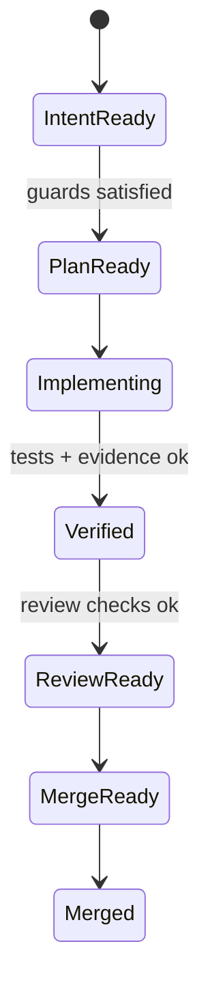
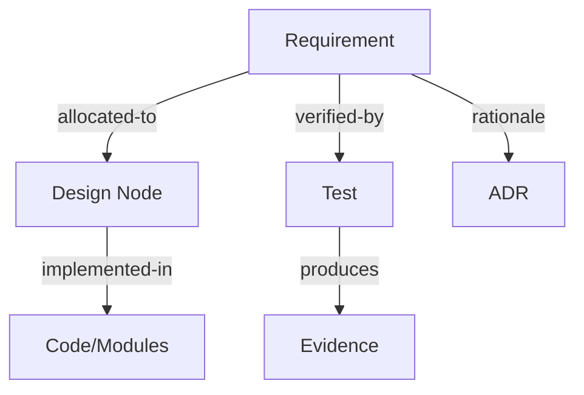

# Проверка концепции и модели

#### You:
Я делаю документ, помоги проверить и развить идею на основании информации в файлах проекта. Если предложишь новые разделы, то учти, что нужно сначала заполнить существующие. Так же изучи модель Болдачёва, я загружал её в проект. Я планирую вписать её в архитектуру сервиса как неизменяемый слой, всё остальное агенты смогут менять.

---

## North Star

Цель: SDLC, где человеческое время — самый дефицитный ресурс. Поэтому человек проектирует **среду**, **intent** и **feedback loops**, а агенты выполняют работу через **PR-циклы** (план → реализация → проверки → review → итерации → merge).

---

## Важные точки

### Принципы и механизмы

**Принципы (что должно быть истинно всегда):**

* **Mechanical enforcement > текстовые договорённости**: всё критичное должно быть проверяемо.
* **Docs as system of record**: знания живут в репо и версионируются вместе с кодом.
* **Freshness / coverage / ownership / cross-links** как базовые измерения качества контекста.

**Механизмы (как обеспечиваем):**

* **Linters / structural tests / CI jobs** как основной способ enforcement.
* Ошибки инструментов должны быть **ремедиируемыми**: сообщение об ошибке должно объяснять, *как исправить*, чтобы агент мог действовать без “ручного пояснения”.

---

### requirements as code and traceability

Я использую подход *requirements as code*: требования/спеки лежат в текстовых файлах рядом с кодом, чтобы снизить риск дрейфа.

**StrictDoc** рассматриваю как базовый инструмент управления требованиями (иерархия документов, связи, генерация HTML/PDF/JSON/Excel/ReqIF, web-UI, расширяемая grammar и custom fields вроде PRIORITY/OWNER/Verification method).

**Критично важное:** traceability между:

* требованиями,
* дизайном,
* тестами,
* evidence,
* и конкретным исходным кодом.

StrictDoc-подходы к traceability, которые мне нужны:

1. **Markers в исходниках → trace back к requirement**
   Код “помечен”, к какому requirement он относится (и это можно проверить автоматикой).

2. **Relations в требованиях → trace to source code**
   Требование явно указывает на связанный код/модули/пакеты, поддерживая принцип: **“код должен чему-то принадлежать”** (ownership через требование/спеку).

**Мой вывод (как правило системы):**
Traceability — не “документация ради документации”, а механизм контроля эволюции: изменение требования должно порождать видимый долг на обновление связанных артефактов (дизайн/тест/evidence).

---

### Графы процессов и требований

Я разделяю два графа:

1. **Граф процесса (FSM)** — “в каком шаге SDLC мы находимся” для задачи/ветки/PR.
2. **Граф требований и артефактов** — “какие требования, дизайн-узлы, тесты, evidence, ADR связаны и в каком статусе”.

**Ключевое правило:**
FSM-переходы — это *функции над графом артефактов*.
То есть переход `State A → State B` должен:

* проверить **guards** (политики/инварианты/покрытие/актуальность),
* затем **изменить состояние графа артефактов** (статусы, coverage, “suspiciousness”, debt flags),
* и зафиксировать результат так, чтобы он был проверяем дальше (CI / локальные проверки).

Пример (в терминах эффекта, без инструмента):

* Guard: “все требования, затронутые изменениями, имеют OWNER и Verification method”
* Effect: “артефакты тестов помечены как required-update, пока нет evidence/прогона”
* Enforcement: “PR не может перейти в merge-ready, пока required-update не закрыт”

---

## TODO

* Создать **глоссарий** терминов SDLC/requirements/artifacts (ориентир: IEEE, + твои внутренние определения).
* Описать **типы артефактов**: требования, дизайн-узлы, тесты, evidence, ADR и т.д.
  Для каждого: структура, обязательные поля, связи, статусы, инварианты.
* Описать **диаграммы** для визуализации:

  * для FSM процесса,
  * для графа требований/артефактов,
  * и требования к инструментам генерации/валидации.
* Собрать **шаблоны артефактов** (включая диаграммы) + примеры заполнения.
* Зафиксировать **стейкхолдеров**, роли и ответственность в SDLC, и взаимодействие с артефактами (кто создаёт/утверждает/проверяет/поставляет evidence).

---

## Идея развития

### SDLC simulation

Создать симуляцию SDLC для проигрывания сценариев и проверки гипотез:

* неполные/противоречивые требования → как ломается дизайн/тест/релиз,
* потеря traceability → какие проблемы проявляются позже,
* нарушение дисциплины артефактов → как растёт риск и техдолг.

Цель симуляции: ускорить обучение, улучшать процесс через “safe sandbox” и делать последствия решений измеримыми.

### Open source / Open garden стратегия

При развитии системы отслеживать, какие компоненты могут стать **отделяемой накопленной ценностью**:

* часть — в open source для усиления через сообщество,
* часть — остаётся проприетарной (конкурентное преимущество / продуктовая упаковка).

#### ChatGPT:
According to a document from 2026-02-22, Boldsea (модель Болдачёва) описывает активность системы как **граф событий (растущий DAG)**, где **событие — единственный примитив**, а исполнение похоже на **dataflow**: событие происходит, когда выполнены **conditions** и существуют необходимые **causes**.【117:1†boldsea\_en.md†L1-L26】【117:2†boldsea\_en.md†L55-L70】【117:3†boldsea\_en.md†L43-L64】

Ниже — проверка твоей идеи на согласованность с материалами проекта + конкретные предложения, как усилить **уже существующие** разделы (и только потом думать о новых).

---

## 1) Проверка текущей концепции: где ты “попал в десятку”, и что стоит уточнить

### Что уже хорошо и совпадает с источниками проекта

1. **“Humans steer, agents execute” + среда/intent/feedback loops**\
   Твой North Star практически 1-в-1 совпадает с подходом “agent-first”: человек проектирует среду, формализует intent и строит петли обратной связи, а агенты исполняют работу в PR-циклах.【113:3†Harness engineering\_ leveraging Codex in an agent-first world \_ OpenAI.pdf†L32-L66】

2. **Docs as system of record + quality-метрики контекста**\
   В “Harness engineering…” прямо предлагается идея “карта вместо толстого мануала”: держать **документацию в репо**, иметь **AGENTS.md как карту** и мерить качество контекста (coverage / freshness / ownership / cross-links), проверяя это автоматикой.【113:0†Harness engineering\_ leveraging Codex in an agent-first world \_ OpenAI.pdf†L1-L37】

3. **Механическое принуждение через линтеры/CI и “ремедиируемые” ошибки**\
   Отдельно подчеркивается, что если линты кастомные, то тексты ошибок нужно писать так, чтобы они **подсказывали агентам ремедиацию** (то есть “что сделать дальше”). Это прямо усиливает твой тезис про ремедиируемость инструментальных ошибок.【113:4†Harness engineering\_ leveraging Codex in an agent-first world \_ OpenAI.pdf†L61-L83】

4. **Разделение “граф процесса (FSM)” и “граф требований/артефактов”**\
   Это очень сочетается с Boldsea: состояние — вычисляемая проекция событий, а не “хранимое поле”, и правила задаются декларативно через условия/ограничения.【117:2†boldsea\_en.md†L62-L70】【117:3†boldsea\_en.md†L43-L64】

5. **Traceability как управление эволюцией** (а не бюрократия)\
   В ISO/IEC/IEEE 12207 прямо фигурируют требования вида “дать objective evidence” и “установить traceability validated elements”. Это полностью поддерживает твою формулировку: изменение требования должно поднимать “видимый долг” на обновление связанных артефактов.【125:9†CAN\_CSA\_ISO\_IEC\_IEEE\_12207-18.md†L1-L4】

### Где стоит добавить 2–3 уточнения (без новых разделов)

1. **Понятию “intent” нужно дать артефактную форму**\
   В 12207 есть термин *concept of operations* (verbal/graphic statement assumptions/intent). Это хорошая опора, чтобы “intent” был не абстракцией, а нормальным артефактом с версионированием и связями.【117:13†CAN\_CSA\_ISO\_IEC\_IEEE\_12207-18.md†L80-L87】

2. **Ввести явный критерий “качество информации” как инвариант контекста**\
   В 12207 у процесса Information Management есть перечень качеств управляемой информации: *unambiguous, complete, verifiable, consistent, modifiable, traceable, presentable*. Это можно превратить в твою “линейку качества контекста”, которая дальше механически проверяется линтерами.【125:14†CAN\_CSA\_ISO\_IEC\_IEEE\_12207-18.md†L67-L74】

3. **Сразу зафиксировать “цена прозрачности = дисциплина моделирования”**\
   Boldsea предупреждает: если события слишком мелкие — будет шум; слишком крупные — потеря контроля. Это важно явно зафиксировать, чтобы ты не утонул в событийному логировании всего на свете.【117:5†boldsea\_en.md†L1-L4】

---

## 2) Как встроить Boldsea как “неизменяемый слой” (и почему он реально подходит)

Ты хочешь: **Boldsea = неизменяемое ядро**, всё остальное агенты смогут менять. Это естественно бьётся на архитектурные слои.

### 2.1. Что именно в Boldsea должно стать “immutable core”

Boldsea задаёт **онтологию исполнения**:

- **Event graph (DAG)** как основа: событие — единственный примитив; “схемы/статусы/отношения/документы” тоже выражаются событиями.【117:1†boldsea\_en.md†L22-L26】【117:2†boldsea\_en.md†L79-L80】
- **Состояние = computed picture** (проекция событий), а не “поле в таблице”.【117:2†boldsea\_en.md†L68-L70】
- **Dataflow execution**: событие возможно, если есть нужные причины (`cause`) и выполняются условия.【117:3†boldsea\_en.md†L47-L53】
- **Три уровня событий** (genesis → model → reification) — это прямой механизм, как “рождается” модель и как она эволюционирует.【117:3†boldsea\_en.md†L24-L36】

Плюс “runtime-компоненты” из глоссария:

- **Engine** (валидирует ограничения, проверяет условия, генерирует события),
- **Query mechanism** (извлечение знаний из графа),
- **Subscription system** (реактивность/пересчёт).【117:7†boldsea\_ru\_en\_glossary.md†L5-L17】

И ключевые типы ограничений:

- `Condition`, `Permission`, `Immutable`, `Unique`, `Range`, `SetRange`, `SetValue` и т.д.【117:7†boldsea\_ru\_en\_glossary.md†L19-L32】

Вот это всё и выглядит как “конституция”: **не меняем**, иначе ломается смысл.

### 2.2. Что можно (и полезно) оставить “mutable by agents”

Сверху на immutable core можно позволить агентам менять:

- **доменные модели** (какие именно артефакты SDLC существуют и какие поля обязательны) — как “model events”;
- **политики FSM** (какие состояния, какие переходы, какие guards/effects);
- **линтеры/CI jobs**, которые механически проверяют policies;
- **визуализации** (генерация графов/отчётов, UI).

Но важный момент: даже если агенты могут менять политики, **они должны менять их через PR-цикл**, с теми же проверками, и (желательно) с “мета-инвариантами” вида: “нельзя удалять обязательность OWNER/VerificationMethod”, “нельзя отключать traceability checks без explicit waiver”.

Это как в Harness: “enforce boundaries centrally, allow autonomy locally”.【113:4†Harness engineering\_ leveraging Codex in an agent-first world \_ OpenAI.pdf†L61-L83】

### 2.3. Как твои два графа ложатся на Boldsea “почти без швов”

**Граф требований/артефактов** в Boldsea:

- каждый артефакт = individual (проекция событий),
- каждое “поле” и “связь” = событие (attribute/relation),
- traceability = причинные/ссылочные связи (и главное — они queryable).

**FSM процесса** в Boldsea:

- *state PR* = вычисляемый `SetValue` (проекция по артефактам),
- *transition* = `Act` с `Condition` (guards) и `Permission` (кто может перевести),
- эффекты (пометить “required-update”, поднять debt flag) = тоже события, порождаемые engine/агентом при выполнении условий.

В результате твоя формула “FSM-переходы — функции над графом артефактов” превращается из метафоры в буквальный механизм dataflow: меняется артефакт → пересчитались derived-поля → разблокировались/заблокировались акты.【117:3†boldsea\_en.md†L55-L63】

### 2.4. Практическая “ловушка”: гранулярность событий

Если ты сделаешь событием “каждый чих”, будет шум. Если сделаешь событием “всё одним коммитом”, потеряешь управляемость. Boldsea это прямо отмечает как trade-off дисциплины моделирования.【117:5†boldsea\_en.md†L1-L4】

Рекомендация для документа: зафиксируй правило гранулярности, например:

- событие фиксируем, если оно **меняет возможность других событий**, т.е. участвует в причинности/guards (это тоже в чек-листе Boldsea).【117:5†boldsea\_en.md†L26-L33】

---

## 3) Как усилить текущие разделы документа (без добавления новых)

Ниже — конкретные “вставки” в твои существующие места.

### 3.1. North Star — сделать intent и feedback loops “артефактными”

В твой North Star я бы добавил 3 строчки:

- **Environment = harness в репо**: “карта (AGENTS.md) + документы в репо + механические проверки качества контекста”.【113:0†Harness engineering\_ leveraging Codex in an agent-first world \_ OpenAI.pdf†L1-L37】
- **Intent = артефакт** (например, “Concept of Operations / Intent Spec”): кратко описывает assumptions/intent и привязан к требованиям/PR.【117:13†CAN\_CSA\_ISO\_IEC\_IEEE\_12207-18.md†L80-L87】
- **Feedback loops = CI/линтеры/ревью/сбор evidence**, причём тексты ошибок должны быть “remediable” для агента (как минимум: “что поправить” + “где посмотреть пример”).【113:4†Harness engineering\_ leveraging Codex in an agent-first world \_ OpenAI.pdf†L61-L83】

### 3.2. Принципы/механизмы — добавить “центральные границы” и “map-not-manual”

Сейчас у тебя есть “Mechanical enforcement”. Я бы добавил:

- **Enforce boundaries centrally, allow autonomy locally**: фиксируем few hard rules (инварианты), а остальное — пространство для агентской оптимизации, но внутри границ.【113:4†Harness engineering\_ leveraging Codex in an agent-first world \_ OpenAI.pdf†L61-L83】
- **Map-not-manual**: AGENTS.md как входная карта в контекст; дальше агенты обязаны работать по репо-источнику истинны (Docs as system of record).【113:0†Harness engineering\_ leveraging Codex in an agent-first world \_ OpenAI.pdf†L1-L37】

### 3.3. Requirements as code & traceability — сделать “инварианты traceability” явными

Ты уже описал 2 направления traceability. Я бы превратил это в список проверяемых правил:

**Инварианты (в стиле “должно быть истинно всегда”)**:

1. Любое requirement в статусе “готово к реализации” имеет:
   - OWNER,
   - Verification method,
   - связи минимум на: дизайн-узел(ы) или тест-стратегию.\
     (Это бьётся с идеей 12207 про V\&V и evidence/traceability как обязательные исходы процессов.)【125:9†CAN\_CSA\_ISO\_IEC\_IEEE\_12207-18.md†L1-L4】

2. Любая поставка/изменение требует **objective evidence** пригодности/соответствия intended use, и результаты должны быть доступны стейкхолдерам (т.е. evidence — не факультатив).【125:9†CAN\_CSA\_ISO\_IEC\_IEEE\_12207-18.md†L1-L3】

3. Изменение требования порождает “debt flags” на связанные тесты/evidence до тех пор, пока не появится новый прогон/подтверждение (ты это уже написал — просто закрепи как инвариант и сделай автогенерацию статусов).

4. “Traceability validated elements established” как отдельный чек (не только верификация кода, но и валидированного поведения).【125:9†CAN\_CSA\_ISO\_IEC\_IEEE\_12207-18.md†L1-L4】

**Как это естественно реализовать через Boldsea:**

- связи requirement↔code/test/evidence — это события/отношения;
- “почему появилось required-update” — объясняется через `cause` и traceability (в глоссарии: traceability = “почему произошло”, audit trail = “кто/когда/почему создал факт”).【117:7†boldsea\_ru\_en\_glossary.md†L15-L17】

### 3.4. Графы процессов и требований — добавить W-model как “логика PR-циклов”

Твой PR-цикл можно красиво “подпереть” W-model’ом:

- W-model подчёркивает, что тестирование/валидация должны идти **на протяжении цикла**, и проверочные активности сдвигаются “влево” (раньше по фазам), а также усиливается ритм **review deliverables**.【109:3†w-model.md†L4-L15】【109:4†w-model.md†L5-L16】

То есть один PR можно описать как маленькую “W-итерацию”:

- слева: intent/requirements/design,
- справа: тест/проверка/evidence,
- посередине: реализация,
- с явными обратными связями (defect loop).【109:4†w-model.md†L11-L23】

Это можно вставить прямо в твой раздел “FSM как функции над графом артефактов”:\
guards/effects у переходов становятся отражением “W-симметрии”.

---

## 4) Заполнение твоего TODO: что можно вставить прямо сейчас

### 4.1. Глоссарий v0 (стартовый набор)

Ниже — короткий “скелет” (можно расширять). Я даю формулировки так, чтобы они были полезны для автоматических проверок.

- **Артефакт / Work product** — любой документ/компонент/запись, создаваемые процессом (включая спецификации, планы, отчёты, код, записи проверок).【121:2†SDLC\_12207\_Synthesis.md†L2-L4】
- **Событие / Event** — факт/изменение, зафиксированное актором; в Boldsea это единственный примитив моделирования.【117:2†boldsea\_en.md†L77-L80】
- **Граф событий / Event graph (DAG)** — растущий ориентированный ацикличный граф событий; состояние — вычисляемая проекция, а не “хранимое поле”.【117:2†boldsea\_en.md†L68-L70】
- **Cause (причина)** — ссылки на предшествующие события, от которых зависит новое событие.【117:2†boldsea\_en.md†L86-L90】
- **Condition (условие)** — логическое выражение истинности, необходимое для возможности события/акта.【117:7†boldsea\_ru\_en\_glossary.md†L23-L27】
- **Permission (права)** — кто (роль/актор) может создать событие/выполнить акт.【117:7†boldsea\_ru\_en\_glossary.md†L23-L27】
- **Engine (движок)** — валидирует ограничения, проверяет условия, генерирует события.【117:7†boldsea\_ru\_en\_glossary.md†L9-L15】
- **Traceability (трассируемость)** — возможность объяснить “почему произошло” (в твоём документе: через связи требований/дизайна/тестов/evidence/кода).【117:7†boldsea\_ru\_en\_glossary.md†L15-L17】
- **Audit trail (аудит-след)** — кто/когда/почему создал факт.【117:7†boldsea\_ru\_en\_glossary.md†L15-L17】
- **Baseline (базовая линия)** — формально утверждённая и зафиксированная версия конфигурационной единицы в конкретный момент жизненного цикла (удобно как “точка фиксации”).【117:13†CAN\_CSA\_ISO\_IEC\_IEEE\_12207-18.md†L71-L74】
- **Audit (аудит)** — независимое обследование work products на соответствие спецификациям/стандартам/критериям.【117:13†CAN\_CSA\_ISO\_IEC\_IEEE\_12207-18.md†L68-L70】
- **Intent / Concept of operations** — statement assumptions/intent относительно операций/серии операций (как артефакт, который связывает “зачем” с требованиями).【117:13†CAN\_CSA\_ISO\_IEC\_IEEE\_12207-18.md†L80-L87】
- **Information quality** (качество управляемой информации) — unambiguous/complete/verifiable/consistent/modifiable/traceable/presentable (можно сделать инвариантом контекста).【125:14†CAN\_CSA\_ISO\_IEC\_IEEE\_12207-18.md†L67-L74】

Если хочешь, этот список легко расширить следующими пачками: “статусы артефактов”, “типы evidence”, “виды связей traceability”, “guards/effects”, “debt flag/suspiciousness”.

---

### 4.2. Типы артефактов v0: структура, поля, связи, статусы, инварианты

Ниже — минимальный набор, который покрывает твою идею (requirements → design → tests → evidence + ADR).

#### Requirement

**Цель:** фиксирует “что нужно” и критерии приёмки/проверки.\
**Обязательные поля:** `ID`, `Title`, `Statement`, `Owner`, `Priority`, `Status`, `Verification method`, `Links` (минимум: на дизайн или тест-стратегию).\
**Связи:**

- `REQ -> DESIGN` (decomposes / allocated-to)
- `REQ -> TEST` (verified-by)
- `REQ -> ADR` (rationale/decision)\
  **Инварианты:** если `Status >= Ready`, то `Owner` и `Verification method` обязательны (и проверяются линтером).

#### Design Node

**Цель:** объясняет “как будем делать”.\
**Поля:** `ID`, `Owner`, `Status`, `Interfaces/Contracts`, `Constraints`, `Links to REQ`, `Links to Code modules`.\
**Инварианты:** каждый “крупный” модуль/пакет должен “принадлежать” хотя бы одному design node (чтобы выполнить принцип ownership).

#### Test (Test spec / Test case)

**Цель:** формализует проверку.\
**Поля:** `ID`, `Type` (unit/integration/system/etc), `Owner`, `Status`, `Links to REQ/DESIGN`, `Environment assumptions`, `Oracle`.\
**Инварианты:** тест в статусе `Active` должен иметь ссылки на REQ или risk.

#### Evidence

**Цель:** “объективное доказательство” результата проверки.\
**Поля:** `ID`, `Produced-by` (Test run), `Commit SHA / build id`, `Environment`, `Result`, `Links to TEST + REQ`.\
**Инварианты:** без evidence нельзя поднять FSM до “merge-ready” для затронутых требований (если политика требует).

Эта логика прямо поддерживает стандартные формулировки про objective evidence и traceability validated elements.【125:9†CAN\_CSA\_ISO\_IEC\_IEEE\_12207-18.md†L1-L4】

#### ADR

**Цель:** фиксирует решение и мотивировку, чтобы уменьшить “археологию причин”.\
**Поля:** `ID`, `Decision`, `Context`, `Consequences`, `Links to REQ/DESIGN`, `Status`.

---

### 4.3. Диаграммы: минимальные шаблоны (Mermaid)

#### FSM процесса (идея)

Смысл твоего правила “FSM-переходы — функции над графом артефактов” можно прямо подписать под диаграммой: guards смотрят на артефакты, effects меняют статусы артефактов/долги.

#### Граф артефактов (идея)

Если ты хочешь “W-акцент”, можно добавить, что review-артефакты/чек-листы — тоже узлы/записи (в духе 12207 есть богатый слой reviews/baselines/records).【121:1†SDLC\_12207\_Synthesis.md†L15-L30】【121:19†SDLC\_12207\_Synthesis.md†L16-L31】

---

### 4.4. Роли/стейкхолдеры: от 12207 к “agent-first” SDLC

Базовый набор ролей можно взять из 12207-лексики и разложить на человеческие/агентские ответственности:

- **Acquirer / Supplier / Developer / Operator / Maintainer** — стартовый словарь ролей и их смыслов есть в синтезе.【121:2†SDLC\_12207\_Synthesis.md†L6-L12】
- Сверху добавить:
  - **Human steward**: владелец инвариантов (политики, thresholds, “конституция”).
  - **Agent executor**: исполняет PR-циклы, чинит линты по remediation, обновляет артефакты.

Полезная мысль из 12207-представления процессов: supporting mechanisms (reviews/audits/QA) пересекают технические процессы “поперёк”. Это ровно то, что ты хочешь сделать через CI и lint-гарды.【121:4†SDLC\_12207\_Synthesis.md†L1-L9】【121:10†SDLC\_12207\_Synthesis.md†L6-L13】

---

## 5) Развитие твоих “Идей развития” (они уже есть, просто усиливаем)

### 5.1. SDLC simulation — почему Boldsea здесь особенно уместен

Если твой мир описан как **граф событий + ограничения**, то “симуляция SDLC” становится очень естественной:

- сценарий = генератор событий (вносим неполные требования, ломаем связи, имитируем пропуски evidence),
- policies/guards/effects = те же механизмы, что в реальной системе,
- метрики = derived значения (`SetValue`-логика) вроде debt flags / suspiciousness / coverage.

Главное — ты получаешь объяснимость “почему система пришла в это состояние” через traceability/audit trail.【117:7†boldsea\_ru\_en\_glossary.md†L15-L17】

### 5.2. Open source / Open garden — опора на “asset thinking”

В 12207 есть прямо формулировки про **asset storage and retrieval**, контроль изменений и уведомление пользователей об обновлениях/проблемах; плюс есть reuse program management. Это можно использовать как “стандартную” рамку для твоей open garden стратегии (что выносить в assets/open source, что оставлять продуктовым).【117:15†CAN\_CSA\_ISO\_IEC\_IEEE\_12207-18.md†L1-L3】

---

## 6) Что я бы НЕ добавлял новым разделом, пока не заполнены существующие

Ты уже правильно поставил ограничение. Единственное “архитектурное” добавление, которое реально может понадобиться, я бы оформил **не как новый крупный раздел**, а как 1–2 подпункта внутри “Графы процессов и требований”:

- “Boldsea-kernel как неизменяемый слой (event graph + constraints)”
- “Policy layer (FSM + lint rules) как изменяемая агентами часть”

И всё — без разрастания структуры.

---

Если хочешь, я могу в следующем шаге (в рамках этой же структуры, без новых разделов) сделать для тебя **конкретный “Artifact catalog v0”**: таблица “тип артефакта → обязательные поля → статусы → допустимые связи → проверки линтера → какие guards FSM используют”, чтобы это сразу стало спецификацией для механического enforcement.
